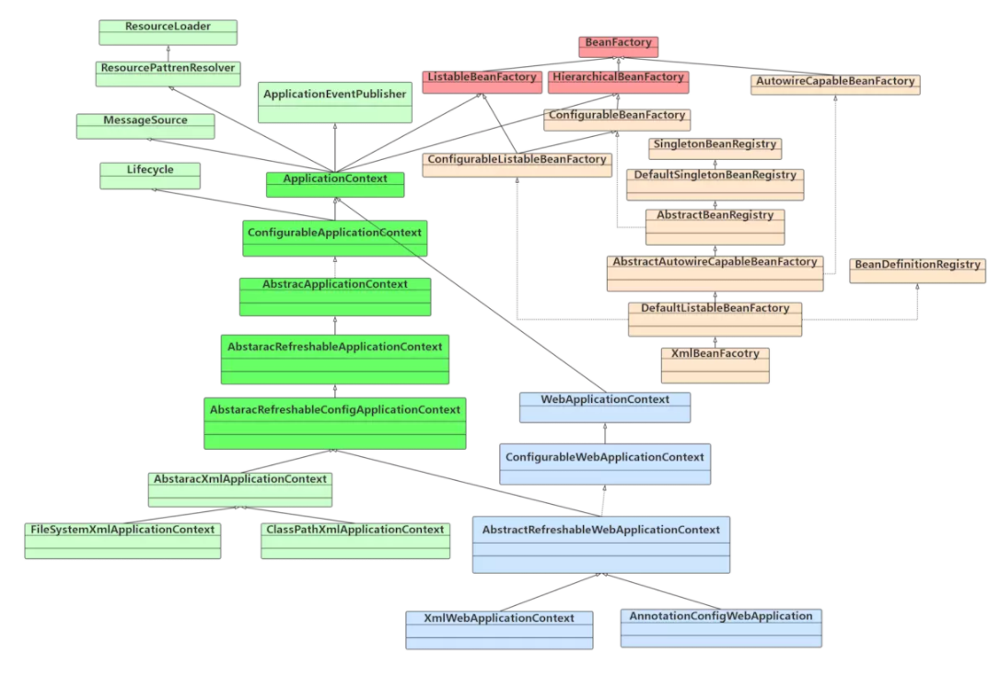
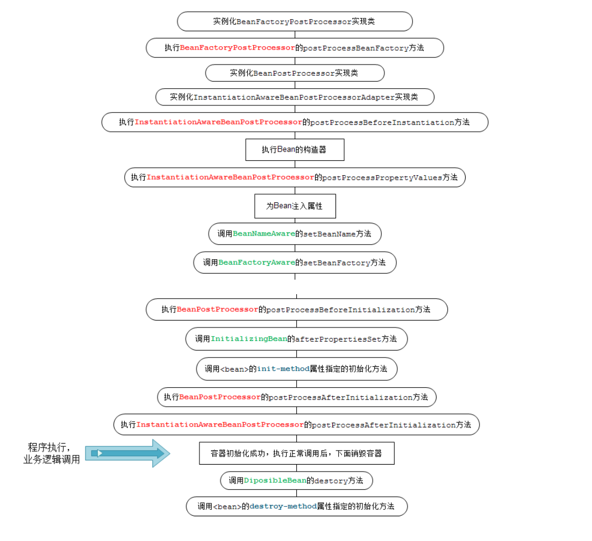
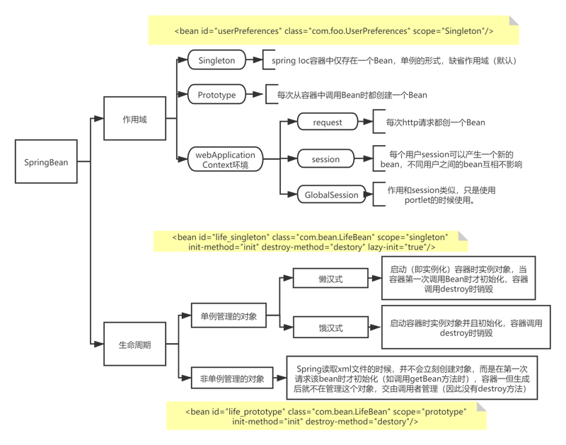
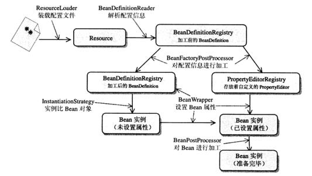

# 1 IOC

IoC（Inverse of Control）即控制反转

## 	1 IoC类型

主要分为构造函数注入，属性注入和接口注入，Spring支持构造函数注入和属性注入。

​		构造函数注入

```java
public class MoAttack {

    private GeLi geLi;

    public MoAttack() {
    }

    public MoAttack(GeLi geLi) {
        this.geLi = geLi;
    }

    void cityGateAsk() {
        geLi.responseAsk();
    }
}
```

​	属性注入

```java
public class MoAttack {

    private GeLi geLi;
    
    void cityGateAsk() {
        geLi.responseAsk();
    }

    public void setGeLi(GeLi geLi) {
        this.geLi = geLi;
    }
}
```

## 	2  反射

Spring能够通过容器完成依赖关系的注入，依靠java本身的反射功能。java允许通过程序化的方式间接对Class进行操作。

### 		 1简单示例

```java
public class Fruit {
    public String color;

    public String name;

    public int price;
    
     public Fruit() {
    }

    public Fruit(String color, String name, int price) {
        this.color = color;
        this.name = name;
        this.price = price;
    }

    public String getColor() {
        return color;
    }

    public void setColor(String color) {
        this.color = color;
    }

    @Override
    public String toString() {
        return "Fruit{" +
                "color='" + color + '\'' +
                ", name='" + name + '\'' +
                ", price=" + price +
                '}';
    }
}
```

```java
public class ReflexTest {
    
    public static Fruit initByDefaultContent() throws ClassNotFoundException, NoSuchMethodException, IllegalAccessException, InvocationTargetException, InstantiationException {
        // 通过类装载器获取Fruit对象
        ClassLoader contextClassLoader = Thread.currentThread().getContextClassLoader();
        Class aClass = contextClassLoader.loadClass("com.spring.study.IoC.reflex.Fruit");

        // 获取类的默认构造器对象并通过它实例化Fruit
        Constructor constructor = aClass.getDeclaredConstructor((Class[]) null);
        Fruit fruit = (Fruit) constructor.newInstance();
		
        // 通过反射方法设置属性
        Method setColor = aClass.getMethod("setColor", String.class);
        setColor.invoke(fruit, "blue");
        return fruit;
    }

    public static void main(String[] args) throws ClassNotFoundException, NoSuchMethodException, InvocationTargetException, InstantiationException, IllegalAccessException {
        Fruit fruit = initByDefaultContent();
        System.out.println(fruit);
    }
}
```

在ReflectTest中通过获取当前线程的类装载器（**ClassLoader**），然后通过指定的全限定类名装载Fruit对象的反射实例，通过反射对象获取Fruit的构造对象，最后通过构造对象实例化Fruti对象，效果等同于new Fruit()。获取Fruit对象后通过调用setter方法调用方法设置属性。

### 		2 类装载器ClassLoader

类装载器就是寻找类的字节码文件并构造出类在JVM内部表示对象的的组件，在java中，类装载器把把类装入JVM中，需要以下步骤：

​	(1)装载：查找和导入Class文件。

​	(2)连接：执行校验，准备和解析步骤，其中解析步骤可选。

​						校验：检查载入Class文件数据的准确性。

​						准备：给类的静态变量分配存储空间。

​						解析：将符号引用转换成直接引用。				

```
	符号引用：
	以一组符号来描述所引用的目标, 符号可以是任何形式的字面量, 只要使用时能够无歧义的定位到目标即可. 例如, 在Java中, 一个Java类将会编译成一个class文件. 在编译时, Java类并不知道所引用的类的实际地址, 因此只能使用符号引用来代替. 比如org.simple.People类引用了org.simple.Language类, 在编译时People类并不知道Language类的实际内存地址, 因此只能使用符号org.simple.Language来表示Language类的地址；
	直接引用:
		直接指向目标的指针.(个人理解为: 指向方法区中类对象, 类变量和类方法的指针)
		相对偏移量. (指向实例的变量, 方法的指针)
		一个间接定位到对象的句柄.
```

(3)初始化：对类的静态对象，静态代码块执行初始化工作。

​	类装载工作由**ClassLoader**及其子类负责。ClassLoader是Java运行时系统组件，负责在运行时查找和装入Class字节码文件。

​	JVM在运行时会产生3个ClassLoader：**根装载器**、**ExtClassLoader**（扩展类装载器）和**AppClassLoader**（应用类装载器）。其中，根装载器不是ClassLoader的子类，是由C++编写，在JAVA中无法查到。根装载器负责装载JRE的核心类库，如JRE下的rt.jar,charsets.jar等；ExtClassLoader和AppClassLoader都是ClassLoader的子类，其中ExtClassLoader负责装载JRE扩展目录ext中的jar包，AppClassLoader负责装载ClassPath路径下的类包。

​	这3个类装载器之间存在父子层级关系，即根装载器是**ExtClassLoader**的父装载器，**ExtClassLoader**是**AppClassLoader**的父装载器，默认情况下，使用**AppClassLoader**装载应用程序的类。

​	JVM装载类使用“全盘负责委托机制”，“全盘负责”是指当一个**ClassLoader**装载一个类时，除非显式的使用另一个**ClassLoader**，该类所依赖及引用的类也由这个**ClassLoader**载入，“委托机制”是指先委托父装载器寻找目标类，只有找不到的情况下才从自己的类路径下寻找并装载目标类。

​	每个类在JVM中都拥有一个对象的java.lang.Class对象，提供了类结构信息的描述。


## 3 BeanFactory与ApplicationContext

Spring通过一个配置文件描述Bean及Bean之间的依赖关系，利用Java的反射机制实例化Bean并建立Bean之间的依赖关系。Spring的IoC容器在完成这些底层工作的基础上，还提供了Bean实例缓存，生命周期管理，Bean实例代理，事件发布，资源装载等高级服务。

Bean工厂（**org.springframework.beans.factory.BeanFactory**）是Spring框架最核心的接口，它提供了高级IoC的配置机制。**BeanFactory**使管理不同类型的Java对象成为可能。

应用上下文（**org.springframeword.context.ApplicationContext**）建立在**BeanFactory**基础之上，提供更多面向应用的功能。

二者简单区分：**BeanFactory**是Spring框居的基础设施，面向Spring本身；**ApplicationContext**面向使用Spring框架的开发者，几乎所有的应用场合都可以之间使用**ApplicationContext**而非底层的**BeanFactory**。

### 1 BeanFactory

![img](data:image/png;base64,iVBORw0KGgoAAAANSUhEUgAAA0oAAAIbCAIAAABaHflcAAAgAElEQVR4nO2d27GjOhBFFY9DIAQHQjkMVzkBIpgwqDp/Nw+C4X5gg16AAIFaYq3qj5k+PPRoSRsJZNX3/X///df7wI8fP378+PHjx5+dX3n/AAAAAACZgrwDAAAAKArkHQAAAEBRIO8AAAAAigJ5BwAAAFAUyDsAAACAokDeAQAAABSF6kXu15LE/1YKwzDLpLVT/Pjx48e/6mf2buKtVN//YRg22lvRRQAA5Ad99wTyDsMsQ94BAOQIffcE8g7DLEPeAQDkCH33BPIOwyxD3gEA5Ah99wTyDsMsQ94BAOQIffcE8k6ctU+llFKqblOn5K6GvAMAyBH67gnkXTTrXlX16rb+ybZPrR5Nlzov9zbkHQBAjrDv3QTybot9ar9Km/P/LFzeda9KPdv9KfzXVN7T5/yYx9j3Dj9+/Phz9PNoPoG8C7N/TaWUR3hp/kHDda+qejW10hZYh2OUUqpq/vXd6/e/R9N9z2rq4SKf33lKVa+2eSj9yP6v1w6o2z/7Ur12jEdNzvkx25i9AwDIEfruCeTdqrW1pZ9m/KO8G1+ba59fOTXN3n3qUSO6x/cz83ztU9WfQSZqL+Q5l9JPGZRf/bGzM+fHNEPeAQDkCH33BPJu0T61/xMHn1+bvet0j/UPpfNsLWVmna5N5nXukdal3PS3z21+rP/rkXcAAHlC3z2BvFu1zbN3y/LOnWbzyrvuVY0Xd6/svZR1WWbv9hryDgAgR+i7J5B3Ybbt3TuPvPue60z7Lci7n79rHqp6dZ7F2dmZRd69O2LIOwCAHKHvnkDebbHFL2cX5N13qs/6tGJmydU8RSlV1U93bdf8tGLUbXw5G8GQdwAAOULfPYG8wzDLkHcAADnCvncTyDsMs4x97/Djx48/Rz+P5hPIOwyzjNk7AIAcoe+eQN5hmGXIOwCAHKHvnkDeYZhlyDsAgByh755A3gXb9Nti07erhy/b1juv2TWP76e46UumNEPeAQDkCH33BPIu1IZdSKpXF1FaadfceO6gNT2bLWPHDXkHAJAj9N0TyLtA0ySducVx+9Qm3z59b/9c2PT7s8Y03af3ykTvub8jf96XMY+oKU7PHetP3z5V9ax1OTj8iS2OZwx5BwCQI/TdE8i7MPOvzLb1pPM8v12m/QLYsAg77UX8+xUKjblzv4eNoq1uLV2ozeRp04H6sm/VfLTZPn6+YsWQdwAAOcK+dxPIuyDTV1HHf1sTcuMBpr9u/76KSj1bfcbOuzLrnjtOwk2HGSuzhtSbrjndcThrVJ9zP6GLjfZm3zv8+PHjz9DPo/kE8i7EDAn101vThJx25PTjY/oabvs0nY+m86zM+s71vWNn6MIZqeeIwq+qa55umjHLmL0DAMgR+u4J5F2A/bNXNtWj6b5rpuYHFtqcmb26ai2eurpt4dydK7O6jJvWao2JQMxjyDsAgByh755A3q2b+bmDtuL5MXY18bxOZ71st7wyO7PxinH3aS5QqZ+qc7/tcFZm+/HbC165CzDkHQBAjtB3TyDv7mHjpGPylGRgyDsAgByh755A3t3AvrOMvHIXaMg7AIAcoe+eQN5hmGXIOwCAHKHvnkDeYZhlyDsAgBxh37sJ5B2GWfZm3zv8+PHjz9DPo/kE8g5LZW+lLEuepDFhqdslAABshr57wh1iMewakxyKSRojAAAcgb67cAob3aWlZ44jxZhLHgEAQCwMJIVzRCsI1BkCFeccu9OZSwYBAEAsDCTls08uyBQZQ6pkps1lnxjNJXcAACAWBpLyKUlhjAkTm0KXrUnNKGsAACATBpLyKUle6GmTnE6L8KRmlCkAABAL+97dwr9JXghMv548/U/efElIp+sPXKgVXv748ePHjz8LP1MFtyBQ3smfOvLuIZIkJftYTa3Yb5YBACAjGELuQoiwuCYlR/AmMouUjyyn1lp9RuoBAMAOGDbuQriqkMxcOnNJ/8CcYlvIBToPAADCYbQonxBlkItuWBZAV6bkOPsWmpnSAwCAVRghisUVAQVMfZUhUkdCvhRZPh2dBwAALgwMBbJp7S8vcVDGG4Q6emUd+aELpB4AAIwwGBTF8gCf+2enffDy5QUpiUtEZYbOAwAA1YvcrwX/Vv/CiD63b1zI8dL8R3Z4kZD+Bf+Y5ljXn5vSE5Jf/Pjx48d/np9H/LzZOlWT44966fDzD/tg9RYA4FbQ1+fK7qE66zF+k7zLN5ungs4DACgeuvj8ODg2Zz2uh28dckFicocpPQCAUqFbzwlGYjb+PQlKDwCgJOjN84Chd2BubxcKJxZM6QEAFAA9uGgYaC28P8nq/gmiQPgBAGQKHbdQGFa9DGXiLRyK6zyY0gMAyAvVi9yv5c7+cRAVkh5Rfl1hnL1vHH6vf9R5QtKDHz9+/PhdP8/igmB25CCU3pUwpQcAIBb6ZREwRkaBMkwFOg8AQBR0xylhUIwOhZkWpvQAACRAF5wGxr+ToFTlgM6DC9CfKDBpljo6bg2lfzUE/dlQvNKgu4fzeCvV93+YQKO9p4XSvw6Gt2ugkCWDzoO4IO/EGs08LZT+FTCeXQylLR+m9CAKyDuxRtNOy5791ZIv59/QQuqF+sJCLNa+Sskzggm043G1Iw6T6xjMa0niAf/o3yOuaU4SGgn1he2wg7FEXGELFjG6iMMCLEk8wAjyLgND3mGxDHmHnWfIu2jWPpVSSqm6TZ2SA4a8SwvyLgND3mGxDHmHnWfIu757VdWr2/on2z61ejRd6rzkGQ8wgrzLwJB3WCxD3mHn2T3k3af2q7Q5/8/C5V33qtSz3Z/Cf03lPX3OX1Q8wAjyLgND3mGxDHmHnWely7t/TaWUR3hp/kHDda+qejW10hZYh2OUUqpq/vXd6/e/R9N9z2rq4SKf33lKVa+2eSj9yP6v1w6o2z/7Ur12jEdNzvnLiQcYuaW8y+21BuRdTMut9uMa8u5Eu3do9UXLu7a29NOMf5R3Yxi0z6+cmmbvPvWoEd3j+5l5vvap6s8gE7UAcy6lnzIov/pjZ2fOX0Q8wEhW8u6urzUg7/r+vrUf15B3HiO0Ilmh8u5T+yW7z6/N3nW6x/qH0nm2VphZp2uTeZ17pHUpN/3tc5s/83iAkZ373p3YkHitYa2RSKqvuEbtn27vqPveJc9OsBFaV5h3OC9j37vNs3fL8s6dZvPKu+5VjRd3r+y9lHVZebN3AveHK9UvZ/aO1xq2NZLU9UXtX1T7omIpt7gitHKNLpFxuC2WPPLue64z7bcg737+rnmo6tV5FmdnZxaTx1KSeIAREfKO1xpObSTCh2Fq/0q7lbwjtC620uXdr/oWZoIX5N038KxHhZklV/MUpVRVP921XfNRYdRtUmaCkXdpSS7veK3h9EYieBim9q+228g7Qivv6ColDm9tyLu0JJd3fz2vNZzcSIR3f9T+lXYbeecLoTk/oRXJkHeYbsi7tIiQd33/x2sN5zWSHLo/av8iu5W8I7QuNuQdphvyLi1y5N1gvNYQv5Hk0/1R+6fb/eQdoXWdIe8w3ZB3aZEm77D4jYT6wka7q7zDrrCi5N2wSbXs1XDhhrxLi7R977D1RkJ9YbvtfdN977ArzDucJ9j37vfzId/p0eZf1zy+U7Dh2VmRd8NON9snVs20xVlztz/W2by99mL57M0p+96l9jN7l4Exe4fFMmbvsPNMxOxdrFm3U+Vd/el/i/gRfsJukHfGawARF/Qjyzu4DORdBoa8w2IZ8g47zyTIO/9E1Ciqhn9Uj8qcPBtfl5zej9TlnT7lVr06+/hn+7vvOF84nWXda7rs8HHPb6bNuYU1J7d0TV3eWWrMvexaZvW/Vs0/O6fjvdqnUo9Kz4KRjGTxACMi5Z0TJUb7TN2FXW8HG8np9SXZiCXTIna4ucZVlNq/cQgtWJLh3I5DZ2XWqK+vPJokmlfcGM7uVZnXqZp/fhXlvYL3XpO2+vT938wtxkxpQtB7TXf2buGyi5n1iWMzp997Pb5zhNrVhnP1yUjkXVpiyDunpzu6kL9jSD7jhYb919w/m31Gp+kfhn+5W1saOJSX7a+8fIxnxePDJ7FkWsQO1x9XmwrkVwXjMLPnHaljtx5s830tuVBotGy1JMO5Lw6dbsSqL1Pc6Iukc4pHWRc0i9pYZl28l2dScPYWf6Zfk3fWNa13736x7b1seGZ/zcEn76YYG//q2YEoSTzAyCny7mgHtHtIjvtCw/4HdFlDsl1fWn+k3HI+OS8B5bb5veAlI5ZMi9jheuNqX4FEK+dz68J3kaKjZaslGc6X4tBYSTwk7xzpH0Pe/ZLX+m6h33faiHtB3lXfH8obU+JN+XJmp/QPOELW7VG/k3a1O+mIvEvMOfJu60K+dsAUQJPXemXB9z7BGS80uPnynuvcpbHy6H0t48I3GOz6mm7xrN2y8nV8i3nRHtqmZYV/TWX2qkZ+p4P1qvF3o+ERQixd+zbM+wx5t1w1VhQt1PhCpK1WkHX8Qi0bQ3iB0bLVIkZXnDh0q8nXyzlCygzFbyFbojl4cXbeOd3Xd4tpw0V3cXZO3k0hoR1sXnYls1bIBcg7LTjtJ/Mk8QAj58q79YX8ybQI1gLIbgBzb0Kc8UKD9x2OxXP7/l9Tv7qQln/hGwxu9zeWqlFB/nmI9bx0zWMoiu9YoteRLe9++fVVzdrkx1qEEEvnx9JyXG0wq5CVWVBzVWPldKnGzdLQi3Shgsx3s35VMF9T7uJsWdGy1SJG1+44tL4bmJfjei83lOpMKPZ+ea1J58VPK7zybjpU20nbvsW4xKyp8FV5N5WA1hyMyy5l1ljP1X98Zcyp7xnge0dnvvmNvEtKjH3v1uSdEfGOvPO8XuA+i2jN0v+awhkvNPiWSNxzfaIkYN7+wBsMh/eF8qufEHm3sAZRt/+aStX1c5wgcUfr8TqrL4Usl/lcsomlkFgSse/d2uydv8CdTR9ma9xbYgui5+f0BuFSLRcdLVvtLWTfu/0WoRDysViZ/epFt+tOEg/4R//pi7PLC/n+1wsChuTZ7977eC80OPnynnuok73kDQZ/fVmjz9xSQkhe+k+tVNW8avVouk+tHnX9MNbFnPx6K3HVuRwhxNLFb8McGlbD5J1/pd4XRf4ajyHvVmq56GjZahGj66I4NMptIOq7vxItdmbn1/STxAOMnC/v9Ahw5J3/9QItXELfhDjjhQYnF0vn7lwiueINhrdv8WLsx6cVVe86UUhexsn536+nTwUyN6h4K9H3aUV4hBBLF78N8z713Ttv1fik20KNTzdyF2fnKsg5vlmu5aKjZatFjK6L4hA705LEA4zEk3cj2gv16wv53tcLvJ95L78JccYLDZ4lEt+5Vglor3n98rj4grNWkie9wWDWlyOhpsUa3zsZIXnRNaIlH+fnDGbeFnc3RgmOEGLp/Fha6gc22aq88xa4ndP5GtdLwyrS1Qqyq2CxlouOliyG80NxiJ1pSeIBRkRua3xT2/YGw63r6/AnfqXbWbFUeFzd1GajZash7zDdkHdpQd6JsdPeYCiwvpB3e8sHeYfZFq81Ie8w3ZB3aUHeZWDIOyyWIe+w8wx5h+mGvEsL8i4DQ95hsQx5h51nyDtMN+RdWmLse4dd20ioL2y3vYXse4eVaN7hPKt977CYliQe8I9+Zu8yMGbvsFjG7B12njF7h+nG7F1adso77GI7UsfJE4+JsiOxZMVV8vEDE2URo4s4LMCSxAOMUPp7iD5SwsWE1x0VPUdynYoJtCRxmFzHYF5LEg8wQunvZAjctP0a7Ca8yvSKPjlRAF/oVcJB3ok1AjgtlP5O3MBF6mXEKNrCD+4ZdOFC3AdIAs8L8k6sEbFpofT3sxC79MjC2SfvdA81C6fiDTAJi6HSQN6JNeIzLZT+fsLFAX2xKPSK2K3weibz4GRCQgu1l/x1Q2zBUkfHrdmz7x3+0b81fL1BLzBfZfut8p+rRP06yxU91GnyfOEvzx+lh4mYHvxev17mEtKDH//Ofe9AZ0f/e1JKIBC3ClYrJaTWeGCF6OwIJyLwMvQmT7GDNIjIo2xq1XQBEtgh7wKPGY+koiEWPEBKw32Qo8xBIARlBDYN/KemBELw1kKUCTzreKobokAPI4GF6XmKHQRCUEYgsG3TBQhhriLiKjyqG2JBD5OW5Uc1ih1kQlzGIfrcD5zH7p6aSRRIRdz3ByCEwLdpKXaQCXEZDR7vsuCIgGMSBRIS69kDltn0jRTFDmIhNKOBvMuCg8/iPMpDKpZ7GALvODuKkWIHsahe5H4tmfoX3rpd6DjkpP8O/vBFrh37kLHfGP5T/cuvjS7ELf5A//H3a2XmC/8N/Tx5RGZ5y1we9ZJzfM1l95cZAMdZ3taHabzj8IotlAHRGZnVzZDoEdJykrxja1O4hpBdG4nDg/AhCxQAARqfsdkvTPPQNaTi+KM5oymkJWRDXTqZIyDvoAAI0PgETuTQOyQhfPZuYYBkw3pIC53M2VC2kDsE6Cls0hBnJwZGVj+M2LrTFdUHSQh/GYBOZjdshgBZQ4ymh57iMrzrqpu2ubJO3HQvgIgc/8YTlgmcvweQCTEqAjqLa9A3qdH77h3lz9s5kBdM421ioXOgGCELVC9yv5Yb+t3OV2Y6s/Z7R7jBf9J930oJLAf8t/V7419gOtP69VJy+wf2F8SfhZ+nEFnwXJgEih3uA9N4y6zuLHhtcgB2QqSKg+4jCRQ73AoC3svqy3aUG+QCkSoRHq+vhwKHu0E/YxHyZf1liQE4CMEqF7qSK7mgtKlQEAhhOcDHUlAYBKto6E0u45qipkJBIMxL3Tz7UCTEtHToeS8DhQd35raReduMQ9kQ1nlAB3QBFDLcnBs+TN4tv3Af2L8nG//YDQlJT3l+9h3Ej7+/zb5ulpZNnh78+OP6eXDJiRs+W18JZQswUHxXU3buAHoWZ3OEjuk8rixb6hGEU2qIlpovAB2iPEuKf7ZOxcWlSiWCcMrragrLDsAcBHrG0E9F5/oipRJBPsVEaTEZAViFWM8bequ4UJ4AXgqYxss9/QCbINyzp4BuVxQUJsAc+baOfFMOsA8ivhDovGJBSQIskOPzZHYJBjjOLfY3uol/rguTlk7h/oT7C95kvzH8UfyDzMKyNoFxhb8YP880RTF2GbCbtAVI9UEgb6X6/g/L12jscCqEV4HQaxwEhQfyQd7lbrR0OBXCq0zoOI5A6YF8kHe5G/0MnArhVSws1O6GcgP5IO9yN/oZOBXCq3DoQXZAoYF8kHe5G/0MnArhVT50IjsQUmhCkgECuYu8a59KKaVU3aZOSWyjdcOpEF63gIXarcgpLjkpAVFIl3fdq6pe3dY/2fap1aPpUuflHKNpw6mw786N/FZvkjw9kv1vpeSkh/2x8LsIkHef2q/S5vw/C5d33atSz3Z/Cv81lff0Of+lJr9dJ98XMKFJKP+Dfp4e7gXPi4FQUCCcpPLuX1Mp5RFemn/QcN2rql5NrbQF1uEYpZSqmn999/r979F037OaerjI53eeUtWrbR5KP7L/67UD6vbPvlSvHeNRk3P+q+WdZJLGWEqTXzUhlJAH2MSbhdowKCWQTKqht60t/TTjH+Xd+Npc+/zKqWn27lOPGtE9vp+Z52ufqv4MMlF7Ic+5lH7KoPzqj52dOT8aou975F3mlJAH2EEZ4XsqFBFIJsXQ+6n9nzj4/NrsXad7rH8onWdrKTPrdG0yr3OPtC7lpr99bvPfXkMg77KmhDzAPpjGW0Zm4chMFVxPNrN3y/LOnWbzyrvuVY0Xd6/svZR1WWbvtoO8y5oS8gBHKCOOz0BsyYhNGFxJRu/eeeTd91xn2m9B3v38XfNQ1avzLM7Ozizy7t0+kHdZU0Ie4CBlhPIZiC0ZsQmDyxAw9C5+Obsg775TfdanFTNLruYpSqmqfrpru+anFaNuy+DLWckIiLE0Gx/Kr5oQSsgDHIeFWi+UCYhFxNCLHTD53cuhGMt540P5VROC9H138F/pf4vfh+liv7eRC0wn/hv6kXe5m/z+di3Git348M2+d1AeZTy1xILSALEg73I3+d3LfIwVvvGh/KoJoYQ8QFxYqNWRXxTyUwhngLzL3eS3XG+M3WHjQ/lVE0IJeYAzKCO+j5NFOWSRSIhLdHnX/WZHqubfKYJmGEqtcXd4cT7R1iRpTX6zdWLsLhsfyq+aEErIA5xEGSF+kFwKIZd0Qix88k5bzNqsmaa1qkHnxRd5O+Td76vJaVA/noz91xyKN9ont/LbbJzZuww3PpRfNSGUkAc4DxZqb559EIt3ZsU77m7QXqfOou2Wd/Xnpx5i7I6xf74QeTda4Rsfyq+aEErIA5xNGbG+m5tnH2RiDb1zU27d9EL676+Dvqke1TR9pU/7PZrGFlXThGA7I7lG6Tasc5krZd/7Wstnw8iqiy19Xs3+66AbfuLVPdJ7R09OffLOe65zl8YoimfrLVujHB6VnmZH3b7FdyzvI1/O5rzxofyqCaGEPMAFlBHu+7hz3kEs1tDrn9zySrGv6Hl1Xn2mn7Vwul/eDUJKHzg1WabdYhKj49W6V2XKsumvI4Mm8x7pvaM3p+Y1Q87t+39NPYrgX+5CykE7ZsiyXkHyO5Y1eVesya+aEKTvu4Nfjv89s1ArLZ3R/Vauk6dn1f8Wv58W/uP+EHlnOJdFm0/e6acHyTtN2OkzW668cxNjHq+sv+rp9x/pveOaPO3nU+srT0Pe+cvWLofxFM9qpvx2emd5J6H8D/pLkKhwJWU81mwixyznmGbYxDtgcfZqeae/HfVLzPTGfYC8sxeXdSn2O731Hem/Y5i88557SN5py4vfSbvanWXMYIrozvIuddlHoIQ8wMWUEfqbyDHLOaYZwnGGXt+nFZtXVw3t5eiesLVd/c2qmcVZT2K+a6bmG1HO4qa2Ymsc6b9jmLxbOnfn4qx3ww77qxf5LRR5lzUl5AGu532zL2pvlVnIAt/Q69kYZfbTigB5p//AwPeS5q8OTE5b1owp0T4vsD6tMJdcTSX0S+3cJiaejyF8dwxdnPWdO6ZNu7VWmGufVjjSM8fdN96B8q64zQvlV00IJeQBUlFGGwjhPjmFXAgdeuPY3EYYWGDRefbskN+r+GPsp3qnHC2vsC+YvRfx5m19Fu+4fyMb+VUTQgl5gIS87zGNd4c8Ql5cIu/MDVP27ah3c/Pu9tf/9TloCG+MTXvljJnaPXunF47zdc5hQ94BHKaMxrBM1nnMOvHg5drZOyy+yW+Vnhj7CrJn7a5i61/tzGwlqG+jOG16N/3+rLJfbTR1ZMgujOPFzYN/ezGWsiVhCCXkASRQRntYIPcM5p5+sEDe5W7ym6QbY+NiqLEq6vso+2fT1yqehVR39m5ha8PFNyl9q7SmXixrS8IQpO+7gz8j/9tcqE2enrj+MWtC0rPD/xa/zxb+cD/yLneT3x6dGPN/B+2Vd+5WgrNfokzTcV9d6N3acHmbHs/FvfIueEtCCeV/0F+CRAVRlPHc41JqviBTkHe5m/wuxY4x60NmZWus+S11fB8j69sE/nTeoN5WN3H0fwdtXdw/e1fIloQhlJAHkEYZbcOl1HxBjiDvcjf5/YkVY9oGgX/9OMemT9qZG2LbWwmOlxrXYd0pQH1HG3NGbWkXRvcXhAPkXdZbEoZQQh5AIO8Sv6gtL0eQL8i73E1+f2LGmLNv9rjc6Vmc9WwlaCy56u/b2V9OeHZJ1JSiNkM3szhr/XrKVymWtSVhCCXkAcRSRiMZKSk7JeXlniDvcjf5bVBqjMXahTHjLQlDKCEPIJky2slASXnpi8vO3ZA69GKhJr8BCoux2Lsw5rwlYQgl5AGEU9JCbTEZGSgsO7dC2NCLbTb5re+2MSa/akIoIQ+QBWU0mDJyAQVw26G3GJPfmdw2xuRXTQjS993BX5L/LX6fp1X/u4j9kPBL8A+z2rptus5th95iTH5/eNsYK6OfL0GiQkbkvlCbdeJBFG4suYJvQfzddugtxuR3JreNMflVE0IJeYDsyLrxZJ34BUrNl2Q2lblP8KUfCLHdJr/F3TbG5FdNCCXkAXIk3/aTb8pXKThrMtld4MvzfFguFjecovNG3uVMCXmATMmig3PJMc3hlJ07aewo7UxbzQKFZackkHdZU0IeIGuya0jZJRjEsjWWyou98tRqSSDvsqaEPEDuZNfF55VakEx4LJUXdUOOystXMSDvsqaEPEAZZNSiMkoqCCcklrJ7/glhzFF5WSsG5F3WSN93B/+t/N5GRTpT+d/i9+XK1L/p/fq5AwTmK9yvZ8rKoKh03tx/Z3knofwP+kuQqFASWUxUyE9hLO6T07OZ03PLJVxk+W8qAUjIneVd6rKPQAl5gPKQ37rkpzAW98npGYRM0Xn/msVzzg7cTBWZzTJA3mVNCXmAIhHewIQnDxKydWOz+yieOSF7fUoghFTbAUqw1GUfgRLyAKUiuZmJTRikYvfAcJPFyrl8lZpfOAiBcRCKD6Qjs5HLTBVcTJTH/fFcyc8zx0HewSYIjINQfJABMtu5zFSdx93yO8cZKzhlC7t+MXjKzjjs482eiIeh7CAPBI5/0tJzATfM8sipL+WUXbDLuSs777AP5N1x2NcKf05+vbUnT4/V9SRPzzX+MddC0nOqX5+ok5CeHP2rI/Q92xH+Bb8eEnPxIyGdwv1IY8gMOc9zclICESns67m0hJQh5QwWIfIOVqHgID/kDL1CkgHHQdJFJ7AwKXOwQN5FgYKDXJHQ7CWkAXbDRN15hBcphQ86bjwQIfug1CBjkg/MN+93Ms0+ku5sNhUvFQE6yLtYUGqQPQkbP/1OLiXARN31BBY4NQIjbI4YEYoMSgCFlxCxJYCkE8JyLVA7MEKQRIQig0JINYrT70gDSScWb9VQUzCCvIuI6kXu14If/z7/9fuT3WofOLH+hYk6UenEP6BXFvve4R/8m7a/Fph+aX4UMZTGxc95PFamgrXXAqD6YJv79PgAACAASURBVIRfN4kL5QUFcvGYQb8zckFRIOkyhSqDBdgBOzoUFhTLZX0BnY7OGaXBRF3uUHGwDPIuOhQWlMw13QGdjkWsAkHSFQOVCMsg76JDYUHhXKAP6HQiwkQdwN1gE+wzoKTgFqDwJIOkA7gzyLszoKTgLpzaL9Dp7ABJBwBbewB6jEBUL3K/Fvz4z/Cfty/a9fvt5eK39gV0J+qEpBP/Sf65wVhaOvGn8ut9QqCJSr9YPyoYbsdJn3ZGv2YxsPZ6Z6h02AeRcxCKD+4ICu8C3AduuCFUPeyDyDkIxQc3JbrmoDPqmagDgEjQhxyE4oM97HhbAsPcyEkdyAAgFPqHg1B8sIe3Un3/h2HbrR//TfcNAHPQPxyE4oM9IO+w3TYGD9132VC/sBuC5ziUIOwBeYcdsSF+6MHLhvqF3RA8x2H/GPx7/Mg77KCN795JiGf80f3j8CwkPfjz8hM/x/0IZNgD8g6LYQAAHpi9Ow4lCHtA3oVa+1RKKaXqNnVK5Bk9OAB4oXM4DiUIeyhf3nWvqnp1W/9k26dWj6ZLnRepRg8OAF7oHI5DCcIeipB3n9qv0ub8PwuXd92rUs92fwr/NZX39Dl/Zjb24HTlhUGFwkEIoeNQgrCHzOXdv6ZSyiO8NP+g4bpXVb2aWmkLrMMxSilVNf/67vX736Ppvmc19XCRz+88papX2zyUfmT/12sH1O2ffaleO8ajJuf8OZneg9OblwS1CQchhI5DCcIe8pV3bW3ppxn/KO/G1+ba51dOTbN3n3rUiO7x/cw8X/tU9WeQidoLec6l9FMG5Vd/7OzM+TMxqwenQy8D6hGOQxQdhxKEPeQp7z61/xMHn1+bvet0j/UPpfNsLWVmna5N5nXukdal3PS3z21+8UYPDgBe6ByOw75T+Pf485R3f/2O2btleedOs3nlXfeqxou7V/ZeyrpsubN3EuIZP378ovzse3fcj0CGPeQr7/r+b+u7dx559z3XmfZbkHc/f9c8VPXqPIuzszOLd3j3DgBghM7hOJQg7CFzefdTSAtfzi7Iu+9Un/VpxcySq3mKUqqqn+7arvlpxajb7vLl7EyAQX5QcRAFAuk4lCDsoQh5hyW25R6c/j07qDKIBbF0HEoQ9oC8w47bag9OF58X1BfEglg6DiUIe0DeYceNHhwAvNA5HIcShD0g77DjRg8OAF7oHI5DCcIeosu77vejDlXz7xQxMXy4YH1L0T7VlRuLSEiDJKMHBwAvdA7HYd8p/Hv8Pnmn/QbXZr0ybfMx6Lz4Im+HtHL+upi2IfuLH7TuToP9Re0x23/NgDxusU373rEPlmT/WylR6cGfu5/2ftyPQIY9OPJuGPg92wVv0F6nzmDFkHdHpc+xNAxbq/j2xtto++cLT5F3G6MOJELVQFyIqONQgrAHS97NTWuNS67TXwdtUT2qaepIn/Z7NI0taKYJwXZG7oyyafh5LvMHvr73tX71a9BYutDR57Tcv86IrfEWZlLPSMOw5fJPQLtHeu/oKW1fvrznOndprDx669eoi0elp9lRt+/tPfiOU+ACqBeICxF1HEoQ9vA25Z1/Yskrxb6C49V59Zl+1sLpfnk3iBh9bkmTRNotJjE6Xq17VaYkMv7q5MgnZ+dmtmKkYWRIjPdI7x29pW1eM+Tcvv/X1KMQ/+UxpC60Y4Ys60FCDw4AXugcjkMJwh5C5J3hXBZtPnmnnx4k7zRppc8qudLKTYx5vLL+OifvTHlky7v4aVg+0nvHNYnsnWcdzvXVqZFHf/3adTGe4vkhuDc9OAD4oHM4DiUIe3gHLM5eLe/0H3X9JaatN0gre3F5cXHWmAOrP5b0OSUNv9Nb35H+O4bJO++5h+SdtgL7nbSr3VlG5B0A+KFzOA4lCHt4h3xasXl11dA9juYIW9vVfxB2ZmHUk5ivVjOXVpflXa+9T+bIuzPSYK/nmkf67xgm75bO3bk4a/7w7lcF21/eHOzBGQAkQC3AGRBXx6EEYQ+OvPvzbowy+2lFgLz7SQ3tku2f32lLijEl2qv91mcN5nKnqUJ+qXU3EPEuj5qzhuorgE5Lg62Zfkd67xi6OOs715qh1F4Z/OVx8dMKR3q63+q+D/fgx68AB6EK4AyIq+Ow7x3+Pf73pb9a4XltC8vHvorc3dLlvWXfuzn/OAxIaBd38+tjsIT03Nn/VgqTbNfHCQIZ9vC+Qt6ZG6bs21EPS27e3f76v5537wDicUmfjO20JH0d3Svsga4EO27IO4BY0CdLNuQdZANdCXbckHcAsaBPlmzIO8gGuhLsuEXv8tCLV0Jpi4I+WbIh7yAb6Eqw43ZGl4fmuAyKWhT0yZINeQfZQFeCHbeTujxkxwVQyNIos0/+7c3kfneflyHvIBvK7Eqwaw2JABALWX1y96p8H8uv/Mm2T13KngnJ5J20/Xvwy/fL6kqwPO0dY987/Pjx9wn65E/tV2lz/p+Fy7vuVR3a7vRfU3lPn/Of3tddHCc8PcMekHfYcWP2DiAWF/bJc/vMa/5Bw3Wvqno1v/1LrZ8dqpp/9i8WTsfrP/wz/dC2uQfqdMD020X2Jqmf2r/p5py/qL6O7hX2gLzDjtvZXR7y8SQoWIFc0ye3tX+Teds/yrvxtbn2+ZVT0+zdpx41ont8PzPP1z7Hn6zUXshzLqWfMv0yuHmpOX+GfZ0XWinsAXmHHbcLujyESHQoUpmc3yd/av8nDj6/NnvX6R7rH0rn2VrKzDpdm8zr3COtS7npb5/b/Ln1dS40VNgD8g47btd0eankyDv1b1xiSeo9FW+Zs3fL8s6dZvPKu+5VjRd3r+y9lHVZxewdQBjXdCVY2Vb2AEwbIbqu5MJ42/bunUfefc91pv0W5N3P3zUPVb06z+Ls7Mwi794BbIChCztuZQ/AtBGi60ouj7fFL2cX5N13qs/6tGJmydU8RSlV1U93bdf8tGLUbaK/nL2AezUAiEXyZResDEsdyCfyRt4ltbKjy4V4k2xJopF9p/Djz8C/IIZEpVO4Xy/D4vYhw4IGVAlxeIafeJNsbjSy7x0AfLnPvNepXFZ0DLfSBtSyId4kW7LZOwCQj9VBoPN2c02hbR5uh5/XvOQ7vjvY3ZoG8k6yIe8AYAlvH4HOk8nicDvu3T+94j28PL760+ld81DDa+kHBhvzItMPCQxE+fn2tt55zSgZTDWgJkSgvOt+PzVxvDZzN+QdACyx3EewdCuKheG2m35haZR3wy8srX7QN0ixg7+zbl5k+OSwenXxpJV+zUNpy21ATYgdb8Nk8EiUTUC2XXPafGQ5rrS/Gq1gTzTa+xtvDqTFmwY2UinReK8GAJA7gd0EOi85s/Luu5nq0xgqrIHzu0RrzKvVrTnNVr26cT13+MUnc2wbJ8w0NalU/bIu0k7jmbmfmZ6kIT3e6/tS7hkjd6WtMw8w7vjN9bPW5eDwp+rVIe+0tf7AieFQeWcEw7zW2bNp8H79ZNzU2Dkl4h4oyDsAOI2t3cQbkbfIeYVjD7f2CGEMFdoA7D9AF0OjbNIXQD1a6vfTnLowqtugldm2ttJmzoJoI/eU8mlkta45d25g2n4/Nv8bts1cf7TZPmOv2ruF/by8MydEdTnu+3Gwb+F/hfKj0o80Xw81Ksu+7EerpUfTaIp8/rLmgv6z1W6nq/ylFBrTxp/ZJyhnO72BuvXI4vGmdvLGe7VPpR7VzIw48g4AQtnUUyTpVvLipCJ6++SdI+M0XTJu96+0mbnvsPOx5Y53LsGcSLPGqp/Nrsz6b+0Ow/r1tTRMg713ZXZ72gz1MF3TzvWoPi0ZerfIt+PNOx/cvSpTHpmrkFr5a/OgU9BaVTb+13tZPQxaS97NXdYnyMazrMcJ76XceF7I+MJl649vldZM3vdej+8coSNG9enSJNHIvnf48WfmD+8pvEcmT79Av15QJ+5D5somfSh1ljXtGQtLNplj7fRLANMaq+89NvMingmY3ySKtZbnu74uEaZ7uePirrTNSD1HFH5VXfMMHFAlxNsZfr+8GwrKlCwGztyYG5Or8s5/2QV5N3tZv7wzAnL5Uta7d+ZEo5VC/bJz8m7gF8w+eed5fdbzo21uNLLvHQB4mBu69h0GZ2APt/7BYJx2cuYenNkp78rsT9A4839bVz+n9HzPmp23sK9vLZ66uu1w2pyVWV3GTUtm5mtedwt+O97c9+SM9yynI/Vin2ZAA+TdeKL/c4SE8k57D3U4y5vCZXlnP4+5yXNa63fSrnanRVmcBYAwQjqLuw1v0jCHW1PNGPJOf0vJuwzqvjw0njWKxZnNTYzJjGm+7XuR1vrM0JKeepJ81/d+cutRqLvS1rmDqzN9ok/MOF9xvm8W/+95eWfPfZoF6Mythsk7V71Z3xzEk3erifE/IH1TpcfS7JusszOUxjPJirzTQtr+YjdJNN6rAQAUw3J/cbexTSD2cIudYvorjOkH1IT45d3IqEI8H1KMal77PmBBUbnX9F52j7wz9wwK+bRiQd5NM7vaHLBxEd+Dh3fF2XyZ4Zu82bl2z/fCSaLxXg0AoBgW+ou7DWxxiVV69nCLxbevLvFu+XG3VkC8HTDP23IHruMJSOQdAGxgrst4sxnKMaKUHsNtWrtbEyDetpu5e8vhnbQXdvNG3gHABrxdxui82/AWl+Olx3Cb1u4W/8SbZEPeAcA2rF5j+b9wJQy3NxxQE0K8SbZk8k7a/j348eMP9Ou9htWDiErnDf0MtzIHVGlxQrzdwdxoZN87AFiB1ViZMNxKG1DLhniTbCzOAsBmho5jtfu422gXkX1FN3zggiW06JEgmTfyTrAlicZ7NQCAIgnsO+424EVkR9Ex3N5wQE0I8SbZkHcAcC53G/MisrXoGG5vOKAmhHiTbMg7AIBCYLi94YCaEOJNsiHvAAAKgeH2hgNqQog3yYa8A4DruNv4dzEMtzccUBNCvEm2ZPJO2v49+PHjv8avdzoS0pOLP6TcGG5lDqgS4ucMP/Em2dxoZN87ADiXu01yxGK13BhupQ2oZUO8STYWZwEAsmG5y2a4veGAmhDiTbIh7wAACiH5pr5Y6hC4lOSljS3b9SFxrwYAAHANb2ZT7jdfck9SyRdYhioBgC900xFB3iHvCib51BSsQq0AgAGd9Q7cQkPeIe/Kw9VzyDuxUCsAABGwBjnkHfKuMLxFSjmLhX3v8OPHjz+O35rVSC5x7mxzskNCnJTkp5zF+tHdAADxQd7JlHdwnLFsKWTJUDcAMAsv1uwGeYe8Kw/3xbuEiYFlqBsAWIFOfAfIO+Rd2VDCwqF6AADig7xD3pUNJSwcqgcAID7Jd8nHUodAyVC88qGGAADOIt9RMN+UQ1yIhEyh2gBgA8yL3ARqGWjsWcO+d/jx49/sfyslKj344/qHQd07tItKJ378+Of8CHMAADBYkHcAkAW0XgCAK8hFLb3Z2Awgf2i6AAAXkYVaQt7dFl62KwkqEgAOwZCwCfllhby7J9R1YVCdABABxoYycOuRmgXIEdotAAB8Qd4BlAHtFgAA+n5eyaHwSoWaLRjVi9yvBT9+/Jn655CWTgl+fXCVlh4daenEH8XPvoZl+1HuABAZPrYIR1RBMXt3H6jT4qGCAeAUGD8CEVJQy8kQkkgACIQWCwAAyDuAoqDFAgDcnRD1hsLLHWrwVlDZAAB3B3lXPFTf3aC+AeB0GFpCSFhKyLuyoe5uCFUOAFfA57QhJCmi8JtSgwC5oHqR+7Xgx48f/z39loRKtf+Zl7dSycsH/yb/HNLSiT+6n0cxAID7snVCjgm8XKCmbg7VDwBwX4ZF802WOsmwDtUERAAAJIDhRzhUUL5Qd9Aj7wAgFUwFrSL8W1oAEAsNGABALqlkFvIOIGtowAAAohG+WwpIgPoCCwICAABskAsZQWWBi+pF7teCHz/+u/mv3+8N/4J/TjFISyf+oabkpAe/ED+SHwCkwMcWcqAiALKGBgwAkA2XqS7kHUDW0IABAHLiGuGFvJMMtQOrECIAAJlxweiOgBALVQMhECUAIBSGsYRQ+DKhXiAQAgUA5MLHFqmg2AGyhgYMAAA2yDuArGG/HPz48ePP2H/SfoHseyfHr9eFhPTgz8LP8xkAQN6cMdPG7J0EeDkBdkPcAEA2MNTNEb1kKGqArKEBA0BOMJ9xDRQyQNbQgAEAwAZ5B5A1NGAAALBB3iWByWmIBWEEAFAUUfQBIuN6KHOICMEEABnDiOjleLFQsABZo3qR+7Xgx48ff6B/ECLDqhaGiTUh7QX/Tfw8nwFA9vzGzj8Mk2lz8m7OD3AQAgsASgCFh0k2r4xD28F5EFsAUAJvpfr+r+/75AM5hrnmKjm0HZwK4QUAJfCTd3/jPzBMjiHm4GIIOAAoAV3VofAwaYa8g4sh4ACgBCxJt/4qXvtUSqn6k3zgL9x85dw1j7sV/vv3fXfaZgL3gVADgBKYmbHr+/6v7/81lVJKKfVsf39qa6WUqtuVUXkQIlXz78jQ7ruIJ0knJOBTK6XUo+mCTxnU2JctJ86Yr5yHvM9dfCyZL6t1FJ6MHdeMEgB9/7ewNwrAGbDvHX78+Evwzy/I9t+5IkNLDbpnRVqtCZFA81zEl6TzErApnXHk1M985dy9KqVU9eq8p2h/jSWtVu54Sfmz7x3+i/08TABACczKu+71VkrVT0NnGHNU4yqhMW9Ut+Y0UvXqxnXG9qmqVzeIBmdCSJNuStUv+yKj2jCTpEmZUVI4CTAvXrc//aT9SXe24zWtlFslUH/6uelMbx6t0tMztXxk/ekt0eYkwykHX5UN9bXvjgv5Cqg7p/z/zLJ91rocHP5UvXqWZeFyCDgAKIG3X959Z4/eSulaSpMy4/SSZ57JkgX6Ap9HK9QfewKsfdatqy28d9RmiWanr7zHfOrvrad12K55aOrw0XR2ytvaKopH067Nb0159JZe+JFWqsxkdP6VWd+Ra3ecisi65ty5q3XnryOzbD/abN+nniQdn1bA1RBwAFACXnmny4thfB3H3a9cGMdpd3LIXphzpIw5UVS33s8I7NU9R/EsSDrjXENqmPJuUGxV/ax+Qq1q/tkScG7mUpnzfFYZunn0ll74kd4C/yWj0y+4fOTaHafi8q7Mbq+7hfJ33un8ite3UmO9v5F3cC0EHACUwNuVd64sUI++7/WBXB+z9XU3jywwh/9BpZlriL73tLwXMZP0m29zJJ1x7ozU6F6VUnXzqtSz7V6Veta1IxN9KbcWYRec9jqpr/TCj7ROse7oWbetP1vTZhWjuzK7q+5myt8RhV951zzfZpqRd3AxBBwAlIAt774vV1nfUgzDc6/s9bs/e3h2ZIEpMpx5qZDVvdkkaSduW5md3iGb5p++CbBXZn8p/97Lmqjz7VTizaN39TP8SPu1Qt/XxA9thnXuyIXyt4rI1W276m5xZVaXcYPnbRcm8g6uhoADgBIw5Z37EegoFz71MPoOeJb53EXM71maMpvZvMN4YV+bwXKPNBWntW2H89nBo+l83xb008v7nSXR5lcPf/c1S8DKkeeVNX31c/HchSMNPe0cYH7u4OjgtbR5lbFHwe+ou7ny935/3fd9777F+EbewbUQcABQAu+Nv1Sx9Xis770vqGG69XMbDSLv4GLY9w4/fvwl+HfItffqL1tghl25CV9+9v5+ne3fOHBO3klrR/iL8fM8AQAlcGA2rk+uDLDcbTX8mL2DiyHgAKAEji229sn1AZatBcUe8g4uhoADgBI4+C4dr+Jhu6wPPBJ5BxdDwAFACRzXZyg8bKP14Qcj7+BiCDgAKIEo4oyPLbBA2/WlNsB1EHAAUAJvpWJZ3Kth2GCpmwjcCwIOAErgHXlptU8+P4SJtJ2RhryDi2HfO/z48Zfgjy3veBUPc63ffe6cvJPWjvAX4+d5AgBK4Aw1hsLDNOuPnM7sHVwMAQcAJXCSFEPhYX2MMEDewcUQcABQAmfqsIH0IgO73n5fRUS4TsrmAfeDgAOAEjh/mq1PLjWwyy1apSPv4GIIOAAogQtWUVmovZn1Ea+GvIOLIeAAoASu0V4ovNtYH/eCyDu4GAIOAEog+aa1GLZsqZsI3Av2vcOPH38J/vel82oDyWeYsMh2XhTNyTtp7Qh/MX6eJwCgBK6Vd4P1yeUIFtVOrFBm7+BiCDgAKIEU8o5X8Uqy/tTrI+/gYgg4ACiBVEoLhZe7/YTXNXcBuAgCDgBKIKHMQuHla5fVHfIOLoaAA4ASSK2xBtLrFSzcrowZ5B1cDAEHACWQWt4N1qdOABZul1YW8g4uhoADgBKQIe9YqM3F+ovviLyDi2HfO/z48Zfgl6Or5KQEc+2aDynm7yulveAv3s/zBACUQPLfJMCwZUvdROBeEHAAAGBTnhwpL0cACxDuAABggxgCyBoaMADAieSok4Y055hyABig9QIAnEt2OqkYeVdAFgD2QegDAJxOXjpjTG1eybbIOvEAByH6AQBgQldF+SqkfFMOEAX2vcOPHz/+6/xzyEmnJYys/8pJJ378+Nn3DgBACsInlpblHQBkAe0WAOBqxGomb8LEptYil3QCXACNAQAgATK1SL7yLotEAlwG7QEAAPp+XiHJV07yUwhwMTQJAADo+0WRhH4CyAtaLABAYoSIJ+QdQDHQYgEA0pNcP60mIHkKLaSlB0AUqhe5Xwt+/Pjx383v1SuXpSdQ3gkptzG1QtKDH780P08/AAAQNBkmZMJMSDIAJEMjAQC4O4GCCV0FkAu0VQAAcVwspMJvh8IDyAIaKgCARK4UUvLlHbISYBM0GAAAoVyjabbe5fqZRbQdwFZoMwAAt2bQT5ssdZIBYAVaKQAAeEDGAeSLoH2M8OPHjx//nN8SW8Xvw4cfP/4jfh7OAADyQOzntNHvy8QhwEFoQgAA2SDzc9rcbwpQHjQkAADwgNICyBdaLwAAeEDeAeQLrRcAIEvOll/IO4B8ofUCAOTKqQrssk2V0ZEA0aFRAQBkzHna6ALVhbADOAnVi9yvBT9+/Pjxp/Wz7x1+/Pn6eXICAAAPTK0B5AutFwCgEOIKspPkHaoR4AJoZgAA5RBRPJ2hw9B2ANdASwMAWGf4wBO7iaUON4CjEMQAAOu8ler7P+wOhryDAiCIAQDWQd7dx5B3UAAEMQDAOsi7+xjyDgqAfe/w48ePf92PvLuP6fJOWhzixx/o5xkFAGAd5N19jNk7KACCGABgnYPyrmseSimlVNX8Cz2rfSqlVP05XdB0r0opVb26JHeXZ8g7KACCGABgHVveDepnxNJGtn3q9WMcmwTWp1ZKqWc7I7wG7TgjHM1zvbZD3m3L/pb87rlmQB6Rd3AzCGIAgHX88m5QP4M8WpAXwwFbZ8KC5d1R6bNb3tWfvv9ra6WUqttI8m7PfCHyDsCGIAYAWGdJ3lnzZ/osVPXqvuJj4NG0gxb8/V0/xVJLP2erna/Us3VlkHP6eHH73M53d9P51Xn6Xewc6X/911RKqUfT/fmP9N5xOKx6VHN31HWnda5zl8bKo7YUbuexenXtU6lHpafZUbdv5B3kD0EMALDOe1HeTf/tXpUpYqrmn396TBdGi/Juffbu5/Gt0s7NbGl315I3XWE5R9ZCqjaLaR+5kN/q1bn5dcXc/Ll9/6+pRwHtKZ/p4t88Pr7zrNoxQ5b12UfkHRQAQQwAsE6gvNPnjSbpY8o785j48s6UR7a889xdT9548eUcuXN7c0fuye9Uzu65vrVgI4/GAaZI1cphPGUQjob8fSPvIH/Y9w4/fvz41/3vsMVZ/1cO3umxrxCJKe/shUvnXP/dA+SdnSP31cPq1fqO3JXfpXMPyTttAvU7aVe7s4zse4e/BD/PKAAA6yzJO1ceWYuh2gGD+Kiaf6GLlVvlnX5H51z/3Z3kGXf35shZ3NRWbI0jl/K7Ju9Wy2r74qy2Pj692Pd7CY/ZOygIghgAYB2/vBvx64afOjG0xfilhf6C/yBfJiy5o61R/t4b02/tXR71rAU/W+/drU8rzCVXf47msu/5GMJ3x9DFWW9ZeT7gMPO4+GmFIz3db3XfyDvIH4IYAGCdN79aUZp9JbW7pQvyDgqAIAYAWAd5V5r5P2f+65F3UAQEMQDAOsi7+xjyDgqAIAYAWAd5dx9D3kEBEMQAAOsg7+5jyDsoAPa9w48fP/51P/LuPvZm3zv8+ft5RgEAWAd5dx9j9g4KgCAGAFjnrRR2H0sdbgBHIYgBANZ5M3t3G0PeQQEQxAAA6yDv7mPIOygAghgAYB3k3X0MeQcFQBADAKyDvLuPIe+gAAhiAIB1kHf3MeQdFAD73uHHjx//uh95dx97s+8d/vz9PKMAAKyDvLuPMXsHBUAQAwCsg7y7jyHvoAAIYgCAdZJvtItdaanDDeAoBDEAwDpvZu9uY8g7KACCGABgHeTdfQx5BwVAEAMArIO8u48h76AACGIAgHWQd/cx5B0UAPve4cePH/+6H3l3H3uz7x3+/P08owAArIO8u48xewcFQBADAKyDvLuPIe+gAAhiAIB1kHf3MeQdFABBDACwDvLuPoa8gwIgiAEA1kn+OwrYlZY63ACOQhADAIAfhA5AptB0AQDAD/IOIFPY9w4/fvz48Xv8g7azFJ7AdOLHj9/182QGAAAevPIOALKAdgsAADa6qkPhAWQHjRYAAGyQdwBZQ6MFAAAb5B1A1tBoAQDAwNVzKDyAvKDFAgCAAfIOIHdosQAAMDGn5FB4ABnBvnf48ePHj39iWd7JSSd+/PjZ9w4AAIJg9g6gAGiuAADwZVnDofAAcoG2CgAAX5B3AGVAWwUAgL4PU28oPIAsoKECAEDfI+8ACoKGCgAAfY+8AygIGioAAGzQbSg8APmwjxF+/Pjx4z8q75KnHz9+/LqfhzAAgLuzdUKOCTwA4dBEAQDuzluprZY6yQCwBE0UAAD8IOMAMoWmCwAAfpB3AJlC0wUAAD/IO4BMoekCAIAf5B1Aw4Eb9AAABBtJREFUptB0AQDAD/IOIFPY9w4/fvz48fv9rryTmU78+PFbfp7MAADAD7N3AJlC0wUAAD/IO4BMoekCAIAf5B1AptB0AQDSs+N3I+5sqasLQDo0EgCA9LyV6vs/LMSQdwCr0EgAANKDvEPeAUSERgIAkB7kHfIOICLse4cfP3786f3Iu33yTlo94scvxM8zEABAepB3++QdAHihkQAApCeOvGufSilVf5IrMOQdQFpoJAAA6THl3b+mUkqpqvk3ibbq1YXLu+EfIyHnBl58zzU/tVJKPVvkHcBV0EgAANLjzN5Nkqitg7WRJe/qT/89XdVtJHm3Z2oQeQdwNTQSAID0eBZn26dSqm5e1SjOulellKoe1XcC7dmOM2rDXJpH3g0TgY+mc2bghlOGa44+Y77wdyPr4mMKvec6d2lqfdLv2fZ/XfOwz/pm7dW1T6UelZ7m8U/IO4BgaCQAAOnxyLvfxNukbL5ySlNI1vzc3OLsoMm6V2UKuEmQ9X+GENSWg+2Lu2Ju/ty+/9fUr86avfPOLBrK9Sdb60//y6k++4i8A1iFRgIAkB6fvPu+gWfLu+rV/UTPoLFm5d2g6n7/1ufMdNln+jWJNqcdtUS65/rWgg15ZxwwXlNTruYpQyEYC7vIO4BV2PcOP378+NP7XXn3nbVqtCm3ffLud1arnWLdRbvOBnnnPfeQvNNWYL/Zr91ZRva9w49/3c8zEABAemx5N8kdbd1zl7ybjvyurhozYcO5VfPPs8C6Ju+Wzt25OKt9jTu92Pd7CY/ZO4BgaCQAAOl5+zZGMaa41LPdKu9G7Lf3fu7m329qTRkfNIQuzvrO9X3Aoa3hrn1a4b566Hyri7wDWIVGAgCQHnv2DrM0LvIOYAs0EgCA9CDvbPPN5yHvAAKhkQAApAd5F27IO4BVaCQAAOlB3iHvACJCIwEASA/yDnkHEBH2vcOPHz/+9H7k3T55J60e8eMX4ucZCAAgPci7ffIOALzQSAAA0vNWCgu31NUFIB0aCQBAepi9Y/YOICI0EgCA9CDvkHcAEaGRAACkB3mHvAOICI0EACA9yDvkHUBEaCQAAOlB3iHvACLCvnf48ePHn96PvNsn76TVI378Qvw8AwEApAd5t0/eAYAXGgkAQHqQd8g7gIjQSAAA0pN8o+C8LHV1AUiHRgIAkB5m75i9A4gIjQQAID3IO+QdQERoJAAA6UHeIe8AIkIjAQBID/IOeQcQEfa9w48fP/70fuTdPnknrR7x4xfi5xkIACA9yLt98g4AvNBIAADSg7xD3gFEhEYCAJAe5B3yDiAiNBIAgPQg75B3ABGhkQAApCf570DkZamrC0A6NBIAAACAokDeAQAAABQF+97hx48fP378+PEX5Wf2DgAAAKAokHcAAAAARfE/frvPLoMIgHIAAAAASUVORK5CYII=)

```java
package org.springframework.beans.factory;

public interface BeanFactory {

    /**
     * 用来引用一个实例，或把它和工厂产生的Bean区分开，就是说，如果一个FactoryBean的名字为a，那么，&a会得到那个Factory
     */
    String FACTORY_BEAN_PREFIX = "&";

    /*
     * 四个不同形式的getBean方法，获取实例
     */
    Object getBean(String name) throws BeansException;

    <T> T getBean(String name, Class<T> requiredType) throws BeansException;

    <T> T getBean(Class<T> requiredType) throws BeansException;

    Object getBean(String name, Object... args) throws BeansException;

    boolean containsBean(String name); // 是否存在

    boolean isSingleton(String name) throws NoSuchBeanDefinitionException;// 是否为单实例

    boolean isPrototype(String name) throws NoSuchBeanDefinitionException;// 是否为原型（多实例）

    boolean isTypeMatch(String name, Class<?> targetType)
            throws NoSuchBeanDefinitionException;// 名称、类型是否匹配

    Class<?> getType(String name) throws NoSuchBeanDefinitionException; // 获取类型

    String[] getAliases(String name);// 根据实例的名字获取实例的别名

}
```

​	**BeanFactory**接口位于类结构树顶端，最主要的方法是getBean(String beanName)，该方法从容器中返回特定名称的Bean。**BeanFactory**的功能通过其他接口得到不断扩展。

​	**ListableBeanFactory**：该接口定义了访问容器中Bean基本信息的若干方法，如查看Bean个数，获取某一类型Bean的配置名，查看容器中是否包含某一Bean等

​	**HierarchicalBeanFactory**：父子级联IoC容器的接口，子容器可以通过接口方法访问父容器

​	**ConfigurableBeanFactory**：定义了设置类装载器，属性编辑器，容器初始化后置处理器等方法

​	**AutowireCapableBeanFactory**:定义了将容器中的Bean按某种规则（如按名字匹配，按类型匹配等）进行自动装配的方法

​	**SingletonBeanRegistry**：定义了允许在运行期间向容器注册单例Bean的方法

​	**BeanDefinitionRegistry**：提供向容器手动注册BeanDefinition对象的方法

​	初始化**BeanFactory**时，必须为其提供一种日志框架。

### 	2 ApplicationContext

​	**ApplicationContext**主要实现类是**ClassPathXmlApplication**和**FileSystemXmlApplicationContext**，前者默认从类路径加载配置文件，后者默认从文件夹系统装载配置文件。

![img](data:image/png;base64,UklGRhTWAABXRUJQVlA4IAjWAACwlASdASr0CuQCPpFInkulpCmhopC5uTASCWdu+7GCP/+4of+4W/4OINxE///T/5Af//nAf5PgI+wegD+Af439/9ecqzxBezv4C+Y+iElqVItHP+VvY/Xvn7e0Hp38Jgx+I5N/+jwR+r8jror0if9P1I/671D/67/lfXj+KvvN/eb1Gfqn+zfvYf+D9of/P8Lv8b6gH9H/33rNf9X///93///JD/bf9///v+X/9/kC/kn9J/8ntbf/H95fhN/0//z/eX3o/+3////R7gH/89sf+Af/rrT+1X+s/unrq8wf4393/Ir1R8xXxj97/y3uOfjGgP1j+q8zv6B+Q/6n+M/OP5nfsH/V/0vir8wf+b/M+wF7z/+/7me4D83+xv+371fQ/9D+pv939wL13+teSd7V/xf8H/pfYT9M/0H7Cf5L5AP6l5t/9P9rPJM9X/bT4BP5n/e//n/bP938Mn97+5vnx+w//j/0vz/+xP9k//9/rfbx/////+Gn7k//////DF+9P////4zsvSXbLqBGmHuh2SYw90OyTGHuh2SYw90OyTGHuh2SYw90OyTGHuh2SYw90OyTGHuh2SYw90OyTGHuh2SYw90OyTGHuh2SYw90OyTGHuh2SYw90OyTGHuh2SJSjHmxa6kBGjnikQiuU+YaY9PrjKoDs46HZJjD3Q7JMYe6HZJjD3Q7JMYe6HZJjD3Q7JMYe6HZJjD3Q7JMYe6HZJjD3Q7HVN6IAGN1PYO67yDB3KK5QivYg0Zgqs2rTAU+2XUCNMPdDskxh7odkmMPdDskxh7odkmMPdDskvgEKxZO0pUBIcnVE4tPJvw0ZkqDjBGuysgkFX/u5AaO1rzpxb/y9JdsuoEaYe6HZJjD3Q7JMYe6HZJjD3Q7JMYe6HZJjD3Q7JMYe6HZJjD3Q7JMYVSBfyO0U8Fr5w108OZl25esejLcKL0ISR4NGsdfFdmBuo6LMpdnqGkGEBumTGHuh2SYw90OyTGHuh2SYw90OyTGHuh2SYw9z4w5M8dOvm/3PXcFuviXinuu4yfsNIxnsmMHgRph7odkmMPdDskxh7odkmMPdDskxh7odkmMPdDskxh7odkmMPdDskxh7odkl6hSBLZ9r6wQVxx5Vkc2mRNYR62fwM41qFC31gpiDwI0w90OyTGHuh2SYw90OyTGHuh2SYw9z22M/vUyMN0s90W9aw+4D2P5e4fFkrDodkmMPdDskxh7odkmMPdDskxh7odkmMPdDqxy1kHQhUtQVFcpMtQVFcpMtQVFcpMtQVFcpMtQVFcpMtQVFcpMtQVFcpMsBGSlGEXri+VYBYeVmxtTjGWVQI0w90OyTGHuh2SYw90OyTGHuh2SYw90OyRhBx15IMvwgmG3S7ZdQI0w90OyTGHuh2SYw90OyTGHuh2SYw9z7Y0BViLR15LMtwc7QfJQlYq8lmW4OdoPkoSsVeSzLcHO0HxbsSLYgUexph7odkmMPdDskxh7odkmMPdDskxh7odjtN8eQRF/4OkdviGNBs8AgPPHYuNYniJ57v5Nd/Jrv5NeCSpymRBbu0nLN0Rx0Kqnuwe9LeXTYbtVXTQrULEhAMmwA7hyHtG2aUnfL9sxHXb14GMB0SK+j0FWjPm8jt9iQQozFSn2yPFkaq2Zp5CNsvUJSNNzvU8+t14JBS5A7QH/zQ6HZJe/wAyd9eY7Almgrx+7iZBL1NaEHYWoydZemLi9QJdFukagYaOjUoEbZdmPx/52nqyIwqtwzXa0B8cvJvbFC8HwvYR7odkmMPdDskxh7odkmMPdDskUT8a4HgRph7odkmMPdDskxh7odkmMPdDskxh7nvjBWVmWEKWicnQsIzI1k5IEU3QIQRsBS+HYGFeM7x2CihQnAAk1yAKUfPXlMdguv2Q0978ou3yIa5yR4LRlZiclceKG8Uyg59PJmcB2Q+2DFDB0ckonirsOwER2DqCrt3ct9zVGhYWKYM9SDOHBFQH0BrAeUAOg3bw3aY9whuwTzWJT3NAg8TUoGu3t7rUbiwTVw2ZIvtcy3XFFZpCG1DHmhZvT13gGM19/oPMJf65U+uuYCkq+RXRLL5DMBtFzvMjor/ogCdkmMPbdi9lltpUlX/+SZAG6uq2Jk/JbXc8bF4gsIxyD9LcfYvBjXA09jjs5/E2DDkapK2cWgvMho8ZV8DHP8maB6maL8WH45QmsvllCcWET9nlKeDNOWt/llN502hzdormZK6wQUsW8iPQOVQI0w90OyTGHuh2SYw90OyTFlst6UAe6HZJjD3Q7JMYe6HZJjD3Q7JMYe6HZJizUc7F+XqanpKat1L2zLECyl+DepTHrpLrhHl/L1KYqph7jvgaqG3+zR/cYCL1uaoIuoyQb8G5andnDQh0QadSJ+Hj4XEY6Xypg3qaovH8Z5FAPVtm7cVp6sHxLjoxB4EaWaLfuySCXJRTZiNZitfQDSC1uy+72ttpEhtYBxFbsvnehBEFZuZ7RlSBacnWDer7KS7ZdQI0w90OyTGHuh2SYw90Or0R7vrJMYe6HZJjD3Q7JMYe6HZJjD3Q7JMYe6HaFCmFoOl+RdQXcYVVPguiBGmIeplYcd9UrxLlXBxjTkrlVTYQgxAjTD3Q7JMYe6Gl2cPtXuTT+aOHp3CafGyyqBGmHuh2SYw90OyTGHuh2SYw9z4giUQ7l6S7ZdQI0w90OyTGHuh2SYw90OyTGHuh2SYwrNmBYD9pTXqasUPRXKTLTf+k6K3CJZfx63CJZfx618JZfxIbwpYSR6xcJqbjbZnQxtS4ENmZgzJ+gLcIll/HrcIll/HrcIll/HrcIll/FjHYeNMaQ2qv49bhEsv49XNNmvqMmMPdDskxh7odkmMPdDskxh7odkmLLZb0oA90OyTGHuh2SYw90OyTGHuh2SYw90OyTGHuh2j68qfrrtYivOj9ddrEV5U/XXalZ1rjaQBsfeZGOCSPYIV5mBpQgflTHcp4/61HZ0OyTGHuh2SYxZ2jpgysFmME+9suoEaYe6HZJjD3Q7JMYe6HZJjD3Q1Lr4SwPdDskxh7odkmMPdDskxh7odkmMPdDskxh7odkmMPdDskxh7odkmMPbvFveW9UDwNMykkyioK6U8dVpqggZQlVwDAM/R2eF4Mqq1Kbq9SJP99XsiMPIktUCNMPdDskxh7odkmMPdDskxh7odkmMPdDskxh7odkmMPdDskvkZ9f0EaYe6HZJjD3Q7JMYe6HZJjD3Q7JMYe6HZJjD3Q7JMYe6HZJjD3Q7JL3rqFNtApxt+5cY1UJ0Gqh4fpGVU7Q80r8LuHBw6dfuSAjky1s4qiitROPQL1jo1uvgpiDwI0w90OyTGHuh2SYw90OyTGHuh2SYw90OyTGHuh2SYw9z4dzcoA90OyTGHuh2SYw90OyTGHuh2SYw90OyTGHuh2SYw90OyTGHuh2SYw90Qtdk2jmlh6NZSpQ3FTZ8dgWJfGIPAjTD3Q7JMYe6HZJjD3Q7JMYe6HZJjD3Q7JMYe6HZJjD3Q7JL5GfXFMQeBGmHuh2SYw90OyTGHuh2SYw90OyTGHuh2SYw90OyTGHuh1cFRVh2FS1BUVyky1BSzk0RmlgXttOrbBDyvgmGCS7ZdQI0w90OyTGHuh2SYw90OyTGHuh2SYw90OyTGHuh2SYwrYdy+WMPdDskxh7odkmMPdDskxh7odkmMPdDskxh7odkmMPdDskxh7faNWmHuh2Prt/rVC0vyf9sB/wiq3I4VT/XdlUCNMPdDskxh7odkmMPdDskxh7odkmMPdDskxh7odkiiC6Sdy9JdsuoEaYe6HZJjD3Q7JMYe6HZJjD3Q7JMYe6HZJjD3Q7JMWouogRph7n2ARNbR1gwKYK7SELrf06IEqKWApOVfHVd/6jGo1H38QjNaotsPufvTyFlEYbTtr1JwKlFIL4AalpmXeAHYi7lsTe+cyqtMPdDskxh7odkmMPdDskxh7odkmMPdDskxh7odkmMPdDUr493L0l2y6gRph7odkmMPdDskxh7odkmMPdDskxh7odkmMPdDskxhbt9BGmHuhs6X1WPDDvpHeBqQJThTvSP2SNhMC5L4h9ESdJ4wZJ4oHjySNvEElzKepoQunUOpPdExtZhmRAUNuDP3cHyxuh2a6isFMQeBGmHuh2SYw90OyTGHuh2SYw90OyTGHuh2SYstFTVWSYw90OyTGHuh2SYw90OyTGHuh2SYw90OyTGHuh2SYw90OyTGFu30EaYe6HZeYlfT5eGffmFizQlYe7KABBns/p2Jhqx3sQeBGmHuh2SYw90OyTGHuh2SYw90OyTGHuh2SYw90OyRRBdJO5eku2XUCNMPdDskxh7odkmMPdDskxh7odkmMPdDskxh7odkmLUXUQI0w90OyRg0u2WjOSpIlnXIbDsKkJJcKlpwRblqClPIuHoq7XxorlBpcTsKkJJcKlpwRblqClPIuHoq7XxorlBpcTsKkJJcKlpwRblqClPIuHoq7XxorlBpcTDrtgeTHFpvgpiDwI0w90OyTGHuh2SYw90OyTGHuh2SYw90OyTGHuh2SICELh3ooSJ6f0svoL7It6123Y1DMvSXbHM4gRqHxEC7xliPXlWquu6LsZLbBQEq7WhsHwII6ZZwaE1lUBKu1obB8CCOmWcGhNZRe9B8SBU4E7kfFyd2a1DSqDMWuP/dDskxh7odkmMPdDskxh7odkmMPdDskxh7odkmMPdDskT4isiOPn86itB17jSEk69FsTfsPg9scThZLsnvHQskYFFXWT9PCGw3YfLVhCgzbTX9GyFQQnKyqBGlqKuWMPdDskxh7odkmMPdDskxh7odkmMPdDskxh7odkmMPdDP0YZdWgldr8ec6mSr/0IYOpx1AlsbVi3dPHM6n49dCbUxYqT95O8G04wBFYB3bK+zpGlMTE487rPgPsj9sCmIPAjTD3Q7JMYe6HZJjD3Q7JMYe6HZJjD3Q7JMYe6GnQkUE7bBhfJl+fXV05FlIEPkOIZpf//YvUqvtfI9iEzje+HxWDtgnQwLu8/84BS+tKpWdevt7F4EaYeYTxHbLqBGmHuh2SYw90OyTGHuh2SYw90OyTGHuh2SYw90OxxQveJ+cSQW01Fuk6juZkno9MPMFXs7XB2f+PSJEiGLH9oBxCWVewunjeNIPbd/a3Fr9aNLsTEHgRph7odkmMPdDskxh7odkmMPdDskxh7odkmMPdDskyYuoNscQjDtS/XQFH6erkI7rNq5eku2OZ6/3Q7JMYe6HZJjD3Q7JMYe6HZJjD3Q7JMYe6HZJjD3Q7JNGpU7fH+RyI07BhjAfFjO38kA/QPwUxB4EaYe6HZJjD3Q7JMYe6HZJjD3Q7JMYe6HZJjD3Q7JMYeTHFrp2O3+RYL1NWKHleL0IxRWCemF8FMQeBGmHuh2SYw90OyTGHuh2SYw9z3rrHZgmvU1YoeiuUmWoKiuUmWoKiuUmWoKiuUmSeSU2v9uv83nZkX8etwiWX8etwiWX8etwiWX8etwiWX8erJld9y9JdsuoEaYe6HZJjD3Q7JMYe6GksdVQtL8bRTENG6X5QJK4wZEGD2o+K9114xGOUfKBaXUx7Doy7e5FnyS7ZdQI0w90OyTGHuh2SYw9z1XlHygWnAILMBKdduRltiWBjD3Q7JMYe6HpV2VQJKnuXpLtl0882aj4uTv0vrJSeVOfKBaX5P2XwXgRph7odkmMPdDskxh7odjkHf76Bp02n+M+E7o1jbWq+l8NuTbkmLsuaN8Ng0eTADNAGDoDKkpCsgtrjRrDEWXLBLUtNnflpIfWjLD7b9Aw1Ku0yrke+K3ah1VbhaSJYbXthFOcq2jEODHccKtS6/D0/3dXc1QW8+aRWUMGzGmoj4JJ9FlZjrZe7Q0lecoLim/q6CmIPAjTD3Q7JMYe6HZJjD3Q1GTKGjFk3Y1WyG+2gIjsCMWhALgWaN5n3CCaYCaDqhSxOQoV3GXE3wcYHp1z7VImYNBIlPouuBSqvAjTD3Q7JMYe6HZJjD3Q7JMYe3gLz5xGhDwr6t4hDrJGjFyXZa3riud1fw3dpmxEJNnjUd6fqjUbM4fyEod5mOsPp7NtQnYQedWIncaUhG04zOWTONpdbRMi5FDQwPdDskxh7odkmMPdDskxh4pc8HIiYa6gU+jCzxCQE06FSSivKZ2uNytrsMJ26jVsMgrW44/E6Zm+vn/6RoDq1k2Prjk+wel/r0eIz07Sst8b7X6Zqilh/dxSKVjhfnuupcfD/r7ROZeS2ZVkepWX7GlIVFijET4wm9QZbwdz5VuL7EelyHhS2JBtqXz7tVmuRSs6pxRk4cuCmIPAjTD3Q7JMYe6HZJjD3PeGLIIKSHorxmuCd5Gd+zvF3j+6jWaMI353PR1aNx5JrsQO/nDPGTgZGiwnv2prlwDMXoUC3Ev1IvYDZP60Dz42+/3Q7JMYe6HZJjD3Q7JMYe6HZJe9pVUpNSIRLtcOgz1BBVFMB4b0NHqPCLyZgO5m0ERMfCZnTSq1FZOP1vGFDjlZy7Ot4TTDujtURmZ+fsBjo/KbPdSwyYolKhFG2yAijodkmMPdDskxh7odkmMPdEQU1Upyh+WAXT6hBjcL9b4LaqO8R34N38YLd2scWAsVuk3eTB9mUn3Q7JXjIYwT9ddrEV5U/XXaxFeVP112sLXIaYWNo+Yb8ooeLWuOuLcdk4admJ3c62q8MlquUvugVfbuxJvG+qKxybMZvESetCHE/99dNVKcsFmME/XXaxFeVP112sRXlT9dcg0mMPdDvBP11z13iyw7FYMg83umecpLAFMQeBGmHuh2SYw90OyTGHuh2SYw90OyRV2bk59NENBqoW8K0fP+V+6HZIo0O5bCSnYVLUFRXKTLTuroVd7mVXw9FcpMtQVFcpMtQVFcpMtQVFVPOeAOkRAWlAAu9R5ZDSjfhXlVT1MZk7W/5tiOJ1ih6K5SZagqK5SZagqKqdqsAkH61X2XI+y5H2XI+y5H2XI+y5H2XI+zeZfbTY7abHbTY7abHbTY7paD8q7SZS9y9JdsuoEaWoo3SwUxB4EaYe6HZJjD3Q7JMYe6HZJjD3Q7JEpPedYZmnkI2y9QlFmYqB4mDC3W7oj6v9Zo4dIlmdkP7xDN+gRn1V+6HZJfp1t2MsFmME/XXaxFARmfrNFcHGNQF//cKdXdYYmaFyVQt574xk/MWdo9urXdo6SHZB13Dy9ibjeqv90W92JiDwI0w90OsrCxh7odkmMPdDskxh7odkmMPdDskxh7odkmLMBVhDyOt+GAUsRDCa6t9n5s/uAe9JDecpMtQVFXjB4v+r3NlDPKSLAA8Vao6S49bhEsuPNbjA8DmYNPeXr/D0VygiLQFDuKPepqxQ9FcoRQDzKhzXqaq/j1uESRLIKrX9M/L3HrcCA6Ps+FrTAR63CI+yKLgI08PRXKTLUFK/pBtdZnVNepqxQ8wHp3hKeTDb1UMmrFDybcXNAcOFFUEtJlqCkwOd3QhEsv49bhEsv4hkKekwsKlqCorlJlpu8wd+i7ZdQI0w90OyTGHuh2SYw90OyTGHk+KwTCi7JMYe3clFnd0UNCfWxVu9n28wmICLEKV8RaRn4gQ4vobL19FKBswvgAIf9yq7v+HylUc/yFmSY/rVzSToSuKxzGJyoLMZNDQYH4n2amr+jwJitcAbD0lqAXfZ9BZBhFBdkQNLZhNyXAw01Q8phixcvJzyIBHFrNWE+9o4EBIAqIMrrnRdy0VW53i8TFCEpu1Y7XKIMtI++E/5LFqgYFs1lmaYivMH77E7uy+d63PRWYGmlwfzgwWn72wEG0aLz8i8BeB5RWvYJNJCr4o5GgwsSalkKwmQmdThwUsoMPuvAM79q0mDrEfOfEtaNCZb0oNgaviNMY57wWZiHN5swJFNxAX/b5FEEwVx5CqGi45BTNGWJnX87mhkBK+02FZTa424YVyBTVuGgMeVFZY7dkO4F7IjuNox4p5sYZ7YZjU+SWDP1Eu96RegsJDvzvmM2jNasHQrAacxef3Loz8R0D3B7QFoFnmk0edUHYrn89NUcAWxedy8oRIHWfLZaQwSdhAjqguUHBiIDaRdQbK6ES3uh8Ml8aqt27cbulysXwBikjNmbOW0EGPVHPJE6lRuSAA3O82HfFfsGQj25iqQabsxEjR8Rbr4TjjbAgPF7UxTXae4tLdoj+Uwiwb2H9cYXflkFkQmXUwFocMEMqh4EvbaQZ2aQ2AujQoclMGAEcUkUlNsHdsIEIKB1ZRgMvflOAd0GAJiza41frD0JTPTN2SytsauyNwBxSj7h1cRIgSftZu58a3DabIdkmMPdDskxh7odkmMPdDskxh7oalU7wxxiOh2SYsnJB5P40LEVuy/l6kNUlED9U59cRZfy9TU+u9TZVFPVZD3qaovfg3qaovfg3qV9qi9EJQwtfMIrdl/L1NUXvwb1NUXvwbnHPj0sG3SAsv5epqbX5biXWwhe+t7P7hnAS5tF1g44cYwEZKocYwEZKocYwEZKW34UCysAsSRVUOMYCMlUOMYCMlUOMX9/YNO+dY3nHKy8SqUJWNZwrjZfy9TVF78G9SGqR1fSfsAq4xg34N0Zgtd1odDskxh7odkmMPdDskxh7odkmMPc+OgNaN7UYe6HY7i+3iE1vAyKhBuVCDcpQWLHeY6NeY6NeY6NeY6NeY6NeWCGJMV5xYqtNFj4OEfbEPpOD5ZMwJmq7E2gnTiOgEzVdibQTgbdInY7v+q/dDskxh7ph1iHfT9vfmZjBO1CzEe7KoEaYsoNN1PTrs5EQhFUdAHt1TgK+r+NQaYe21YXqZKPgxB4EaYe6HZJjD3Q7JMYe6HZJjD3Q7HUI/5QQlUPiSc8cErRWuhfeuwlLq8lQohhuWzTxsct4nflQZO8OUT1KQEVStcmsbXGWhCBuZv1EfOIqIk5VLjO0V9xo+cPeIqIk5VLjO0V9xo+cPeIqIk5VLjO0V9xo+cPeIqIk5VLjOzQ4oF8wXqRlDbutQEG5my2Lzy0GBGIQym+T3zHuxytiZJBLkqhxjARkorGxTbR1K7NiOIjFgh6K5SZacX1jUgqK5SZagqK5SZackMX0N+GcpMtQVFcpMtQVFcpMtQVFcpMtQVFcpMtQVFcpMtQVFcpMtQVFcpMtQVFcpMtOJFJi1dsuoQhQJvaK5QJypmkxh7odkmMPdDskxh7odkmMPdDskOMAeD/Z/cYCMlUOMYCMlUOMYCMlUOMYCMlUOMYUOI34H4BrCn27FideCfrrtYivKNgtUeoCwysFmMBJiZSObW4RLL+PW4RLL+OovhLL+PW4RLL+PW4RLL+PW4RLL+PW4RLL+PW4RLL+PW4RLL+PW4RLL+PW4RLL+PWwOUxB4DAPieiqhbT/csCmIPAjTD3Q7JMYe6HZJjDyabpPnQs1npYgT0nk8qR6RqZfPH6+njRBD7H968kw/z8OVDp78jC/JTi/1DZ3NKrsYINy18KDA7QsipdsuoEaYe57ZGPfuWqHrt6MOYXnl8Ux1aJZuHnxMtBw8k9KszhZLZ5pKOExUJAVuLyXwbGsG+us7+vc6GlK3LoedAYsfQRMY2upbtCpHk2XTGsrB907ivBBYmkHVREBBvVzwGgcFIb99e9sPyR2z/MpBsvirmdW4sIg+gk8X9LnJT5CYX+qNC76PDu2deHEcSaE255we6HZJjD3Q7JMYe6HZJjD3Q7JMYe6HZJjD3Q7JFGbYvNoMIy5ilmFn6f9r0wA0atau1bJ8r5m8ZMyCBD7pouuNCG0J6zZcERAjQ3zFfS2W0NpMbLaZfNB/j3KkYw90OyTGHuh2SYw9z31dRZQ+u5dch0hhmekNcX09Bhq3nNt6SYmQr89Lv55zE6EwJ4uO6xOZjQK9RxN3t+vigAOIjcLOxmLLNhcer7Z82aTGHuh2SYslGF79T0ZjT+Xb64tTVX3OgyAVqWMJJXgozbDQX0/IDAnH0weeKR8lCoeLaepiNwAqWrYXpBnhaTAI72ma6fX5vLC8aJmKiW/wrWUICpNbdarb/ASiXWKVyl3zn9jqUKFP4p6gGqAKrKUhpcRtYLEOX/9+FCLhLEIQRJ8KyDCGpg/Gxo1gkw6LlDqQ9bQqzg4LQlmwDcD3Q7JMYe6HZJjD3Q7JMYe6HZJjD3Q7JMYe6HV2P1RWK/OYSoPZlGC4vCkhKRp+Qa3zY65+hBpXE1uFTlYC+Y4jtcgGjlRNGhmh6fCamszd8lfQvyXPkPw6Zcs6L7l6S7ZdQI0w90OyTGFzvwblT6toJsF57GWvTH0bTJIgCL2P51EMfE6ZRL2o5Lzb2oEaYe6HZJi1pkkEuSqHGMBGSqHGMBGRk4wwpdQshIdTVQ6PXe/NqocXknmIzclBY0AzBGSqF1lqAgsEg4MBDyOHcRDJMXL0l2y6gRph7odkmMPdDskxh7odkmMPdDskxh5mccq/iV2YvBnYTte8yUGf9xgKorDF+w5Od3lLj92GSp5y9JdsuoEaYe6HZJiw/0v49bhEsthlcwijTDyaK4NXMQVFcpMgRtUWCNMPdDskxh7odkmMPHGA27ZZIQOHDSG1V/EO1Ji7WG6aSxxdngBJCDzSdNqasUPRXKTLTdMikxh7odkmMPdDskxh7odkmMPdDskxh7odWf9lIeir8C+XHzGVQFdogAaclb1Jhe6qR+5eku2XUCNMPdDse1+MQeBGmHuiy+2FPfZJJNs9JdsuoEaYe6HZJjD2+vJx1FYKYg73QdJduXcMe9vHTAvtgUxB4EaYe6HZJjD3Q7JMYe6HZJjD3Q7JGDaEe7KoEajRHGXPPRZzodDskxh5DggKFDk5lsmkUSxXpauiTO4Z/Gl2ZyEexzoNK26sByHAXvbCOoBOJeVh5myODGvQyC2popN8AGoLQX69QkDrdtWQDo3uslVtYUKXb6pduvW867A9swPQJsUqUFuqYRB7Jf0uYjoQYHcy3TPppGCKtHBqniHfljW9Z5WfZ/nvxfshud+CyYafJRrn0hoTIM1n+eUrJ+zI4IR2/f7gHVzOhQ68hrM3ufzFPSXbLqBEqIRVIItW/8TthK/7siV9DQj9OQOgD1lyuwrm4U9k9llZ9Ngn9SBb5Cg4nRjIjV8IDPgk/BmmvCW86rsjG8bSU7RGdqokbSZ7/4evIMz38WUsrieQg1fxGByotF0JsOdXpf5MG26WECedXUzEcY5tDXSds5zTqjHjh+pXj9iPt2VBH7nWUNhFhRURI9knHOZLVNDNpfM9B25TATG4HMP5W2kJRiRzvrGKKVMNi4nEr3hsrp+pZcWKfCQwpLtl1AjTD3Q7JMYe6HZJjCvI8dcW+0tVorVg8hR3OdKZ48KHgQhEH6F82h7l5ztN835jscwqaF51y3B8t4/zQ7ZcM/0yzotgvJzCHgvJZhVCUjJspT6URKVP1DYdyoyy4SYYcyyCT7D4kcZlBWHkUJ8UkaOZXIrZaX+N3K9zAz9zXaK6YlFAO9F/PYVBW2x5Ii8UrLKFKQJ/vZlEBKwmk2B5hP/Im+ZXfaY9gJ8JGRLdBts8GOTGgHca7crWWoQWKZP/L0jRYsh110AQOwQG/dEfPRvCsMd+OTS38z9pItEELEF6CTuTmHfislsZ58K1aW8c5ITRGyLXuOg+Ut1/KTrSdCEU9wBByCIUKkhrOkey0WxkVTxEUsS49NZmEgGr2zBIvQ8KZvEpZmeyFZosoy4NC0ywUonRDRqrJMYe6HVwgT23X6sKVAncLM57UhqTtpDQ1/w5dwFqau2LrIOPadepo7pGI023b00pm2o47kjqK7iudZTbshGBJ+BINLywpdnBibAXCW+4xGRuJVfKb1mrpUDXTK+Jg4bOUJMybH4DFZjJJeTfw40sAPfx7Z5c2YPLPIQp/I1jtI42Hg1Li95Hsgq6/d3g4cJ+8effgSsSS5Ku0lzUrF1D3lfPXY1tULuuJxL6pH+JxDRhQakXQ8ELfEr3alG2rwbJApm0qnP3ntPoDkcUufYBVy9JdsuoEaYe6HZJjD3Q7JDfxAX9tnxJbzFsTGVo/OPCvWJxnvU/v+KdhPHQdRDlAjn2wcDHR5OxULThjNrwniiJUVl11J8GnITVLGoFNrUONGptrUs8XdAgK+PV24mA6fYf+LMzRzOVwcLWvohm9ysUPNF+BBIvM1lhjxTOc9UBK5/DHn0btbLlTgyxEHmCAtrALUpe0Udno9pf0un23CpJetjRbQNmXD2Xt2k4l7pyWFGpchfFiK3Zfy9TVF78G9TVF8JW9TVF78HJ/+4wEZKocYwEZKocYwEZKoca8isFMQeAvjMlUOMYCMlUOMYCMlUOMSQZKocYwEZKocYwEZKocYs4Zsv5epq+XK2JkkE9CqHGMBGRk4xB4EaYe6HZJjD3Q7JMYe38FUKocYwEZKqkYwEZKocazGxMkglyVQ4xgKoVQ4xgI8SdN7o8CNMPdDskxh7odkmMPdDskxh7odkmMPdDskxh7odkmMPdDskxh7odkmMPdDskxh7odkmMPdDskxh7odkmMPdDskxh7odkmMPdDskxh7odkmMPc8gA/vz10AAAAAAAAAAAAAujGlKtSjT2fVBRbPtS4KJvIKYpUtENQSbsAezuL6GrvLt3s3IZNYqXonUU0by6O4b68AT2m2gTZMgVV0mcVS4GJ9P1fRyoezvxidN7EtN6cGxgs130+nCT6Q8dtNJcYAAAAAAACA51SDTjan3cYtlFR4abM2UwOv1FcFnOGCbm2G2ns+iqZfb7ZkQHrDd1ZLEuAmBAOap6svTYP3wcvdAUZoOwtxAQnCII203Y43yG1dbyGvhxm5FToGKRUyw67BKXuMAAABC9D1easPrZJjMwq5NGpyfb0scrnOEdNxj3N5A866nCWl2OhNqlY4LEtf0HrZnplz2cMi63oxTgrygO5EyQ5OLgiWozBfL8OjVQXoVxZ6X0AvQnCCVdYaqaMiqLFyDys5aNkVsQCqMtxx4CdYC5w/VsQnBGBrTOLEGAIx2PHXnRHfopiw6Jm2/1vGLGXwIEjuLWl3aEzcsSb+Wym6dru/Rle6eTxoIpWeIapgsJPpQdGeDPZ3Xk/b1agCX3p2o8r/iEDWF3lTcpJBkPoCLhmemLNqoqVM7VInKqClBTrxvhFcwKRLRaEcVLXCcPT5PvVuO9ph6U9QjiN4WHKL7FcskHqEiadqe80B8qCSaCdGEOAuhEUuIDNL7REipiNsxcm/SpPB4OcCVaXI5hsllnP/95wh40UH3SrvvTrJsMG63nsDHpFuPNnUijDV/V6QhqzlN7ma3Ai1tZFEoySnIrIEb5WKRlaqLDwAAAAAAAxNzmc3WtJZ6Jb9gf79d0zb7VKy6sBJY38B511ORIFl3C15i+NXqwteBMQcByOSK0Yie6DbegqxVOzMp4neL/2qBDm7O6DFksVmgsWfq2CCAJPx4zSZanuTc+GTksS2grIvFcv/L97kU0EZjr6XvYOTYa2JPu27A4y7tiAg1QEDQZaWtbw8t6ufq7f3OZl1mXed3phOENDqGy1m3xf35oOcDR12nRtpaJtaM0DI7oXjCQ7sL9lJtf9oDZpjasKdiGvxb+HDc9x/g+uSCF+YbohJ1vN45a9c7YT64jp4+RA3YPn5R+wYrLwkG1lF9MQPpW6pDk3qfmKO4uHZHM28TYYotL5S1K+fvVr+MWZvE8h0YKxZyE40402kIByMgz60QTyXR1r+rQaW2WVO0G1H/w9Bv/zJSTrGyA2Xd262A0AN8DQLkk63Voswhi8tCeymZIze+O+V2nKqb0FNcBsv7MIq4z5ZeGqYmQtPRc9Tz++Qff36UiRSdRexuYWYS1brBviLSWHM5VWkO8mSHijfXZ8jcnOZ9gpFTzUh3o8uOtwlvVnJLhX3vBaspGK/9XS4qHOKnoG+lVWCAAAABOklvrJlEUEcgFG+rBKAnJxuydoGI59oW9+oO5y0pOKOWEAB4Tg5T+7+kQ+Ifs6JTcaENG4IOp606kdK41uH6fKMj+1VKOfyUWR0XgiUNW+9N+aMS5R03SbBAZ0xYVFnpEoZytBQpujhk0ZlhAuKcAWkcnAwMUp/X+B4quAA66W9GfUsUwoXtCy8qcZJk8lr8C1YD5qZg4vNaCcKT0b1FoAAAAAAAtvEhmTTqo8YG5522mizN4s/R3fJGwCgNszTGY7NnmXOpCdnKHpPsE0KXq3MbNZ7hztXJc8DfnZB1C+xDS7ZMrwNhMtkk5oPTlnargwh1cQAaClryVQKjO4zlHIuULLeiED41A96U8wjqF+GnSJIvkppLAAaA/D0sJh/bsXcLreZcSytgoi6YUScBklz4IRwSaaCzJj3zE1ASQiWU/7E35m1mXW/te+UMAAABj29fLQ98P4OUefjnIf44wckMmaZB6aVT9K93YAkTAlyAGNmVd9B98YEpBuBXUqRO6wyywtjW6uZf8z3/W3gcBe2ka9HPf6NDiY2oijYCD0vy1zM4UEskioiMa7FBbi8lbg5Ek1ynee78JKSDH98nRZtAAAACUQbMnxugMAcr43NdmmuB3LLxgKFBLJApKdyqIMAAAGmC0SBGR1+0Nw5x+voJ8q5JO49lHfGsZnWufJ6qDUyFgAmV4iMkqmXjIcKJfCbQX86FP/eqZbIuEIEi+ZVGr4FOolQuYs7KjUdU7aHluyMWX+gAAASEnkSb5n7vwMAADijUQ7MsI+zdYAAAEatS76zwkKVwxjgAAAF3WoJVaZ7rWPtoT1Wme61dKTMFGj+3gqzYJAAAC24V4tm6Hlc9ddlWmu2gRxMExEiVHXtTo9BWg/RBb5fb0LvvzK42m9i+L8AgnRfyK+OuNPZNxuiO+lC2GgtjNIyhoKHY/iq9q5n6BxOmQkxCvfi4PQLOGLMOanSNrejadsoj+1TKUtNrsEcVCFNyyIg6t3vSYqiONSCydwlS7LLJn1QL8Y0hRpiqXAxQuUULnC8oLvS/6PpPWx1DdPwpfoltri1gCNxW685OwhH21RcEmOmixKJrlGdZtW1BxUHTTAR91c6T0cxt94BDMr7ZSHFCOh1YNSAAsKWnFZit1cv66z6/3/sUMIvTgWcjUSQ8daA0gu1DYhFoMyHCioHSg2BazKWUXxwVGjTPbPkiInpaiHp2TQOAgZmj8h5XljXF4lSUJjkymk3xhrtzzliBzAJfRzg4bhtnVx5lyOyJvWKpH7sJ/R+4ZvkMTpNfkhcfWh1AtpqDKi2F07vD8AcLZxqkRChBHyBcXUw60gr64s+SoBQZSBPAiDk1Yb241X3u0Ggab8gQtVZfo2oMxfWaL/xzqWAPsS5HEJnc/3/8+D0/UY1lFk8hDPlgoQzxCE7Qo0gESdelpROpgCaOb26vCKi0gP+E8Th1RcEmQR7WU81J0ShwDxHUVwkk/zIIxPs7SXUFWBpquiYdhaxsU+yM17BZ6oMeDbbSPWi+0OHtwtXv1ZLxC2May1dbVi9PZ63OBkfluPx5W2fRXqaKuZaEkCdQAX727BsDiE+9xWUzwkKTVYat2oNMzQAzTZMeowZbcQ+MFSjBeOghz6YZvdZUS7ylDHT+4Scc8yV2iyZ89b1S/BhbABqM+uY+mY3uozlAi99A28dPi2K/EVC27hgzrUw55Np4tGeeL9qM6zatqDioOs0BH3VzpPRzG33gEMyvtlIcUHpSJHX0yIvQzwGQ60APMxNxXFVDmS8/qxP52fFG91Ku1nCpSwgCtpd9fnKPj8Z98VjPqavkONFGPnCeUs1KkXaj4UScc4q/1BUk2UpabXYLOqGLTO8WOAhtS3UtutTjcI8wLiyrwUcy2JBEL/F1vsWXjnXKpZltoZGvGryzW0gDdkWWNbofRRiR/EfnWLeiemJHFctuNuKF0Z/9oDczCiwGP1ir4rOCV1YB4860B6BPyFu9f+H8bjjwDjUU8lrSRPkcOUzKySCr0s4G4WVTPk3iMlnA3HCGr0yTIbCyf+f5eaWrcKRME6miAFMzoYj0wDwLCyyAAP7FxVRuQAANohWpdK7RUkwiBko+DLVJKgTfoAAAAQmnrGDk8lV7pbEiXPeLwkpQozUTyzvfzHplLpbYhxxUL/lUvXZFSOnEEEsG+THJmgUXLGFUDiY5QXYzAJSi3zyU7T/Eon3KKR1XQ17misX8MzX02fXipgvWLBC4oqqCrdqGy8ER7iXbFHuuaYUqegSFi9g4diCp1WxdACXNvdlYwPUwaAjXkK8+uLASFAWEs4GMMVm5DhdBM5WrEMJn7w+eUqKyztw5CNCq4bOFFwJMcbtQcUaEMIjdMmUySulM4zpsRt7fBc7DKVLJXUNw9gfnEOcxN/gD0RHTodn4FTSlC/ZWSPUCdeR5ZyWjRgUXGlAbpS/B5e39QQUvdbmHqk4+AEwpZErMK8ng3o8msJinHIkarjsenpgIZm0quy6u+nbDvbqOmA8kf9cjFv2KuMIElgSuiMxS7SzKTzRRNTdwPNLO4MWpjVVrIY9GcSNvt7CmTWgh9XR2r2bo1WUEGnFm+u6YBh7PPJd4G+Cbqt/WnBju4LQMH4Az7EMkkz58aABAkdxUZtfa4OWqyio9TD3KM0Rc+qw6Ku1lkei0nF8Qa2R7Fjz02kwBnfa+z2Fk0P6nEPugX6t6ztJ6M+IFm53JyhdwaEA2WqiwP4z3N5gxjSnoprsb1PW9vGVjpYdsfJq+3UfOqiKvrGFkbuJNrrX7N0G6Ltts9C6EkchFuGqMeTCm+25QLJpFmbSksiN8d8B5Gwp5Nch28x7c8tUsTvluHoEyshheH9Rq8aRloH4fZOeGTLb7hgbZcEjP3Qbyj7GBcJ3ED7/etq/z9K+H5MxtQIEK0apeAFrVF4wxRiY6ALcR2SW0puFRQUrmohGxsFtx9bpcChzkJAS9rrfqR3JOk/GRJgQunLBzgIAcGJJQxwt0EZU96V3TuEOh0VOUKNRlowxOoV8jpmILApwECinzh19ADvTBZnrcJkz1i85D/RsskTgusyTG2ohPyzp3qsr7bqr9qa1dKXKJgMp32msuPuUFhhNDlJf4ZS4GOEgvubtKFQHD91vRaqhiGV/VqHXTz1/J42M1svSfEUezj/nC7GmCh26sHgsOjYPOUIwjg3ZEpqQj1TKKUQk3dhmbtC6Fzuw8UZF5Qgki20iWKoNqWaDZWUAxafVWCSsKHlaK63k1ViZY/EJnKe7tXXQAWyMmT6cARqtclwqAaNuqr1CGl8E6Iqjs/mzWh5qNdUFyBlnqlLIwSPCptFbKxwp4oRqO6bZrUj5sO0bzS3bvnzUEQZi6vlTzCKotGW+dLYCDB6o94ufcsvB15cK0u5aP5yiEyMRc7Ww9NsPfxq21ZKAWPDq4UOor8H/yH581BEGXVgivkWnhe7gdwacAZ5o/TNrHqvSjYgNiD98G5yRGamgEouShaNrX0T8nk3HBFVmujmlZoLz6UOu2ijs+zSDLFcVKZPtV/hbEMOe+xEW3ALHjtuEgQ/x6/+lJtRhidCixE1oGKWg8NPI9CMqpPgfCuUyRxuDurvKvHbGGJ3cMVwZsg5WI4Cl8cI36XXKiMXB3ODEot0Ea/AvmYoTryi5Tid8o68spZVzA0Tn8oqxMW/MrYihgUjWo571ODCalM2iUO+yox0zRmaBcVayl1M/ghZHSon1nFf+73QZtNL3giXq/MH12gKEgH1BUWF1iZhoFOsYb/jUj9Mqc+RhUapEF2vKDSyRQ6ysOj8COXxMjru6od9oU4848Z8VfnyJ/X0Po+ZvaQozaIU7V8+45N4f16jz1Hc0n+oVT5bykaJD+CwH9TiKA+23rvK23fyW+RtA3Yp0EuXjJNUbTWxydwMUxgqKfMugM9jN8JuUkj4+6bHqVG7PDhL6T76QUhya5HYeGowa4mOJjIcX0XQU/0gNaJCq3bi1kUExQHn6CBT1DGBukWqviPq5moLDpuVPQTAuR9kYMnnT95ebnjMWwGNq5vPQf3CE2g6VW3lbhx6tzwHAoWspmgkGICwlk+yOc3nOHFO2dFuMhn75k+Cd20JLipNB+vN1+fU9nQV1cSytcIuN3oTkNTLNC6y59FWOLhxduTKgphwDUmwQITYnytYzvg1SeNqhTSTMrHhQ6CzBlHC6KmcwDkQo3bqbaNw7mdRaYm7wVzT/Ak8ha8wGAtM3K2qqtDQ3FIZUIjlhTGyfNlejO0W1m7f2CBUYmOgTgEQo/5i5IRLvIIYqALCu1u36HmwKy2ZMFco5eBJXIcVcCi/t+YmPyC1jb7j+tSI6duNhyPmFwNjSwxtLqDTcCd/b4Tj1w/UZ5F+HvpNBiZ3mHboacOe0nGwrhmsjyFDWhU073nTB5FpbyxOXxSjgqDMeHvZQubdnEfSHkouvFZ6h5fhDiSLFKEk6FBhDhTNoOZu7Y8bbuZ5CMYzTEQ0zni8q9pixa368dYJWh3MIDOBEp6nSVw0e+L7ryT4+NOHlzYKDROEnklnN7kKMJGSr69BQIJVc+iJqqzch4LU3xGY0kB6j/FD/7zUWQYwYjAt3ZF7/t6nre3jLlDCz1LYt0MVC9Bb+gihQpH1hseBrfiP7oNToz96rw/v5a+FcQx+VqGvZF4PKYuIbQSYcs1RtuIeNtWddsryZaBdvx29VNmN2rHWEdpv8vCH76va/v84I+RBhjGKtp5Pn3aWLjr8h1Da/VnaviS0nBZ9e+xMvZKexPR/90PIpF5/R54X3zrmXB0e1VxBcNqD/ltDowMRdC1olP0nvDA8/2aBEYJvlPENBzUcSVjQmBtNrCfZSqtZswwkPq72fANUmKmos/Q+zXgGnSW3y/YJfKUS6PFUbE2g+7GPtMKPtd/h+5IQCiVLnxUgivjRE7gnvlivQBxiNnQy3o5ziVLw1rZU60qkLpuFwSynwwQ3iOcJgCHGyGbRK0kI83EHwe2PQ4jtb8OD4hNBafKOolN7GTRy3I8ZWLsnpIOKlrxkxHZZbct6mWcmOaOu6QwSyncoUUKvv4JFV2AcVq9NUwvqdcKnABpLnxyWBq+oQYKJkoS6S4sNaVFfEOcJi1bZZ8YpDRv/vDIMmvMRWYvHSGFsM6lXnzOINf3/Ec1xmCJaihcnF707Cu4x4EeluFExOzDfs31HWgDLceZgZrlLhr2Avw/j7kdbhb/QLZkF4fUzjIifupEfLeEVl//ct+5vpOxLn3EWhYxGFSckKQR2VCsVMU2z/THSZ1Lsctpk7CfvcNzu00xgupIY3hfWP2EMvGzRGLpxhLYqvzPowVuGcUk9PP+fGETKPIrNvF2G+davap/SEBmYCozCkkRpN0C3TRgH7HHcVhtGsM7aUq8cTCnUatMsdH2MMVD0eqNloYgUUdn17czNE/mQkUVJzVFMoQQXISyEjDmoUMyG7f2Pgd5TT3lvrpjOEifVuTSjax14eaC7rOhwqEXPsfVI/lUOrMFTOgyJl4m75fi13RfuU66I+0ycuX4C7+4BRig9uha0DkZdPezz6ZEgAh7l0k5ZJRyhGdmCfSEnluBrK8owCnQLQtkKjAaby9ci8aH2rUoLFKBUlM1xd79Qsc2zPa+2pn8OYguMi8jVlgsRzJAwB4UfcV3wGnLxOsXooqL5c+jYlhq1wNQL4Og9LFa+qQ3+6CH7kKbW6S682XPJ7xozWoQL4hfhe9MK7QXlWDwWGKqtxycfPXajOTAeDbaeDYSfiFtC3dG2Gky6zj/nC7GmErZK3+OpMaJzK6eOAqJMWnLpIR5uIPhAm0Myg673i13H4U2+2HuF7ZZfGkb+U7q6+v9lg0tO41RdP6e3R4KnS4RVapHfrk9xoyHFAKzS18TrR4MCZONIXJpNgrQjA4SHTV8imqWDprBxGS5xmsbWdgwMlLmIFOkhEpgVuB+OBloQz3WZqoF51aDgXIIJU+0Q/5lOGBnIpIh9mnCWOOjm3F5/SHO+dR9LbMibaY7OJV6vGJpHg6fcFntsSkSKTqLk1y/Pu7VbKI0ix5lV9KAHkfALMX50XlbaeGxtiiR3p3v/tRfugUsA5DT+oXwnrIhAg5y2YMs5gtC7nqayFHi5XodTY/8RMOKvTpt4axCCINHc+1djkTX4FC52PuzPkePIgvUXS16elTMal0zeidJCAuOoYaRVuGP+1BkLgerhtvpaFV9Yl0HPNfa9Q1hVKZXkwGnjBMNkxuTcr9NJhT/L+5M1+NwTQNNoNzmtk8fznaEoi5hO27aQjsidYv1yy6DwMdx02xtK4xSdiWPl30o/+jPK9G9YHayXCeOqO5yLRwr9bSYe12eq4DMCHCr32u5cHnjs8VoZyh1b6ZLZcD7eF3ciUA8d3NttK5WCtQdWqqZv2nQ1anNpg3zyqjz7zymuT3Yc3B6Ww+rl84vKjqxUiTPEuf9r6QQgiBlmVjwCVRPKVSe3BC4g+POAsu0Ja3w7RWs21MVgqNaxtfL8M0rqejkrnpv3nApZfx2X8bnZFeTJJL1s1NSWK+UMCcOWb4oy2Ki1i2RiL3+RpYP65DYLhBCOHpDvflyysUjte9JvzuAkWoXPOf53lh54AZnIvam1WanCh++p2XE/udIc+KHfbaABlG9IH1M3cXgduEahKxU8CyA+HqHrgily04d3eQe18P3mAnnQ1QEp+FrXnlfQYfXGTm8jmUAMNC5wUFMomoRyrpmF93xfmHkKQAAWYWcdgu3UQb8pfPFACEtho81M5KwAAARMpw+bQapL9QEOaCjklcCsM0K0wkjwTnTB11eDtSv2ryT9/LM2B0bX/kDLngH60mVgHEjjG9YM2NCQa+15NeQUu+JZUMUzeaqNFibDGr3miniW86/6hAe2eZd/x8Dsmrt/1virHIBH4QH1JEVDC60DJ8lxfMhk1RA0zLXvQICGGWXaapyqI1+fkHaWK6oiLdPTPK4V6LkpW3qnpqj9Etdl9rL9V2FaCVNNpkmBmkNFSgpoDih0qJZSW9L1hO2S4xvrGW8armw87Lph8FO/YRnZgKJGp/xiFQLzDmEZnH6IyAvCSTkuRVejWGfxLRuKWMXlCBvCQDYTLZJOZb3PvoNcb3FlbyCKe1DC/Y5ILlyEq/Fu8Gyz7HGgkaIsd2OAWgu4ZiBhZOSVw0B3JV/Sib5NcIhON5hU9+YbeUEBhYpxWbc/2+dLUdSxbNkgGk2aXs7oUyqF7QwDxKAu4FpPM8C3NBtviBkRiFIjMBG4oGNvQDQCu/SGd5vif5rAJC83FhqSR1EciJf7WE8YP5fbY/3cYVy1oxJYqlwMURkeqhSZIZyLaJlx0QhvmG/BFi/Z6snsBCW469wnmO5Nfkza0A/SiA6ENXgsfZKm4B5frTUwGzcTieeQE4AAEmAYbPn8HGJKP8IAA/5O7XQf66fluQ1IYrfIohI1wN5+hZXIA+RmnyYkbkOXMN8CWhynuH9WksmmfdOo57cnkJYJWCpZ6s/uuPMZ6XlSzA0UccpWCVXIHiV13e/0QABSgJEqB0Xp89Y3dnh/NQltnEx1cAAAAG4sa/Xup0JIFUN8BLSOYJ73LN1peOW0ZnYTy0mn+cS1nL1pMNvcgrtRzZ4EkiSSERWdpqGJ0RVdx9I8rrNRu4Vs/K3vFklkNrg84DJfyKkW2IwiKHKhyPrr6UgAAh0nKKvsg03v7N48ACyqTNuYzpvX/925LU8v648RIAAAIXkZWrsrSnqYkNVncgmgHvc+J51cAAAAvgG6tJip/0gERjTlVT+DWT+JTtJCC4/avNgTlDT0n5GuVxNgh081ALWWpJQI9h8TW0kWefPLRGQnzyzVKHWmdKdcbxdYoj+7uPgtH5ZLyG9wrVV3Tg8lhIiG/J7kMmeGVG23ReYHwyox0VLZnByxEtYIxONnHOj3HGDkaH6LCzR6w+B5lzUCuHnZqYL4j8ll1nkHyXpMAC+gIZzLYaNmTP6VOdOlifDJefUsjz/hv1zThrN2gHw/B4d+nxkjPBbupJCLTaIyZA265IrqlrdvfodbkQOtyIHW5EDrciB1uRA63IgdbkQOtyIHW5EDrciB1uRA63IgdbkQOtyIHW5EDrciB1uRA63H1fMscKDxUjx/3EWMBWQwV5u83ebu6rOFkEJXkRMgETtvgS0aQAAEHxkZV2VpT1MSGqzuQTQD3rqu3IAAAAAAACVMNonKq3Ch/x6thlUX68k/rtEeYuJR4Z7pLzw7b7SNxxFGj9zMWBG4ckebQY2PGILFf7BCNmz+vr881WQRRo/XmZHuTCVeN0+FAo2ZzwNB4GMX/9q3HGBDi0WQtybMSK5SKecpjjHg+5D125aQscvGcdNtGzb8gAAAAAAAAAAAASnbp4CFYP3OEFwbYfzUJbZxPW4AAAAAAG2V7VBudx5hEPzQtUOWFtHcQS2SfL0DTJETxTvDs0M6wBQDCshn5P64CWennIS48q7e4Cu/5tq9cfEoFlzC70uqJsfoXFCY11Ts/WukB1DvOUhEmi1r2vyYabrbjsTyzXBAcANeAe3RTFd9ctXdngN8bsacfCno7v0sjZnqs6WTPBqtevTvcby76AyrJgAZCL3sy3RjLxcrlQbe6rPihSO3ODASihD3h1+MOWTm8OSSUEPCgDSJgXguRKCuiT6JKhuF1/FTuFkDrWuTwCE2O6vlPbVNghkDydIPo4Q/oNOnRy+4YHcvaFC+5lUz47OFsmN7Q/0iUqDI+awQ4uqaVweWgesTgzC7PpESIHzLG3VaFmm+pibhNSi0MIH0oAF8FDHM3ccTTWD19AfOh9efPleJ6mmMKZtq4qlk2oHlkCl3YDmH7/IF6SUMTGVrQRWLW1ztwyLZUx0zt+DHKxRBi2uKvEWFCwuJiUyCRtiFzGcNa0S5lv0pkdHqbMW7NwcniU/jPKPkcOp88D7dFl1K2t2rgX/cNsu+H7Y9Ec1M0H4KeXS7sgHxJ4ERsVZOKWI6XzpGV+J/AznmPT1K2ZbCDLkeG04R2W4f8BTIBuSedXKN/AAAAAGpQCFHwZapJhEAhR8GWqShy89R1cAAAAAANHqe3ThY4p8lL57RRU59ioc0N4bjPiW9Mi95hRY0NWWWuLmE8thxmlBqX5jbZWib1+FPZJfMUDmn+C4ydXHz5CriK1ORviqrXsOe0qIT0rBxIbJpRVbjF1LxPyw4StvFRwv06qhWvpJn7EGXGcNmYKU2wAk3ViduydFXhtqMJadYhqVmWkqY6c/isHou7/TVRUwrjXQ7L6ZiTWtTS1pweqWkvAYd8pMm6xEiThCv6K6r0m8l7BhoShWmwevnwC0oza3UA/vk2claa8J3ZnkyeX+8N3EyQVe1rSMkQwl8r3DBQbR9yzhyBLSWC49WniXPAGBUYeITGAAAAAUtF7zuQTQD3x26bh/NQluICljGAAAAAADx4BguvC3kq/T2QHpciCPfbQMur75+BTRO2O3z0sfpuhxOKI7XZ12kluSfe4/YSVraMNs7eU/gefog7PKriXf/Wr0AJeWBqOv32oZuGwqSl+zFW/tKslaJzAAAAAAEicdCj4MtUkwiAQo+DLVJKgTfoAAAAAB5qpS02uwWruD18bjEI482QFTGrenuHjsmWc7kVdr9y1FOMIW2uNJrejDbz2SfNWSyE/aQ/mto2GOhvMHT5pdZ5utD+fQFLix+e9ezyKEr27s9nXaZcDEzafneYw9bhUjO5v97vqTAAAAAEe2hPVaZ7rWPtoT1Wme61h9wDbPAAAAAAlT5ZEYNCwqZU0Ob3gmMrxsd5seMQWK/s6EbVQigMeYLPDwnxx020bNmAAAAOaB9woAQlsNIsdCj4MtUkqBN+gAAAAAI1EBIFvpuVbxjBCqhS4RQK2ZLIeHEq26xPD6ot/wjtrOlH/PGJKgM0GUj0RkFmyl2iR3I/maUemyaB0G2AmYrXTwZTvZaNfKggxubETJZDAUU7Tc1op3EWxfrRjIqpDltnI7xKysdLu2j3nuwWJNxE8mxL2g0EDGij0Xb40upfy1NHeLA7qZyUdIwA/BysjmJ9RqHDib1ZKESD1k4/x6bB2C88C+peVZ60sZtPsbPD/oc1PvsasN6vhutSjJtQewklQnY58iIak8SFbTWfi9ymjmPldYeLuspxCFoHJYHgyocZTHYmmhH4doLywO+asvIxXU8bnRD2t1IHIBHEADAdKUrVpj2gnWnQEFPp3hTrNIsjpgakSpttko3cmDJn+4BOBmpE5Io9F3AVdgOMNftrUG29e1uhF9OlL8zj0fBvjB1IkBSxMH6QbfLcEBAYxZY3iADEtR4m5Q2bhdNrHHcMC0ZqST2vS8bK1MW5HmgjPCW/gMsqEiLAxv0gKnCgDSJg7j8HX0BOPPvSfLFtVIkEHxb57r1Ig00q/ovQgWMXx6YwCsimMtlPIumqE2vI6dZ8Wf6G9Hk+wrdiGjLvwEHiX0gt0MmNLig6RiFvPF+ewSWPpNTDm/JR6NhBHPPAypyIECFg9Uj678TH+HvadOAYsmyq8CYC1AbWqYMnrwNMizZWLgwDApOUve95+a/ShQB5Lz5fpn2js0dXm8RPxLLY6RBh6ezzBRHFtwypWqBq4XozoInq45KXkacFWGwQ8xHu0X46JIsu/v9Flsv9j8q9qfdVvU2TR7Sy4xGs48PjwUain2SNWdLr81yrnIvMkp7xxjVL7F9YvB0LJhvpOSKJw2+XkAjivQv8ZMMmnxt8m6g8A1Qupy/YYdd2Ftlv7J0S+J/DES+QYRYaf9gWyk3vIsfCMc7jv2AVAjHJzBBzIAAAADmgfcKAEJbDW0ufCgBCWw0VrMfAAAAACTXGTCX2qCAEx/35zAwGgoevgK3G/3e3FKvtQ/SA5KSWhOHoiUsKSyOmtRL8nJgkWQ7MgExLmaECFK1rKCAI89iqtJO2tThek3k+gwWTnEdeJcgCydJw+95s7EYLXPE+FYPlEnQc8C6+xq1QIQYtQ/MpCEZnut0PBe2uG4yRGjitVsF9hLvxjxHDEUXfy/dNRDMeLcxSg31dCxY5Sc9GjW3lAOUD+vv78/YMAVvQuzbyjhqUW54AjnaYyqfc7Fh7pyZz1ZuG89lpbasiCM1OgUxhrhP/wqEtT/GcqVfRLqBzquAMIEL/DACXsXe1Xz1MPVkvF6R7OQ1TjcPk10fz7JtX7F3B5bYkmcbVGGvRrpilj3YnTnjn/BrcgZCejZkXdutVH/RD8yVLPYOGTCWkQvcP32YMvI6QUKPMSIOiSuuzY/J301MvUE3zxiWXSLMkX/EACA0A9yVLix8FA/bCmGGkssQRC+naWUiSAAAADttFw7kE0A+CnUlu5BNAPe58Tzq4AAAAAcowAD8keD6hkawbvqnhLEY3vvQX6Tq+9kXO/9CWrZLTPZZ7p143Po8NBMKm+ATmF4oF92A343gvEp2FwmHdnbKCwqNteKYn/p4+QGLZeXGC6advYLFCFZOc0yasqRrEjBKvgAAAAx/ax8P5qEttGBIfwZbfXcJxd4IAAAAAhVkGKUbMvTC4nsJFaV8ALoFUeHqQTEavtb8aEbcizkinX6Ukw2F2zi5d5aM7ExCaLw6v7tBk3rfSOcfxyDrYvH8cg6ymCXGpT7XeA/x0/mKsB/jp/MNM2TkHk7h7aN4x8EAs+NH4be1E1Wry9r9N1RyyxXhF3i+gjkILn2v6nLTeNpAW5m0BoQzkHWxeP45B1mKTthGQrwAfjC4wlVyzlN4higwxQfrp8bQjeMfBALPjR+GtbbPFnL3Anc0kSXeWjPNOzH1o6392v6nLUENnFKDT0IJjDR+H3CYw0fhrW2zxYEC7wH+On8xVgP8dP5h3SFHsP7Ce9jDKt16SqUUc0uExQfiYQ2h3NJEl3lozzTsx9aOt/dr+py1BDZxSg09CCYw0fh9wmMNH4a1ts8WBAu8B/jp/MVYD/HT+Yd0hR7D+wnvYwyrdekqlFHNLhMUH4mENodzSRJd5aM807MfWjrf3a/qctQQ2cUoNPQgmMNH4fcJjDR+GtbbPFgQLvAf46fzFWA/x0/mHdIUew/sJ72MMq3XpKpRRzS4TFB+JhDaHc0kSXeWjPNOzH1o6392v6nLUENnFKDT0IJjDR+H3CYw0fhrW2zxYEC7wH+On8xVgP8dP5h3SFHsP7Ce9jDKt16SqUUc0uExQfiYQ2h3NJEl3lozzTsx9aOt/dr+py1BDZxSg09CCYw0fh9wmMNH4a1ts8WBAu8B/jp/MVYD/HT+Yd0hR7D+wnvYwyrdekqlFHNLhMUH4mENodzSRJd5aM807MfWjrf3a/qctQQ2cUoNPQgmMNH4fcJjDR+GtbbPFgQLvAf46fzFWA/x0/mHdIUew/sJ72MMq3XpKpRRzS4TFB+JhDaHc0kSXeWjPNOzH1o6392v6nLUENnFKDT0IJjDR+H3CYw0fhrW2zxYEC7wH+On8xVgP8dP5h3SFHsP7Ce9jDKt16SqUUc0uExQfiYQ2h3NJEl3lozzTsx9aOt/dr+py1BDZxSg09CCYw0fh9wmMNH4a1ts8WBAu8B/jp/MVYD/HT+Yd0hR7D+wnvYwyrdekqlFHNLhMUH4mENodzSRJd5aM807MfWjrf3a/qctQQ2cUoNPQgmMNH4fcJjDR+GtbbPFgQLvAf46fzFWA/x0/mHdIUew/sJ72MMq3XpKpRRzS4TFB+JhDaHc0kSXeWjPNOzH1o6392v6nLUENnFKDT0IJjDR+H3CYw0fhrW2zxYEC7wH+On8xVgP8dP5h3SFHsP7Ce9jDKt16SqUUc0uExQfiYQ2h3NJEl3lozzTsx9aOt/dr+py1BDZxSg09CCYw0fh9wmMNH4a1ts8WBAu8B/jp/MVYD/HT+Yd0hR7D+wnvYwyrdekqlFHNLhMUH4mENodzSRJd5aM807MfWjrf3a/qctQQ2cUoNPQgmMNH4fcJjDR+GtbbPFgQLvAf46fzFWA/x0/mHdIUew/sJ72MMq3XpKpRRzS4TFB+JhDaHc0kSXeWjPNOzH1o6392v6nLUENnFKDT0IJjDR+H3CYw0fhrW2zxYEC7wH+On8xVgP8dP5h3SFHsP7Ce9jDKt16SqUUc0uExQfiYQ2h3NJEl3lozzTsx9aOt/dr+py1BDZxSg09CCYw0fh9wmMNH4a1ts8WBAu8B/jp/MVYD/HT+Yd0hR7D+wnvYwyrdekqlFHNLhMUH4mENodzSRJd5aM807MfWjrf3a/qctQQ2cUoNPQgmMNH4fcJjDR+GtbbPFa2KdES9Us0t7ji25frZWLG+ECWAeIyTht1j4fzUJbb7aE9VpnutYfcA2zwAAAAAO1ziRVSGoBIABvLGywROUPHTZBvbIQMTIIZgAAAAAAAAAAAAAAGoqjcVpdU8L6L4Y4tuX62XniJZLqvPRA+OmDMM4EFh2Yl+iXmncVdl+gAkQxusk2uwcORjemGA9wrIf/4AAAAAZX9dRVIjY3EPXE7IxeR8Se61GNPw81OOoDYgboaAC3I0IazV6Ys8AzR+cJccT6MxP9DYEHgfY6abcqZ76N6WVUwrBuuXZcZbpAoa+SSsNxXfHgTGeYA1z4EZi2jrZ6m3dFGHsL4mrMcivVzzYyiX4KDYzTYUMV+omSKo3zh4rIfBvlXxRYDUU8DBJgw7P33kaJ6xDcwOQcC2ZW1iq9rxia2dYS+bOsP6CwZHZ5Gb9M+vpZTOnhfAV5pgwivaow6eWaIzDx9ivyb6lKDXCwUlnWGEi+n+tprSCt1AkDIc/TM6sGR2eRly0779E6L6sgNM91hOcoIFE9vWXrzI3dl4jZ3YW1M4HiYdRn33rkBolBPcjFpQjt1eLpL++TDggSlEDPv9AOb+FRaxGHk/lGn9tfoKl4oBTylDJQ3DLvNM6Z3bVaKwYlueylaEzZJComBlQEqdGKHdzvZNieoaIONSj+Vad2/THG8k3RvH01uTAEyQVirtIiL3f2kUsPM/OjpheN5CmwEG3/KtbFNMMk9mTmaumYLlqZXbzvGfutAWLVGUga/0nUyaHil0lLOVUIWf5o1eN57CbMyJN2Kv8rULhUlrH4NcK2n0q07av/U0OM/+gFs53WzaU7kGSU8eM1u2ec8eWv0ID5DsCLm42JtEf7jVb6WsfNOIaT23EQh/S07XjqtdH6y+dIeetjs7ALy2rtUocsebr+h3uCFoU/0g/HPtAznQXOSonCdYW0gAAAAKCT6U+FU2x4iWhQCwewnKTioU+xy9v7hMrDXz0o2uaAnlvJcdou5DBeeGUrN5UmnSgqNKfbpG91tdUHRSj4MOviLz8OzTDwgQ0OZsuM6dbl2/OL8a8neKjlXhbyV5teqB3HDI9vyzjovMvxEbbI3k9Deo8VYfsodJnX+9Hyt7GuY0tkTbx9uZan+3Y0UjHsYhzmXMqbgYFRuoXwposFYrLfwhQnZ0r6aM/yc9i0O6PpCsw1KZAZ5IJM33V4lf3pUivtDwUjMpHe7BzhP9g7LxejDtdrM6ARVu7pCWdjeUXIxbytRQyJh48Eia1anmH8b9xemBiiiqcGl+JbK9Lk41a7z40UhFCeuc3lQxMxNAgyZCm4MZEH1F8rE+br/srqjqL8fV6NQo0O27CUya0DPI4qC+K9xokdE6VCl7NefNgGwAd+u8yBhVCZYT9X/BlcB/g1vGajcFKzb5Eu3RZdSsttFoM21sOFue+mdeCvPzcGvfV/RKjqGI4pfj3vydbvM/v0wZSxf7KiNkpjNv2hSps42zvrHbHNJIVnjA8UVDWU/5F+z3y/b4IUgDegTTQCTf6QyoSJ6GDUNvNgaZCAyB2b4F8o2gFusRm/0YHZvdmeNZP2xGAHD8HLirwIULaQldDPSd4AwK/7IRH1yugGe+TyoyXZfvV+Ov1JrsKQx9jsakq+vdfvwwhuJC1FkDkKbAP0D6Z7l/6kHJEVO66U5cgKsL7eWDzIaRMFT3Vq7L7Jwrn3I1O8eJdY2C+hjv75OStsbcJ/TFbvY7Ih25kSv7ruW4J+ARERAh4C2LgvB1VMUsI9rb/7lrHVVz7SzcJ2YhYilqtenugAAAAGZUH7ufCknauxMWr8WyhJT9Jqw5KYi1HjtY6jwhXLWP6N26M+SKG3QVE8srdnu6U1zpIxarURJDsOO0JXDWwR9kd70SfRbgtu/slB+ckaS7KBVPf+rGJMV/6yUon+Z6IpLYXkolFszDAVSgcrmOfDdJFcXu6DfX2QTCYJcS9ZQCQVZ7TCAq+mMGtszvjADvRYIvCiVBp8kQZe6RoxphZbeUD5IDX4Jdguq544jOxGajhQ0ZVV3JvoAUXqLMc4wP8uV1QtK0HnfeZ7ce+2ojn1SG0YS06wzrmQ11h0U1slMaBujbWodoeLqQ1HA8oqda8xdZLCuCXkmLg4S6R2BOF4RcRUeKBnJf1xUDGMJvGdeNyzBZrT/wlNnABrSBFJTilH68rWRridFFY/j5xkykIAAAANi9xt+ag0ePaARjKC3T7YlsvgxZ4a53rTaSt2zvr40i7lsrURM+crz9+isq678yh1bUxdUuS9abpChFAyVRqNrKq/JUR+ZGogx0nbuShmSFx9Bth/0Bl0x5heCHyJfxAFE0NHxA+9Il2v7UoM6xnqz/5e7OzphNjzUh9p+cTcQ3YNyDjw0GsF86ct9FVXJKyy3FEgVw73W91EnlEis6TcjAA+JHizZu71au7K2iDgvD/zuhRjiEiomVoldeJpbdKmKsx5FNp2pfq5p0bfD2fgRrw8vJnv3frrBurfL2Pd9f7kEuSo8UZuiAI7reS+ujuKDqebmcX8t4nw5kMqIJ+J7b5zGW6YeNOuNx+AAGzDifVKEXEU43neXKn5JNB7bpcn+e8LHWsFLam6qs1VvsJ1ytdIiz+lf1t30bWa1ubo+tBpRjsA+vIAAAAAA/gSCz+X8bS3ofa5MvM0TnaTdXnDb/HrNyDAqOWDpJ7xK8EJFJ09t6tJxbDtO4FaYVlBA5BiaBYh8cxOb86Fa/XHE3e0OIklhnpsqJcCoVYHQ7HIs7tWj0XOaOM7zqkAAAAAMzvBNN4Pp1X3D0uWNbOYpX3xOd9WmOUXmUqpnn4zmUNnghArTNrJIq/Zaj+ZTxEY4pzJ/j2jc3+K+VtQSn3poQv7RpVriGaN5lHewy2Pqw0SGI0g1Krit/nTlKRgkbYmLlT6mWuZ7SEf+9EO+d2MxJebiOwnMyKzHC0mYAAAAAN4B+q7kE0A98dum4fzUJbX4D/VYQA6Rc2PJOZMoQulshNTyJoHBiec3sF3dnIlRkmBSUGdIQu2HnS9CYOhYCF3iFJ/xgSAABVu58YwP9Rqnp/S5TWCIegK7xmPCXT/iU+HOtDil+CEx4PjR/Ur1mfu5o5cGePAy3+V8pqAnKrgx12vON3G8Y/sQZvLYO/hnohqf1+OK0/LPM2N2syd4+CcTlrPTLD5KenkrpnCN0eUOHGtXykxZBpu7CqfgulPwXSn4LpT8F0p+C6U/BdKfgt2BHJs+c6fSByZI5d4si2qLvPnNDnsghxAcw+GuAAAiXTrHtLYzrOogfcKAEJbDSLHRF9UDUIWUmAnkZP3AGwksz9DTM8CCs8CwRHTryTsp95JU5M3nOepMLgG84mq1MB2xOElODI6svgqRSJf49UQQAAEXIXwJNcEhAsf2QtdhYUY0CmO1KHgDnKtjnpfD87/gMjtkwAAAAAGVwTxVpOx9BE7Vk6c6eJK9O80m0s5/F3jidy2n5H7JepuP+GCEbgADhVdGqi69NjdDI82VithCV7T+OT2IfGtqstVnDVeUcTwhHgSr1AApOAX9K7OuYRpGKmDlbAVNq0eu+CwHzYAw+Bcf88nUlzmEMPtcB/YOduscHp8rVw5hzvV4mOShTkUnWdqc1fXtCYiVoGboEMe7CUq0w4cOIJ8NRfEb964bv/fHSAK3WbWHHrQXwXZVNNycGIQY44pbNRSz8ofanieNp8vpZRlO1RkziYmLCghSKM4GNU3UXBEop7xtEPsRqBcxmoiQHfXY3KFox9MQFeq0MAYZF5Yvls67cSMfa7ROo6xpBlA1txMXHuY/0wQPBDbpkzDGo8SoONCFH/7sDTL4a7Y8oeVE114+UcCtZ9ewTW8IoK9SyH7X4J1LHxAi90dimLixbVSHefvVMvTp983SECcD6emOKf6zGZrvsjJab7cR2I7XPSlqMtANOI9geB2tVJb/6gyJUajaKpP/frKwDrzSg0ZDB3qoFjmr7voLpQfqDzjSLeNyFFH5ZPvkO64lU/p07grppcHAXtoiKAa7L3M9XdX1MQlJ5jhKH0mphzfko9Gw++nPFV3v38OR4fYLz+tY3voRsPgS6njeekgsaPCHR9IQHxDqLcoByjdQvb4qtTjU01u2em6GgbWFoPwtCXG8wuu1pVerqn3tR+CSSgi4RzGrVE3IA/AtFLA6vG6n4EyNlyovwK9J3bYj+MgUcAa6Vqy3GL2Zy+a/RkedTcUSWsB3NX4kySwTeUIK1FDIpGgIJrOREi6Dtj0RyKQzoAZ7bKCMXNELR+r84fWIrqCNKP4bZfo95mHSpjkeLfyFBEIo3OZjLfCcTld8PflWtPiPopVSswR7vaDedUNPMMvHPdhnCDIa+0GL0D36yE374qrBApDDdSI0NaM1hA7rRHejVeasOD/qw1w/tH0vr0yffd6a3rMsFv+xHDZPa67DmANpw+XEZk6iEWEKgH8AIGNzYOqbQpaG5vHI+3Y86EVv2Ijpd/4GD0EtLkpFJiBh5L78BDbmbi4XNeAsCr1Yr88h8YX7WPiTbv3ggQ3tbaVY32D6dG1QSU8USKKnMki93IJCi9YguGF4OpC8Rhs/Jq9YH9uhQt3uiG0eKW0peryltNeH/50ODI6eD+GbB0wZfn7OJxU3l7NnLcyGih4GIonoetOqrEYBEJVe6selz8HmoKHhg+V4hicBcT0oM3IlEtFYdU/t+jHLP196dJM+WC+KEwtSQa5QUoS32rfjIVvDNMk0oToU+8w3Cd7K+xTPk7W3AuPcsjXL44J6BnPW7cy0niBBgTZCIpe9ZcC1Tm8P43u5cM+r3PQUwgrhVS06+x4lxoPQJAIT3pZqsiu4akEqh+b5JjADtZrjaoQsqd8ELuqP0mcqmKrUx+F+TD/AynyD1aqjUT/cRZFOoQuPncuAoSRJrmSX0zImconjUhuGO2lJF0CasYYUW0ixXz6X85DCrSzyrxHqBAsvGMO+q1j5se2Lu3dmq9bruzYT2ozETshdea9TpzgKlB2XxOuJE1rF+hWB75p3xX/EILT2lEv1Uss0cO6i7Gys2DFAxkDpIENKEbmZASkw2qdqYt06wcMA/Vw95MA/UQTL2SXA79kAXR1Vdn5lYCxZwtj1eD2bagKIyrvVHXeUJuEYhI1Mxa20LrA7gxIQGNV3LjmKD5zIS66QCMT5i2U0lXL2bqVLvL0eZNplTx/xLDjfGw4Ap5UpJ0holXOC07jH4DdR3N4CQzaMICGBJYQZK9vmZhgSO39zksr+iU2ceAFzEk4BDOpaRbw1JfltrzNzlQuK3p/nX/p9Zftx73cCgDh+DlxVmau3I/3LF+Vg+spFKiNAyu2TdC37YH7peLlX1iFWI6IFeZ9PikNYCz+CXGzpoLoaVJWaSMgwJME8n5rbbOVwcV3wylN2jBMv2JFyDaEe7BQQ+CP5UdRBU5QkVxhxAAApzzasqKLVl7VW0qlVx0PstrUJU/FtoC/ivEpNya8488SU9SqwHcgqmTPrXhJMcFH3nBmBnyRm5LeI76hy8KbQr7sQC/HbVVrFlU9sT/GNM1EtvTdF92uQ6FDn326RnHc28W+osCmN13O0BWjujsOdIIUuokJVKxrYkQYAKcyNdmGkj0fhaVOdlAYH7peNJK+dGrUJav/TzuydqY7rVp9jo8bvVLyZbARLaQR+CiAvm6FPmu9Rw+7PngPelLD992hNaGwKG24rslvymeGmEZMxO5AI4r0MMsqeVvCmrYTEjKZ0znehZ06hb3uSFevJbjkdhihYVmsS+E3ctl5+/8yNrd7mIgsMbTImgdR4Gq9NlI9FMQlMmtAzyOKgvhnW05FO9HC9oBuGgu5+225QH+0h8X/8fV6OIohLsgZqNwUrNvkTJTTLXDWFwWH9Gciw9F6gIgLB5c4ZHp6538/yyUuB+b5Ji/oCA7GY/4/5lqxgvlnP8B/sS8SNKF+S251XQWWz8oVsqpsIjSSys2uQB2UTnv9lWuvrBW3+ejK50+NM9uiy6lbdZ8vI7JqOrMvyXvbcGwF7N1s9uMboszi62nzDPcA9UH+Krsg+PGEL0hqlPqUo1bcNAaWTuINABAPH5i1LliOPPFfEeGAzJs4cXl2XGIuVvlf0K19ZBE8sO46Lr6PJaHderBjfvX6gl5WzCb6FqLIG8NEAUxL2v/HiXWNgvocL0uz7e/8CV1iis7gsVSihgnCDQNiz9vRkna9iTQ29XXvy4IG2LN214EHgxLFm/mE76bBOJgTwEexiGlfVyRlwyhseH0eIeS78AAANSDUncjk6b41te27Ox7u7i62/4cCgvm2ndzDbaNOiyXuvJlBK8LeVrJXSwpzOF9AHQSzlwAAR/oGRjeOUjBCqPA/CrNfHkiAlU/PGfFEJGM9cTaEtPUNDqBMsr6etK5Q8AB7dzR7W96cXzpLuIgYBgb65vmt8RGY3Xwy0oSnutL+s21Acy/rpfzkMKtLPK3rswGQi529NKgDVZtgFvdap1jWRt2SQtG0Vx2qe2zxxTIHk0LZM/6adMTz+80VmZUZrZCMfj6fc1UJnzzS6qeSra8pseZGvRFdLlm5UiYPpAcQQ3fAor9ZeqWz2Ao5cvedcefVlP+Rfsl3RHNLgI1j0HWl/i8KngdrqDASef6Z+bYz0o2mxbokz+/vJmKqmdAbAtwoo9yZA08waTAtvo02OjO4M8aVq6UGFXXUnBXGeZ7q622dMZsY5xG6CFFPCbOh7u0ADGdgdiq5pkMwIVADphQTHKxXbzVkvpiwHvf3Uu4mMfaDGml6b9mcsoT77sykV+N8D1NoX52PDjUo/mIIQ/fZKXHMUHzZp21RGf+xe5eMsz8MOCrpJxTdbDw8LpW5gv1Ici6lcHXvl1fp2M7kNO8rxDE32Dpd0+R8UK4nJH1VqodiF9G2hiZbNn5lMnt/+xS32rfjIbQZgB0IFdXn6etVWEoTZ1RolS1Xg31d6BnHwRnGXMsZWp5hHvMB1HJgu3KWakk9sVi0qmNc+KXLSV/RKfQoQCADDMQe+FhWCBR3RmfJY2IMhFNUEnl8aWcvAKhuo4EUoE5xQhXu3VnQ4/5GeH1nKLfAMsmZztW4GbORkutiyBwTc6mwE8Bq4LhVNK6POwdfx560VFxeY7mGHQgm0c5+0BnUn9Sa5xY4GTh8t1CS3AO4ho+4et2daxtVnpedAUy3Wigk3qUL4Eup43nfRsPvpzxSfKJYrDqGTbT0iR/xtqZk/DEPx/fc4PjN/tgbmvKN29NWzqhbSeINulcL0bdQAMTpGXBz/tLor+wjftzXZh8ximWSgllAUejeoU056yqvts7O2A0+ternHiLChWmoJPsAJEJJRFerFPgqkXvhmUFScHwlIjckzvLImb4EOyTOqAq/uFHyoDIJ0M91f0yN+Zb7BV6fXkYu6EQsCoySeBEbFWTiliOqYZikWfq6resM7+BtXmw4nnhp1V8a9VCTA3hY5yIDQLAAPsGjCTAjT51BGD23mskm3dKbaKNGgSP4nKOqt2/05d//Zuuosd0gl7mLDdaDwYNOSydGZO/IPAK1p4UKeiw0vyX0qgzHrSwLv3r3nqivDBlBOtRKEay8a3wEYe8H41ecjhStBOGjSRBV9jU3e82UeO6nMfwqQZhhFFcYl/BVpWnnHDyEw2P3ZWYieP9mlntW4epbeKjhfp1VCmyrpjfjW/0l81Ogo8K3qWNorBYTrXniSIrwlbZG2/0EgGC0mHwplMcpPdpo1Qe9BwPtE9JcWBnkBJoU0/rGatcOnqMi30DHn0XkLw4H6yk8GP+8UeYkFUVUYujLaeXbkDPleDrce40h1f6aBISA2wurI23dxXZI9g/ixSX39ckWXsARxw73DWlvu4maFrQY+Kjrw6HbOvshlHfo+8gUsq8NAMysEMngOXObdmPdyfkMPL920WM1a4dPUZFvoGSNqbDAEyaYPE+fM1PB/4XXlpyqb2yauSb28y2WXjyUPh9orDHcDThf7L+3E9lbzZugTjCyINN/SqXWxIKqJjyIn8dwcHWNyhy+x+hfhcJYfIxb4MPmODjwXcMhaCMheSldwPBVsY6NUyylZsBgx8bVMeHgDw0lYLDWuF467TKOOO3wx/7vrtoJCUQDEPuYASI9eVv8zBByh5kMPyXs4wJ5lTsrgc+q6WAs6Vo1/cP10sBZ3oOfh0XBaKSZI2IuEVdXxQ9EMIweS/ffcoCPRCHH/8a5N+ix+osYSM9H1kM5XvAS9wTLBIJroX2Q2Shq0lP4fY1UI+PDtMJam0MC5zi/k9SJispzhDpPVZMQIL/RJ0riEPPALrBY+aqgiT1LzNWMveSoJKvRCfpj4OE9rJQVG0X4OVGDOb3Tw+F5pyHetpTdYBdaWX+dxbbpAQGt8BAHPe4FEsJYQGAA92N8iyp0TDtKgRCQ5z+LAg6EzxPsnFrF3SNac2ouJqH3CDaTGxyON2mFv7VMihCOxfeJiAMjlayKEi/EeUo1awzerkOsU7zhvlbdRtYDR6i54PnzJu6PidEHIB0HrkeS3NWPz1UjWQD9K6/7T+WcSE9Ev+Urq/aBHDAH19pp/bQgGa+9v2wefyxFCG8sPSxCt+DB6EtRnqCXwt1MmVEx20ASw/pNyMAD4jiigKFVJVNVaWJpYw+mPI3du2x7of9//CPayfWaFgKH9Yz+3rinsHvBG0/Xs0gPhyJSXEjG6n3m9F1xCuamb30ef3PU5k4RbBdwy4/RHNqYxtA5Lx8HxtBj/XDN1ZfVEOe27x3stU9UeIWXskWcaMdzXqAbIH2I3SmNHocHHuEQjvWfsUnWy6vIIADpSxGqcdW0jBsfvvolItO5WuZr+4p4TBeY51KgUzruHd9uhYh/0F1ZNAm6+gZATWkI451dejqXgzsOA0cKB3UNxkPdSQ9FEQQoJs1xi0oAAMTRgicZvs8qgVXajGJ3QqJq9J1K6oCQIVBUe/1BnPQjTpyy83PFPGvRV4AOdLkQs4R43hwSN7HfnBNJ4PRvnNQ+rrHL27Y/vWFJ8ejtx9ZI6weklz+D6aNWH1deQrIlP6yVrCEcUleixqsoRqEZNZt3JDRCICADhZl5fHpSMN20aXiXI8lnyQRTVCxw4w4fMPdB1+rhba0Ky1i9muidUQE80ODhckPEkqpNNMT+q4gkEfJfIUevLD0jcSGS8WTVncBLTWBI4VuPc9NaIKot6uYfqg5c5xJDU2DnkSlSI7HtZt66BLcm+/sFQgBjKNrzkPxPH+zSz7cEkm49rcApucaAGfGQ12kL6U3UBT99uaULSU/h9MFekoAF/eKa4MzIPVkvF6R7OQ1TjcPk10fnooBBiDD0h594hzxYxm7izUtzyMoU08BYWKU9Dv7jJusfP2i8d3GDW34pNly3n1aTFtjda6gzXBN+b54xLJuMvfa9NyBvq5emwKUYXa1pD+okz+DjVdEpneFeVe3gAAAAANgACRGrL/5jT37Od5sy4cAeM5ZNkUAUCFCJFjf3IH9t2T8RmzgNMAN3gX3oezIQiEpiNAl+B/EC3RAPxgi7VqycJFqNiC/KclQQFhjif6Yj47kgN9ju8w9mk8Q+auEWPlo5YJbZQ/vmwgcNbhCQbK2lSU3BUE7ew31emzX7ybDfARAhQ97nSkY70MYBoZiUNrMFjLFxoRZF01OgqlEmwb38Rjt7+Ix29/EY7e/iMdvfxGO3v4jHb38Rjt7+Ix29/EY7e/iMdvfxGO3v4jHhbrDvXiIcwc9dkBYg1f3ZoeTaqzvLdwhTmP/Woy3UBkBrfcANoDJ/gHx8FKMAQ8ygx/J2YFvBgXGMHhmp//oYPfRcssLU7jBYrOOEbR/LLfzErN5FxwV5QfSpxWPvwLYUGcPjI/lPL/oqE6+xHkxSuW1XCD+KYBd2Wuh+R15zzA3FWwM18inB0Hr9bLTiFulY7kcgHmNrjT4wURaAk6aDdudJd/hfs7wDC0WfIlCmVQXrVr2+d1mzgCMhtZsGI04MRT6Idy4R9/IjDinO9mGfXEFLF2P0JjsvpWEHhPVm2AwZxWzrlXdmmOgszIn4vhEdXFeAMwVmy8TDTWG4btbdAg/KseOpaMVpvl+qJLdezv74sFEECBEOdCi5oplJM5vXAkKR3Rc46nN49s63WDbiWv9SJJZUEjrWU89QGCsrvsK/NYcMaQqpxbKINHpCsR/CVxOM5sHc6sb1bW1K51Y3q2tqVzqxvVtbUrnVjera2pXOrG9W1tSudWN6tralc6sb1bW4ESlMjealsKTI3mpbCkyN5qWwpMjeacdyAAbQjZsJwK2/n9nOEszpeCS/3TVxKPb5ZLWoWs4g68PicNQ0IxMhGziI85ZG3ShWNph0OzS75dzhr1AsomUKd63yngAAACd2nSjtAntG9lLe44tuX62X0l804j2cD1ua8bXb6+0jBpbRPUXfSXu+LoWUw8Mi1/KpUj5tl/sfTox33+E9brtlziAnXDF0yv4XxFW+4wuj3cscGu4wNTKmT/C0Y8HTl6bUuD5/ICeJQN7G6O6K11HEODemSOdZPpd2xBiF3PRv27tiDELrA0zcAwsQvGvyQWoT82XG50upxYMahS0FG3TIFhHyq+zryIB8D+4ryIB72Q6/vJ+ifEHpYuE1p3dLDyNsv27tiDELuejft3bEGIXc9G/bu2IMQu56N+3dsQVo5tk8+Ujt5mLz0bSsp/50uMo9yOgPgeZc1AzJeD9NkihjikLQ3gMrZI1kzU9OnSOxkprIkpqw7soPdZtdGIEj5E7jw1zFMLvd2TaaRatx3UbnLqABDi+8l7VjeADcFl7oWikOnzLEoCDsw7VFUvf0D0hh7r48RHPxfgA/EPUKA8C+bTL9f2suRmZWLzNCYx1opD0aKgB17NXLKVvUygNiufFEBNykSWosfBeRoOC0AqF48oigrckihYAaazSzFgSguZQe7P4XbvJl200rMsJAbqgMckpDBSgERc8B7dOQAAAEPAiLaA+wvyvt3S0Fk0WZZf669J6DKyZ4TWvs8xjhoWL+22NCsUB3ZWAkdcCkY1XuQXzCaxC4jB2SohDva5HePcrEqRzUW4ZLymUoTtlrVb2C1WAkdcGkiG0MhqAODVISOhUZ/rBcwTernvELvgNkWGDfHatfQSEmnDFfzVAHAojkdfCFEX97gZyEljA0TBW2hcO2cwSDkVH0G/qaqg5gIAHEYoMAiv+WuWmLAyywEeNJlFWxGFy9CgPHW7Ov4v5hYbgxqceKb2e27NR+7JEOCN4JnGIEgHvyrv8wYRhpzaMyJkLwDYhOA/8E6AgHXy/tzq5VsvT4KAJ/jf6Srb9RxI69+AsALOkcSOwH1HVMdDtwaCbFSI8qFAr8ksajiq1ZSVTWSJp3T55CKs/1eNzVsFNvDOXnN1jS0xv90AhNbX8yUIUquo32obkAc4lonX6dnEikP4pfggoVqj95nS05ffwjj/X51mlYqfbB+dqzCnusWpieFnKrz+WXR2kGjAF1hcWoarOj3cscRSwPvqzzD3O2XAF1w/geI/0wbya/83fX1NPHb5I5JQ6kDCgk7DuVYtNyhPUlX/ff2vG48eX9KcGDoz+Ar8HvQ/rP3GVDsp8E2n75/I9KVTi/ThP86KhzFX7jWnY0G1SxmMVHMcSduPIlc7/MtuQcZCRR3+Zi0/zTt0P3fiKxICYweAAATZwrKB1LKWCpG3X5EXWyIv1dfDJnfRenRrFfI+8+Ria6IztoGNhg/2gy+T4rsGTPUPtYGSgGOUNOjWK+R958iBBcG9H4MKIycIficn4LpT8FujSNP370fwXWtyUK5Y90CiKHHVDYP2sgqN5ne0VB6WwoP4JXa7TavS+7n4LpPYjb4KDoUDYuUQgKy4DpTRh/JIAOXLnXgAfgin/gbvCg9UZT3n9R600qEp0rNoYkuqm5+C6UFxPS3wapGLLIQr9ApbhQuZ4/NNQEZU3PwXSn1/zw6gTiNszS5sTFJh7RMymPfWflYIn51WJuVyQKxCKYFprX7G4zCmqmwIyjYjqyP3bNIlkTBonEy0WTseo2E5vldMxpSg+NXkK8gEE7FAVZ0axBQhsWSKidZhzR2bE/J3PQ+OrUK/P534VKcpz2zEYNp29R8aM7I91PPzN9NkNekZutldPcZkOzWl1ydYRDsIXVNnqLtX1NBpFgPx1dOy7fesnkdxnypalafjiRNYKWa+YKvQO21pHaxGBzAQAulPwXSiJZkRRO/FQuM0Y8gMHfxH8T8w7xSa6yTd0p+C6U+szz5mnwlMAAAHeLyLuvkBZoDTHG2xPR9UhhMcPGOyhp0axXtajd4boW+QFZYKUzkeEFaHqxyy+keuVdrcvc4PywuTNF6tqYHHn15eUyd+LuXga44Y2VjimJkXHHpeP7dYkCZ4TPz+GhMcLFcqUpZX+RZrjP4G6EY1xhYxvQpQIGPhgbinrVSBxNJ0wywOTT2LmOFwdA31/Euz4Xdf7wkgJP+4FoU6QljRO0+rul9olU/qpVh8yRF0JpbWJbVFvklAuxP8tuoU2gHDag/5bNxJJwJ6HVujOHoHqTAtHTdmn+nEW5p+kbFPNVhbN1vJYF12GVyM1uIwBpD3tO3ksTVH8tQEvFJslIkUnUXsbmFmEtauWeNeuc3Gyi0k1dk7/81o4g636KxvkGan7xkyje5TCkTgzSRcxNdSrQEVbYGP/ffX09QjQ0WdWx4xOJArg9nrzH5JBlQhI5KDJ/svOWD2s8hRuifwNnT6/udG/OrRbhSKHw/e6Uo4TyRyZrWC0CCzq0hoJkdJSpDr03uy7GjGpdMboKYCF4IeSzns++8geZ5nmOxgCFG7yDWEMuKlmFrD/24+73H0FzaahWKJgxw9+e1tDxFxuD7Yu3QCGp/L7AIxQPN6kK3etfwBVuNasZP8hpavfRYAyOIQln5ZhWCwGSN4UDIYEhdtlJLm3O+lbswX6QUv1iY+N/qCxF7xtxiRtwqMALO+Np9UjXm6d0PRlFsOF55YQsvm9eyeq5BbBdAOUCCyRvCLKNfoWq6DFiKMtcBaOnrx3JtAVgeZncEBM/joQnjH1xzA26ARV2D5cmAIBcHSSQJAxPN0i84/l9w3rDiYGBJ51WC2dMGPA9AIncnKF3CNc8iTXMDoU/x7t3JsBgW7tgPnpdEfdwwsfL+nBWSpvmEgSYA4UirHhfm/lVa+VLgpZy9bP3tKitDrhTNXWjfcSOuczLrMvQiphp9gk14alPw2/5eDhf06dOBDfxtfZmZC/69iPsQYXyYJjSzxFGMNcFL14FPTWb0nS/8MWlA7wW4sa1GgoJrImpc7fDL+9f4VR1qkUvpob3u9M1Sn02fLV2VAgRpvJoC+Eb9L0ZmlTXUz7R9HOu4QgBtS0OKhCmAuibTwCU3QzqD7eWyeVLDrU64Q2cFw65KSDhO6HMuHxl9q7LjI43L3HND2HKUIiAseV807VamWPFrUYJxpktlwPtm7sZso86v6KNBhof0/zcFBMi4flBsrN3fupiiE2aYpWMg0yn5HdAhi/roWp4o1IZBJWbPympG0L+sXCdMz8txJvEyrBfC/rXT33ZnH1NpE0trZdmzclbhYyi/sMmpaztVMlfkwH6211CelI4K9NVQUdpQeAL+7/m3b5DXy0qj6fUqpC0q7gYuHKKngn47x0KUCBhQjCIWWj58bajI1DZzAq7jeWL3TYSKkdOIIJT/UsbLCXV4iT5CGeIXwd930jYFf4qYdQDVr2FlWcXGj7tnTDAt16MhE8DnOnnMOoPhePh4NxoT8iKBZmNbdrmZgYhKMfe0S9cGVyJ/aJ0PzbLnJYZFh/jpfDip0S3SCECqxxGTsYet3RR+IFVBplv+Lk2BrhQGuHHphHzsFOnpCTAB/h7u2ctpMbP6sT+dqyHHIeqk6i+Z4gLj02Tu5ttpXK1HA5DrRzUszLFYRP0A8TSDb77ec1vg4wJaN4slz+zBv89RhM3shIc77nZcg9REW3POzDlUoXJ8ZnRUYRTVVp3M1A6NvnNMip8wnq9nmVIaccIbipgApTsezxef7X2CehBRu+b0tAJV3BUFXUKek03Olq4Lc5+X4n/rAxPN0hxGtXJWxh7aTvfcxeagV6kHd4RxgNn3Yo1EUYq+7O/hR2z1z4QFlf4Z4iDMrau0jzrbs4kz4S8Tle2RFHdBya6xlbHTHjHWOdomKt7L8bHIFuN7YzGKD8AKNee17ldtxxrsa+HuqSTXBMJ1bs68SZcOzLpJghSeExcrITIwHMC8HXsxsmR/CD7CctFx6z3g9kr2eoGGP/PPZ7pFZCyFl1fLV829VO9mYYAR179yBxR+nTCzb5Pp8lE+ZDRuFDHf466xTARpqf01ZQOSdqsn/QR8sKZ9YxOFNU1oYq5yAXg6BDEyedlwsJim+rR5SZdCxcxZiL7/LfTUaXbVYVYGOllvCWiVwjRuMx5lpYA6GFAxDWUUbAGYv+iUGd1Gz63s3lb4ts+iedzmIGoOH3GuDAeIM4Mwj41F0/VwLDVGm8Bt7WAQL8dIIOr3UwCEq5aBfFqLSF48nlDtqd4N3Oimm6BZJnuERUGuAF40KDpKz4EQC97mQhjJt7Hbnqj/RBRQfY1TZd7fuMhI414+V3hfYyDdl5KZLZximpZEoZzdo5NLSiQqWUAUhZN/IyoLAzu9pKvN7zt0m40i/JoUkaVp7/QPicTeMeawPD99X9aUxD+E+B/dmfwi+KNSSjD55VdA61LVG563lQ1KpFTir8nB2iXSbeyJCcNxYB0vv42WGeDwkIDxcrVoSMxYUMjokrODEoyWH5KZiFsHeVbejJMIuK2J/ZlBF0qbhuZoNPB3qnm6SZf4BqJUP8P7hA88/sxjakETT7wkiwAE+oWp+kTHt20sAN9D0QbVk0oka7VgPiXb4fzH7yFwUnTDSBQ1keeExFyUQZ0idg3weTTSVAjnhvO2siB+P5+4gR7lcEU1HzwWw+NAiy3LqSBRX3Ye7rEIed1Bc/qop7Lthc9Pifhb+iBT1PNN6PPIMcgoLdaVQc5bTE89Jz7ppIs3F7G3WD/ecUdfQ6ICBo6/eeieNRKmcdmiGz1gKiDsmWVMYvQHIELxrfc+mFcApN/wE7oHV7wLKP4UYcKXeCRKXKl9OyAiJS7wknAMOjzrzzVJMssF80BkJ0zOlwBJH8WzBz71tmQfcRbgrsEZMjAGiEUeYY+ssFq8ExQCZqNQeIG/JbAYzIFXRuR5gvO2FJIuNomOvt5DmExQpsY68xbRgEdbpQL2Z+kNnZhE6dJf3HkwiwOmXP+19VEeAYN8u6dbyPDFSI0IsYh/UWGQQDdvocT29RteaL33frXkyeuFebnV9nlUWJ2tdSF2txuIEaxkATDq4+KdkRixWhHgo/TOWceDWIylJjE/gEcjRmHLK1wSL1V9VDP8awTp1dYLO71sIJfSkDcs43ER2gL0ACnIFUivjz8kvXy6ttII0DpOMDjdNiQpA/Hjge+7EdolSvfSvWxOD+N1QrGB8meDtDpTqN8/mHC4/NafEpS6CaYStpTsbsYrXvvU09gXV0jtbevp/3qx44+ikm7m+cI+Daz8bnsRTKeEeqKJyzzxt5AvytFtv2Qs8m+twRYrrlf5sSM5tq57ZO7Ox1vbl8at45aGVMObFZ3Iy2prIsqHQanM176KeKK2liydGNtnLbcJGlR9Y5Z5aNNlseMTPIIsxQqPBjK4FStBr3KpzqCjVU2BjpP84ppwxWiPyzAtHO5uA5VluZQsYDxdLKmg1g7U9qEh0Vye0Raabhx5YNr2wdXuZalgi9p//yLqBlhOQZ4IDBrNaaOd8gI5x/aIhaOAJ3Y6af5gs9eMAX1Jbl0X4RsXuzFDBTpthXDJBBCaQ/67zKHkOrCp4bnUmfUN0wJ/Dx5NiL1rHDWEAM/+0oGGBwLzsMtrqbpjp0Od4Tx/QL40Fft7H4NMxHWXDUuw55gLzFmeSXJtjgNEHZMvWaWNp5VcRR2BDual7dg6hylqoVsytJ2XOaqzx5uPbDsPhnvgfjMqojsBgtq+OIY/K1Dk4P2c94i9BYcVbY1U07pvgMcE8MQvFCDfkNk8RsD9JNSrEtPyBSmImBWUL+f/CBtnu7U4zxSv0A5x3tj2kyQuLD5r6nRESrjaQ8dnom/+A+3XqBS0IZ7PKAId9a/R6Ob0H3lM+qrEMd8kTqPu+bBVjjYcgK03cZxGapyN7xYDvqFdTaMDuzmzjnHnYw90GM4Rh34BfZo9XVHrWRTiH/1tpONIVbZkvl1U2i9/8r8wxW0dsRuhLpA2Z7Eb+tNiZq1P5XripD7nm8iDuP6qC24T/xFu0MHfKGrpmOquTHk/TQjzitqi+Vx2ID89M9ocmHzrbnF+tCbc7sA1RW/7qDkfUrfPtMFkZvu9alKH/1d5y81wYgvQk/ht3T/353TvE24awDOBf3pYPIHAxJ3bMGB/ZUlRJM32nTCJHFJNjQwyiRSvKsOR12By0OjgfsN8pMaFKcOTSP/lQ4cQbqlVFT2rQEmvprh2hgP7SqwEEC8DkOtHPJlwXp4ghX3F7Hzd14bnBrfUBQsrwhUHHM7v/DcOoqGSbUx2e8SpqONQ7LD8LWZ5Qc8ddahPWEu+BhmmmDqzws94HzOcfSdlXFRhEGp5aguRGMdDniddgsdur1voOATK/zYkZlLhkV03aV22Mvnzk/2eZ5fh/pPF1Mmq0v0Fjfr8S+Vz+QMlnmOG+yI7E6xSnjqnN/fjKikNJw9tZ6bIZqa/wVQsxhmIfq/wjrL2iGdkwM4oNrOQCBAsj+4pF0EAAECYzPYpN17iERuHRzbdLv2C+anlCotNR4cqjOjUcQZN0xEdNh8UgvjtbohsMI2LiKFEMEx8vma0M5cfnmT+df72uN/KzBTsqoqe1Z+swLnTs+9+0K+teYithmcRjXdprUeph7mM87Y9v2vJUoFyoVAadAthDtKBXERsokk8hftwUM8XVipGaVDV6saf9luPv/bdDPCRIhWK9w2VTlOysuscox+GjxtpBRvV3fiqv3VO0zL0hYrqPVVI67To3geGFxHhMmR/nkhlHgPV5YYZlWS2tWWjpCRQaCEP42+r2v8evt+fGxI6t/b2KwrQLVHOSElmrT7XkrrtBV49m87GrGjN7zzAsEsQ0xKy3ROnHw2914T57OjilJ0Pd1ZeEwRJJkGnOSF3Y7N652KoPqRJ8DX5W/PDrSAaxWkNTe3Ko/6SaaPFvRZhuqB2pvgbQ59DtzNkjBxtmrfzWQrk4gF8KKzcoWOrOlABGrmLGz+u+7MnRwIywrjlSe+QBbiyro6Nnt2+qK8IhpmC3f/dXo2YUGrTM56k8CNT8X/krWX3RS8MUwJZOHs1tkPEQo2yfkldkv3Pe7ETaRwkRQ2PD8x/20MWrPXpSEQcNy6ySSxV0KGzm25v6VwjT8ySHGrXIdaE25qRWDiqU0bfMn3H7zyYdtThXTbGEhQoiMhGgDtqTjJ0v8tn/cHZq+oSbiajSAACxbyrfk4M7VsGyCWW4fVYsjG2Wc4D6eUYl1SpOtLU5tBUC+gVik+JgtZigKzrvO0XN5gveoamRcujrVRJE0KgwBg0BJwpn2ew0HYkEGgtJkpsGIyRq67mlqT1a3gG02zzeOa72g178+p7OzPEEUZVVDKj02Nady6ffqun6BPm0f+lVhBKgvnqasFtRHxuzb9uqLKIK44zLURszc6f3KplUTbo9WIAxhdJeDHWFejb5d5TRvYDcHMSDYe7rDpM3uNFdMeGZ+GSIJQZeHn+QaVulwg/n5UcjDQhzeOR0TBDmJyE6Wb7xxgbT9mrqVu8qzldZBMo6PCObZsySL4TFcjdwRLp/nY5/0L1ZQFp7rBoq7WWR6LbkQJp4F9DDn58Q8u1f0FTkqbaeXdx8YHxNu66o1aD0sVtRcpaH9CxoAvF7v3R9ITxBrGBPYTgohrLYyeH58HWeMiM59qA09q8wyFJiFICaekFLMY5pFF5TAdeerPmYkmdY34bOlVIjzQBDHJhgBEnjcm8HIA3GIs/8TOo3KYCu3M/H7I46JOl1gAFm6DvQfA0xu9ff0aqsKcs1mi5vlgdE/P94LLc5JXepjxjrHO0TFW9l+NjZuGi49Z740Akr4hjG5FhJIpX/DvWwZyR6w1QxzAMvd2qEwIXNVxABRC8UodUwxpzunMRJiKRPKqKmsHZ/jqs6QQ0UNh2LWQA2LR26XlFnzZHMDuDDkD8qMp3lFKCBjjzgM7mLJLUgueo+TZqj66XMpv4ZR1CPCOgHlVU4BLuIgS8zy2p/Pvva0TX21eHf04Gsg8QmAxsUp3aSzdNGEOAuE02F+clE+fR4lW/V1Azwo5NnKdjkTX2sdtX+k5ebwKIi2N1/u2TOaPnCzC7cyNvylQImhC91y8qM7AtG6InvURg9h/MRLOt0wbNqD/D+FAIcIktOk7ZLCdYniCygThCwCTZgy3FBdrKcUqR2/6hQRBtuBgvL1ihmQ3b+vN6QwssEKUI0lfsoVR2FB2Tuu8pJeLo/ghN/PJ9f2NWuaRYApm5lJSB7I8yjE6WUOCQer3fuj6QniDWMBwcJ5A4bdXsZRCfpYih915rKwjbH0ePibf0W5U16/Z4bioY5jztCDpayhNYPkRo0iL0NaAHYxJ6ExQhkXDOKHar8XeKslC6IIoKqmmM4MIgtWX7bC2TycEYRPJxLgyObgWqJPkylxCun938tddi6PFvA1cYR/AX/5i1S5gMWlRynf5UZ82TmKz8Z4DGxq+fEAKFkO0Y+npLwamX51vIZmbILF2FD4PsH3jYexVtmnDtbP/o+ToOf92fmiX0gEtJhGxl/TdhUPLtP9/A0Vjz/kyrhzVh2Rfm2NbQskQbwsDfXc9K0x6auPvlZTq57um80yTCn0meUKWBIitgGVsc5IdBQ8mPR5UMaVlMncj6TwFkHxOmN180Pe/cWULIf2rW1VdJZQSJN1NJz7bmfiidLufj6Fk4kGF34yb7SFJx9RsAjboDkPS3OGZDyNn3W6Kovq/rSme5xSMUP9fQ6mVEvKsK7hXm7v8EUGE65EEexYvVwzO0jf6C2CyougBGbPrSN1Mg9amvL/x/gr8+auji2n7kqd444xEpxu5nTY5pF/tFYyPOzztfkUwmMRLRZoT8RBH6OWzkKjgG0DuG7wCTbnkR5P+uH1HJWye2/Suh8CvF6IOyZb7r/0jNMx6LViq3SsCIYd25Ey3noPGplxDXkHFKjpkdLVYBaNllhMsMziTfYBLuKfAAtGmi6MrcWMpd9hl08LNoRAiWAQ52zWpCKctai5Vu3aHnCoHOsa4DNS00UARc05dERO11lKH87l+Ebi4/UFrzu8EQwQSA8smapY5sLnEwRzUD6RUcBpRGFNCX1yod2/Sk9bHaCktxUPD5lnFHqFGd1cics8Fs38A0amXV9pQJyMmvO6oGEwsFEPePDfXS57k8q1SF9oRaDMhxafDJmumZMipGiRBKeZUupJRITWxjJ/T5eU43CgRx98NreKdVnDNB64nUYk7JazMsXkf495PL5ddK9cY9fNKu4VcVrBJcPjA9JkSwGC2sWhNm+xoNaiLj58CpH9o+sq39fWPhNEjkVvglUVzZUuFTyoLXbaLQxub0/3mwqZ+dV9iLOJpZVC/lbjYn+haC0wLaZMWtcCojX3bvKs5XLOAGZyL7Htd3uf1UYCEaY4ImKPlqLh1hKmYeZjBiiKPD+dvzb5vp1hLo0gZmPBkDXj2/czmXqILeAbKpSXRp2pcmITQr+Jt1UpxWK5fXrM8/uXU+iMmbIHJ1jK/dzKEM4w94v92/Dx5NiI9CuvfCEJEJipW7onCjSxKvmqDR9cnGv0kLiw7Ie+XkyRYAzMMlIXxZ/ttd9EGkec5af9wCyM7Wv9mebHVsISuKO9b542BKWro//P2ee08345HHA+fJXZ53y5PpWNmhzn1i+UjmuW9kVLQ9f/JNouFGtNEr5uDU7AInTZ2ZGt5Ajco6/dOfK4FilAMUvJgUBoz2q/sFxXeFGATqoWPkgnUEeaFYaI+qww1RF02Gm55ivUkwWwRQLy6CuyfV2b62NmHg4nd4lAPc+isIQ4WCzpKFSVHngGOYgbM3Xv/6F6oD24Q5fmH9ZXNm3B/Fov8h9Q8oUphsaNiiWEUGQsDp6JCv4pkIwL9ng7IAgkyT+Sy3L6NnU8igSKuuLWVxgabWUrbujTDkqL4DRURQpvs1cbO2C8Lsc8xnganwgAoMxNMqdfu4gpHuomC/fA6fwAnTgdLVe3ug1Ecy3bW39Q//Mu5S82taShd6+8E9Vc04zj4r3f/ai/dB2GNSF/FU8hjcphxKzJp46iXIQ7+KN+3zy5O+E/NWqdqyc3FxUUaBjDw7FWFEDdnJpeorpIRR85DIag8QN3cjzxH4HFPoREOvShgbX7q88l1FaCIPqDZgCxTmPV3rH6tAGW6mINEMQR28JY0GiOn1TTuDaiXQc819r0DX7gxHjSF01tpL9x3vaztq8wyFLp2HmQrXRMgal6w9CYZEJd1thKY6BwohOB7PcSV4CAs9GOnDNIcvd8KXOveE1t0/7rzX25y9dJzzpGRl74l6joMjKxKK207h/rdLuPufJ961ugUqJXCFS5wjqqI7y0z9Gu1Jki+PIH/R6DhxOavB69R0veF3j4QZlu3bIy5nqjcOrbVrmZemVKv+gDgHDIavzUxJXntHSEMDizwnhBjl1fBPJybHkYpzSXD2hs1j9KSGfbz4HaetdFQXe1LaVOq4nwG5o9E9hazsIYtQGHTcqc/guLMi3ry86yX7h67ZggaRfg29ggxk5BYYlQLkXPf7klPyIxWQKZndTwPV4cMGzhV9PtsfX5iYjYBo3iwDuNXNXoqa2wLgjhNlY3drInDBd2obp7zl4tLe1p3GS7iH/UpEqIaSUxVGX6hl5+nfgWMDr3r7IuW/hAGqsExNT6o3oEpvRjBAbNW/Q8ozwQtnxqnrbfwvEFx3pLMtnfzYuFJzkIYGJUmyfxVhs1SMEZOKZZ/Xd4R2f0k9NNpK5equFpU/ukB9i3vqotLvLhPQnf540KmnMApWftkYCz22+cTCkosWkrwQBjYRld7TrkexdY3eSfI1ed5YBnET+9tCpGGeuUK5MMZcO/fCPjpVbCFEJj9ElCZDqZp7KmHwsxN3add83F2LbzC0ihpVvEaCktxUPruXf3ZhjXdZ519arDss+xxoCZ28PE8Nqqsys6F2jgMzkXUiyeGmpVhIcMkXYTuty9m5QFrWX/bVaG3+OXf7+kBDrwRal9wUssUQBDt0LNtej7EQaE/DV9cl4ACc4TS2Q/6Aw79m3jqZYUpVW1SKdVT1CRGMCCF9nNdaaJgL7e6DT04wxkaDivtiYjyFpcLAgeDjaDn+EP0GXt29vOFAjk0TIlFPJNzH5ZJFMX31fXMfuEGiT49jrpwCZZJBv8CczlL0wSJ85KiBPMW404DVEcSzJlaIwgiMKYIAoEE8dIqv8cETLe6BwOpsbdsje7GfexNgSiB2h9+a14KBemgdiJRkQb/5IN9onNMCczm+beGZB9PJoaVs5OWvYHI+VbW8ECPBR+mcqgadJcCnK73LiNo1ui5//ii0/Gz1UNVcSmvKVac5LbvEptcYGJkm0e5/e0IgimdfGl4INMLyHy6HXnl/ls7SS0K1aoUY8fx4mB73TVxXRNEKWro//V0QqN87PkYK7ieLBoJU7veA+rRJxhi1OXW5BbRHg30ps2FqubyvsC40cXicY5BWoAWA40mNF2CA1gPrDTdZL23WXFHZgAAAwZGrORSyy29Do3i8i7r5AWaA0BiQRJVL8MFMIPt+G+st8gKykqmq15PcViZplrJDgRC4eMgRNzZLC6OLPVAHAWaX90PwVx8h0ujLdncVOcFz5L7PTkaI8IaDnDrkPecE3SVgLj3z70o63tQoHBmRn+EeIeRprUcRHZX3+7Haz0YNa/kwu+dNxumgumGzyrhJ+i8sOEGWl0vIcA1ZakpZ73KZFnaKis1dwuaQPG+ZpdUefVur2mr2+A45AJKLFDjP1PZWmmDgEE7BbrgKTPdasWVIdwC3wMtGPFWnypJXdGq2l9tiYiyvk+RXU89P4HcoCDhbpCAFcMc9LSZMB0Arp+B0TcT0KBdTc7CPHUJWr6FHlRHkCyQpa3Pl4jGPC/dbUy97h/K0CGVweeyjKIcJPZ6+RPYD/Odu+nFhZ39Kei0NViShBvHL3HOTeHVFflqIeRblh6Z4c2Pn7jpYXpqO3au6BhHZUAH5WRIclwqfHROfHGQ/Ob+zUora5bc+met0eSRCYDXrKWlH71gjiUGEZ6eFjrfQArA6TlaDes5WojLRgqf0zuvsOid4cgYdUVUY6dS+K5w6Do3cgizSbvPh6pXf5lbOC580Wdy2oJ7ZPvnaFUcweBPGv33lNFt5rlVKgO8Jn3O1lzPHUoQ3+ml/Nc1M+/d38PzuAOCaAY140YN3JAIJFqrelz33B2LMN1utBmn3CMlhuMRkCKjkTsOYFrc8gAAEW5OOCwjQvpJ/TcjXqvWxk7ddxAfswNJ6rVlJVNYdrqsrDhQApl+gxmLbyyxSgdprDcsq/dbqLENh2K+XKhzELhr0jCmhuSZ3JnfnvlhsV0vw3DQyf7IRPt/K7a6O/r+P2QDq81RG/bdlWVQMTAyhhzosfk1Dv6/j9kA6vNURv23ZVlUDEwMoYc6LIH6Ii8C/RleYk+pYMcquSXdU0eZxguRbVsr0RvLLFKB2msN5KTP2BfoyvMSfJ0WJSlFZ+Gq2VZVAxMDRpAPwpkaeUBtENsxcOEciCLBbkmdyZ3575YbFdL8Nw0Mn+yET7fvzdHf1/H7IB1eaojftuyrKoGJgZQw50WQP0RF4F+jK8xJ9SwY5VckzuTO/PDzW2eLMZDYrpfhuGhlAHheElRfoyvMSfJ0WJSlPaySpL09eMlKcZvshRIx8AfEJ2LV9ZzgjWJH2rxwg8nWyJlXYlNw+zKMQpsyzJAI9MpEGHYN/GBYccC8gCm79Onbq9FAVPkft6IKvtAddPss58j+R5QpFd5TvdEKhTkRX/s64ev/RqETA+/W7qP6K1tlQSZMqwA+RE4kGBEoOmN5tro7+v49SIX5CJEsufdOSXdU0eZxpd3zhLjUtzo7+v49SIX5CJEsufdOSXdU0eZxpd3zhLjU8xERTi/NtsW7n7T4nr+fx6kQvyERuO8UrZMWYyGxXS+9Y00UnMNIB+FMjM1ym/cNxIiepai3yaCDU5Jd1TR5nHmxG8ssUcuPmvVqLsgyYlKUVn4arZVgB8iJxIfN3P7WKOXHzXq1F2R2QoIkADXdc/j1IhfkIkSy5905Jd1TR5nGl3fOEuNTzERFOL822xbuftPiev5/HqRC/IRG47xStkxZjIbFdL71jTRScw0gH4UyMzXKb9w3EiJ6lqLfJoINTkl3VNHmcebEbyyxRy4+a9WouyOyFBEgAa7rn8epEL8hEiWXPunJLuqaPM40u75wlxqeYiIpxfm22Ldz9p8T1/P49SIX5CI3HeKVsmLMZDYrpfesaaKTmGkA/CmRma5TfuG4kRPUtRb5NBBqcku6po8zjzYjeWWKOXHzXq1F2R2QoIkADXdc/j1IhfkIkSy5905Jd1TR5nGl3fOEuNTzERFOL822xbuftPiev5/HqRC/IRG47xStkxZjIbFdL71jTRScw0gH4UyMzXKb9w3EiJ6lqLfJoINTkl3VNHmcebEbyyxRy4+a9WouyOyFBEgAa7rn8epEL8hEiWXPunJLuqaPM40u75wlxqeYiIpxfm22Ldz9p8T1/P49SIX5CI3HeKVsmLMZDYrpfesaaKTmGkA/CmRma5TfuG4kRPUtRb5NBBqcku6po8zjzYjeWWKX7bRt4XlVfNU1Wq7yhFTI08oDaIk+J6/n8eqNvr99+UDYoLXIuM/9C4T3XrJwAIrZhlpc7sqsvVL65jm5wmHwjgEMkzTeWlnOdlqhfgaV8bls4JVz4Ibba4+OXVYMnQexrPKwJWjAAAAAAAAFFQAo5oYFAUR96XuBedGQmIfWbMat7Gd1T86a0y96CsaBuDtyes9UHCUiyCEn7ayHfPqxk/f95xNYnMyPKF+yXGFYsiOCyd8SC4ENDpeAQasnACd4QRyyOfLA/Z7PxEHumBgBrcLBkdGzfgZhxdbBvEO2Rfre64HQAAAATGYf5uY6/wl8B88ms18ZvEDvfci3ld8MYk8A0kPnFFUmYGY9S+ImCt2vTji1WHGg9wuTb49YC0YkxEgctzr3ek6XQN2OauQgm1WYQyitHO7gAXz1bHO9u4TK6ptjWuZ6+AbUwwOUEythDg51UIJy9uYNgwxLBgRGSyvlLIMSMG1TfhTCv+gzGZI3JjVrbzbZVBd2E0t/TqoQTl7cwbBhiWCnPUTNrlQajrIM24jy+8Y3pNLkXDGkKL6GRkQkGJGDapvwphX/QZjMkbkxq+V+bbKjojXmlh9f/KwpTd+1kw8vrLAngOdc3sJpb+nVQgnL25g2DDEsGBEAj3ztLyDEjBtU34Uwr/oMxmSNyY1a2822VHRGvNLD6/+VhSm79rJh5fWWBO/beTzvXP+N1/8rClN37WTDy+vG+EwtlkAfFHYQOAk5yWC+u70nSoVHch00kXasddA51UIJy9uYNgwxLBTlsSeQc8/dSA4iBwEnOSwX13ek6VboB7d2Vppsf8br/5WFKbv2smHl9YmSbrR5i2MajrIM24jy+8Y3pNLkXDGIAxT2/VtGvNLD6/+VhSm79rJh5fXjgw2u7SctHkJr1HH4x9A3Y5q5CCbCFkGxlwo6I15pYfX/ysKU3ftZMPL6yvhUc465qOsgzbiPL7xjek0uRcMaQngdvmNTE0V7YMcZuYuIh37vSdKhUdyHTSRkMqPXCkZOmWNQIcsFvFxPNOIyqGJEwrKN+UsQHMaMQgUUcYHOXiL10m5QBJOzTt2pF6nwSd0JGFEzbiPL7JtKNIppKRTBcFuPT7vkPrOvd6TpdB/dNm4jy+0uTBow5HGeonpsMyRuXbkYNqm/CmBliaNGGj0uv+gzGZI3MXbd43X1svrDOFQBVF1+bFcd+dzIDu29fldNw3xSHpTofT7vehghKTIY+zr8HGMDH/Z0gKnIxgTEgi7D2+OLRU4tVXovlKzTIenJjggYNLlBsSol6C/yC85O7ZsAAAAAAFDf2OwGV+ZKCiN6W+z6n2wFFrb74wrC3Ofy5784KCQVCjp1W9/4eqJsRhqC50el9e1fnfvlyWyEncW+PO/JO0cNPgSUQNiwjLFX3xbigWIO9N6rLV30kWNCpmnzz5CfPPkJ88+Qo4Do8uJeIDim1Ztgr2qM4uKyC/xTsz1bHs/SXC20kiUAAH8nTOIyT65vaqaHzjW8sdJkeY6AhqJxNzAB8w4vTcqj3R2M48AezJECacwzjoefCQ6a2ezrEk2OpbaDZ8HIqfGwciIP5y9buO5/WVwAUAAAGEWd2DD7GuuNevoJ7DzjjqwKOYznJm9c24AcoI5P3HnM2CIfCSEfILuqs02Arxy8j6dr10p10j7yNeDU2kCNgTOO2wYp74BurrbBinsZ20wE/KgY398POzCQ2kiyyGf1s0WJ3PbueItyA+hls+iZ5opNXJp6epp60QOSfBrJe8+El7z4SXvPhJe2pULsgd/N4dULsgd/N4dULsgd/N4dULsgd/L9cU9L4ut8n66+H3r5tJwlpv30v02507jn/efiHVC7IHfy/XFPS+LrfJ+uvh96+bScJab99L9NudO45/2BUfJVIkbV+0oYOon0PPKl46d/7wmWolDRG0AAHLJZbl9GRO3auMBrhXY8UafyRDpN7TAAIz37JmC3X/17wz6KEkPms0a+2GxEA1/qSfKTBNEmW817mNA31s7nYdFm848wG6yJ+keiqA8dZtU5JanEDRNnzCm1ry36l4UX0rcs6vmsRw9/ynV9o6nRWBVfzJFhYANSW0kKb0WSe05UG2F/PdWd4eaHaLyUW4atgynUBREe0aD5PtVd2snamNlf7gLIx4EGupvLONjW9uOiDl7TTSnTyk8pBeIwotqk+vNSKWq8G+rS3VhfRJSOYl82n2CVnWVEwMhUWzIpve4IXwHLl1pNpw1Y74A8XU7bT0jJuV5vr0eiYqBXHHVrktkRvXoRinb6ReI9Ajqd2mbJ3h3M5I61wDQ4A7u927YG/0D0xSvl62BRCBGbb46xVYMpn2vepcw1YZJHTgXpi2rfmI8tg023nCiNup/eRcGb+Srz5E9XHJG9kufxnrzgSEQtPvhW2QGdInL+Le0kYewgslflV8l7bJuNid46ZwyLv6MWAIWfPiihhAcmodXFf2jkLWxQXhSa03qPse81SJalwWHSNntpmVFw789w61W/xkgINQgl5JEidbXxPG4gURpGMZw8R4sERjiZXm14yiCdBkAEomMOF9LWTHcQXNp5J3VXF71xqpES1goIfBJ+fSNDCduoC1Z46dfwoEQURkJs42acsEX9NyvI+JSzncyCHiZYfsR5WMMHXhiMZzrBL/qb446iNkPlskQlkkoHa+X9+hsysAJH1hjNZEy80DtYwbzYInx2TPFkHxosi1/P0WYAQb6K3cosh8GZ2uyhaMlZpyFlUmbUonLiio+50nfMP4KAiUNWLhRvwiAFZCp/boUSidXIiNSdzJ5nrT5oTIdKXVFmlMERaUNWO+Ae6QMIaesoY07AFPKdSXcQ/51/cLLbycRjuYkJNHTqJnDx1CKvt6gbGBUOP4e8y3gbEXxGiASa1qZg4oJ71bvbquro6VAbzt58dYpFsArYsXi8rE8M5o2LlV1wNX6wYkIDGrMpeFM5vbYLp/0FGdxrbCpu/DW1XX0um9fUYJChzGt+2BosXsNYo5mIEYkIDGq7lxzFB8m7mp4okWTjVKBw1tQ1yNgP6SKOPeZiVVJ6korX2XDFhlyi/AQeJfLwv6wOTj/Wo4jkZQm8374rLOlF/gs+U7etE/qX2htrBsvVEthHaj8gd73jxIVW7eMl8nF4HdNzY6U3rpCvO+t0/cqFIdZhfvKSQvLRtSBuBcQE64lPjWzoMuEKE+RVA2pixp2sFXF293FrGp/4WhM3FskAn+zOFcqwwhWxM1bL9JLM3yq/yaH4xFle1Ma1zQlW1MFo9POKv8v/mK5MMPSosua5/XuUFAEmw72/BDxyPtDOOpcCyhn9zrEAEZug9bE/MRHLa2cjlZ6gQJf6UxHFsD5oauiPOzauOQ8iwEHpIKaYQzRL+7xaicuKKkvpxeokyyZLP72NxHlmTm7BO2/IgYwmdyQr+8WbjjUtu0nMNv2hl1RbvYUokgbwKOeLoZxaFVL7KuyUJj80MaTp5nZRKRtzMq6kn++UtVXTJtB8RtorTdx+7wYW9hzYE+nhnum6t2deMBHLGfj3W6g0+29JCAseMtzUVOoVwrIPfNLXOocDEuvVklsupSnQLJQZgj+FkI4bX5DllYWE4mmPDAKH6yYElVdKd+Dw+w+Ttiz6SHtp6DjDC5JK52w7gAkr0/rEYdpIUZ00JvqraxJg4hk7qd10rgAC3krza9UNtN77odvvtD4jCK58+D6jEOUyduVHtfT/4saaJk1RB5JhtsQbJV2cDNKHtpWnxQwoMfoTnR8LphKKW9++lWltqO90eNfQP0ZNuxAD9Em9SopAMeQMaTagCFfUTcCZPS3raLguL2mL06WBVMoLQcLeCIJ0u9KCNQet2ZR3ieVxQU0/xdCElExK3xncnmMJ1NxE1DFYdWWxEnPrX5GbUAWlbqmJw5HuhO6pFc5G0UWVYpilVGEehCSImjHk6W1Y7tcfeiPpcF3lCOBsWh8Bo5FuDjbPzTYJD0kbpOTsCSb1T4wIYBT2HbQAAAA4pLLcwpu5aI6SebJbFdzoYAFwD4IZYm9+/Cy9rv+nGtP+sZVk4mjwQfaJQ4Xel7LDCZ0L7RDNz7vJE/SPgO7vB7VTywkkebuZsbrhTCPjVjx7AQE15es6XhttA76rGj4m4/PRsWWY4U+1EG9d9HN4SR9HyDLypertxapWQ3cgVYusnG7Gn5pJJkwlqVGC2YTYs2SAVB2pE7e0+gU9gljuj0LCr5cFRUFpSqm9QSxF2nboA9GasesTf/H6yLHDyVpu4/d0b993qyiLdwFVLopICbi35Rar21eRq6dyVi93l0T10dWJuIm8HngtLEwWezVuH351jqPhvp3ijvzB931P0Y3k6hwNqOyN4PHi2Y6PJds9xqZZoJteGmGiJ+tcFE9l9LaiPRsPnZ0T6ysiOdtE9ZUujeDx4tf+z/KXlLVWCwHUDlhb96nRwbJVuCF0FYhvjjva4SQqDETmgaHTpN3J5AvLWbXN4vzRImKDJiHdaiTUcaey+FxizwwS655FKFxRRMn3BiXeabelCZbogihH377BzRyLcHIQzh7u71jboo1rYwOxaOhNswJ/MNhLeueMrIADjBlN9dfrNn+SfcswQByZ5NrXMIKxDXcrYbCSOoBseJ0fmT3BfvIvKZ0owKjTkFLkcUOZZ9xgYnNGLOMKjUgaRWQo7hspDw2Xudc/gyFDcduItyGvZSsiZgl81SLAA/HmvR/qQvKn1YhDLKMOB94zuVkICvl9Vt99QNXCVDY7zpmCMtwudJm6E3NU1AY/iXtbv06B+eLdUF9EK2+0Rn3Za0AMHaajpUkjYQ1G6Jro/zONTrdctIpg8tcQKgYkr5vou4a4uHNrz9F5Ny+qN1OaWEB/QK51m33PcKmaM9IRk5kLU0M5+rbhju8QdCbiKzOKFpxPt7uJ5yvKuyczcFwLorlpb/WyRuxgdYWpZukikO/t+1S42iZxXkpqNbywdWEWP4wQu+A+TdSWlfVxUQ7Uy38TKqMgTrSLb4rtabRL3JsjD+s21NTmcdeOyPjo9A0UDpJoYfKhiZOvisZDQp29h764kSth9nkDmk7MUVuIFlhIiyWzmBwIs9UHKHa7T/L0Z7b4HUvfmI/nRjPX73cEMvqwhs4/RVQ2XxOuJDAU+YH5LQLqbnZtN9h7iHqUn9nIocWFr9N8OcKTfIqAgu0H9U9Ns8ZDv0IszSRCDpmLnY+v7TGB/++KCMF8zOl1DZK1fFkpupgRMXNzGfpe1GZ/xe3ieyVCD2As+eF+a8Qku5X7ACRB1HryuLlXUlK2OYLpONv1jR/1NCj9ln+DmZkJb28acZuvwloQQqpGG0QY0boFPvr4ygatN7h++zBl5HSChR5iQC4jVEpFD0HHKjKx02bd0WiW/9dxofMV0afD0OLeYFrdK3MBxYeKeqTIW2yUPhu1LXVklFC5fCHq8yxcbBvvSJzFA+4mnJ5By4nHXTwyJR7v92gDqbg6D39VdTbDjsHuC+z7fIfMw7P5tq64yvns7RsilRCiYWZLbkpSobaqylyfl7UM5DSejo69+dyXLXNBdbc4wE6m7arpywcQt0NYjR5QWvlNBRGp9E5rS895Lp1pl57OsWuKIfPN7vuIn1uHFGwOud2stE1MLv4QRuEBsiFBSPIbxtU2CAMEvHd19qzmEjANfxGrMUS/CerfGLoH7xU7AErM+N/Q29b8nacWevIbZAbpIvhmPmM+Sj0bD5sM4ZR/bB17bsnBrz5NNGqieLVOd1d3ORDXwnZaErfDyBn1yB/FUA4N0WmZZUmNtdVbNarZ61OKiBHemUmTAGtSMtMv0OMd/1lLNVsKI/cRCwrOD8B+go8iUPNlmttlDp+m6GhTsyqyz+2Swr4KZu3rVbKrWD6Iv4mPnNeWKql1/AH7NmJxbJ8c8D+kTigIsR4mJ0v0h/mRPeVyMHlgwrpM+Xd7tReQqb4LM4Mr0ldXK0a/j2L/klWhYteNW/Vdb7RrNZIvkniBMEQFnVXLRHYfqIJl7liQIa2x3hB+S27FGbYddPtrTeFckKixkTJeBaKjsm8ydsSuSWdo7Myqrs/MrNN7c9+Yz+RAYsJRvftnYK3UGb7GIwahNYoffwnvoj8oPWN58OAbwa5qs1hBiagTzsG824HEoNrwzteifSp2i34gbRJtEj+JZObw+QqnM5JuMiY7dtv0Rvvh3o6E0JXFkgjuJhUzyy6mg/7ftJnK+mqClhlIAjeSd1FE0Rw1dmVv6wLRTqrL/8WMmrtuwCHGq0Z/BLjZ0z6Xn3HGzq5O1H/lusgP8R9eS0n84feCaiyJhfZl0OPRsMIruQA+P4CMyHeAZC9LWBTwJ47td/Id711eqsLmgtMz/3UwoXYK/37uSl9m9mTz8C6u2mwH8spv4mksJyYOnkD3nIPoOhrWKZXA/txlGq08xuZpJQDYkLwKNqInjPeG8n4FuHTdGE2s73rooQACbLNU0LVSgmNKAOsBdeuR4MAhx4W3joKqMRpPUFP3CHX/JW4u9b1tN8A4hTB7YW6oL7cyMQ8IEHsBzfF0e6Py+uNDLzr1ZtUFeDoI7UFvCj4so4hdWZ5nb8u/9fHkya9Ox9ctSd/ePnOMQNeA62kBmVM6O1DSQ9FImEzTE9C2s6VEtL+nt5nzoBFW3P7wuisaYEK3fIygZo3EdZPMCDWRD5XxfrromQlWUOzqgMoaonFZ3bUryETtSaZwxxf8tc1q/Rrt/OCaLoBErqWLpFDGVwoNbcXj9bq9nvT+kK2h/uyPPA2cFC4tEn79btZnppGmKr2vFaNnJuPhnSN8mOlPIrs1u8Pe0Q2R9Ym254czXDjUG8FYwur+mgxb+xxBipcRmiIQcUfpVt32ZSvghJRmkFqUYUYulyf6mw319BCIHBIHBrW2onofu/qhKYk3e3thfGHDq6PM1yFfqIaRl/uiwj05T8jupXXu3nm+MApM5slqp9cIPR9ukYegMYcsmNzusVhVhzB4YZwjlI3qhlJfBlEt3BNTLSSom6iS23p8O5Z3afiytCoSGSQ+Lk/aJGOoa/Ql9Rwb1UutElPCffbg+UNC/BdS3VBfROOm5Qd/Q78zNxfPnDCSwKJqRG3B2whjE5KRNYrxKqg3dlMqdkMP5c9DpDhQ4sr29Q47x2BvmFNOx+zke+lGZsC8oqtnRNdH+zXHi0e9u8knXz7tqcGemWyxZrisD9S4tm5IK8/Nwa+Esjomuj+fZNq/r5S6Y6nYVManzuXresck5jG3QUMKw5PwGFGaQWpRhEIx/qmqq5rKTaUvlwuZwdMXidCfUbtaLGb456SGSyN5UwdmVy8Di7icKmgEm/Lslw0WWoV95uV5n3m2ahAxKApnF2AQ0s7nh6ZscUrHWFhVqo//B/goptmvNy0BY6fV6m0XfmUOHLEJWeXYB6xpTQJZBRepA5DGB+yOPMFUWJgdSsB+BcKSRsloCvuCujvlkfmP+oAib7lqNZ80kgBhWjVt6NNsEDk/z3hY61Jx9ZGnOvgCDDD7XgxWEliJ96J6zlQ4L18zMkONdPum7aNqGBBt2Zc0cSRXHuVhxIqc0YrB8HHiqgTz7aIAAAAA4iu1t/BaqcW9uFoUh8QT5jmarMG2x9TiDMSNBKgMqXKwQV4wN0HCPbBgLwTqGP5rvl8XLYEjFIeGy9zrn8GQobjqLMPsj7GDrvXsMJl37160N8hp26LfAfUFFSgNqOxJD96p2D6ufdpMIRKvAhdSRDrccbEK8v2q7HJnGCaIqgtVtPrJlr74mTDo+3aC1Q27SfnBs6/CRgqLX9T5D8DRPIORRXqgYeAp8mU0gc2RLEehD5ZaqVLhBSN57eTjnP441NMO3MLGR3CQFq+lj66DK/MBNzmdOiXUDnVbBgXJgKcYOPp+FMo+M8qdy66tuiSsqExE6bvFYGz8HLirzxtcX/Hli1ECinG3matQZHr68LBH1O6rpHSruTU1iyns8bPuZsLoDq0XKM0IN1KaYTAVdWQFJWwHvtB2RIW4OZhm02u2c7z++q731nP+1b8ZCPGIBlJ89K3l7Ydv1feqO8YQQV0BGNksdR99rLVTU1gWOQknZPgAd3DjaSvhbm3GCPMJvfe1Qu8eH9WU/5F+yS5SIzzo/8Jl4FgfXsoS5cRIDjMQH8Mu2hZGMqZ4YinX/5U2AvZutntxjdFmcWft36l0SWTLNdIZA0KH8k/zpWCQipnvwD9s2W2WC28vfsAVmVCXK+RbLhPXcbTUCl0lMyr0xgkPKsbZ/pxUrxDwA4sc12XOegBGy9/33bCG4kLUWQOQpsA/QIuDtro3FGu7ViGqcdW0jBsfvvolAkpq4XdRT2NDT8XvlXW9o2F99Es085hJDLUV8yLWbv6cPf8wmw9A5mcLIUbocVRq/JRhDAg27NXme4wGhAuuQLHxc45DFUNaOA+LRPXzrqWRncA9vUUSpDQWgAAAkcU3YJbhEwx55EGqtPCT0fWsUSlla/1gyzMLmZv714io/j0EA4xhcAQO9dXEW0jpo/8bNqwZ4+BPX42t1O2VRZWUiKaQLS+Z580i60sIjinuPX9cqyzWzXbKEI5TpNZDjpGBWr3b8EgA8gRlYu9kUW5htAxdUn63ngdsXRhRs9peI1cgiDsMtbLvK2kw62t6ZanAAfMdnvzqiip2oFizwIr7V6aidCCQ35dEwpg8hleAtEry7bxC/AAAAAAA31+2BrxUua8Ha06TgDtsXy+HnTaTFxK7//KoL8Z2J/2eDaWWmuQfD0vyeE61Y3+yTuNJ8Pciqo/5svjMvHd2Ud/QCcfW6DQQtDdyd2xEgA/W21/6Ur7ZiwePl/WkEceXAePJygr4/GdzWcIRVLzbtMntbsfPD2cLu7nKdD4SSC4L55XGrOyHrlSXl4hwPGV3UrJq+cvhG9BZmaVhvlSSSlfRbHbg6smSWEFyY6Nzv9E95RUpCSVPXO2SKcAOvki+b/TU05hJ99qt6ubN0rt+9EO+dq2dUM2NArVg10SLw7QEwLgANFE8ygk2egIApmmy/T2c0zEMIHImCG6kj0wOfAAAAAZYftN5IVlrgMqYE2HCYlYKzZdfzpylqMuu9OcENX2eqFMfzZfH6TVqz9Q2K//6hM9PDZ7dVbKcoRvazd1/0QBTNNmXzDwa+jTip7D6F+yLeMaXEDuegx3WWL4I5AgE9jEuGU/YlUxRoKq7F6L+t5Z7baHojDf3NCgGJutymImckgQkr3Jj3bYS04QZYHG70mpvLFvQRMDXAJ1wICidbsoGjEPO9lzpTyIo7LesU+vXM45V6mQA11GNmpW76qER/9eVHmwTH0TfWF+rZCWmJRkaAcdEknDWN7DC9cB/ERw99PR1Nkgpzd2uaXI37FkfV4Jo32w5gTQDqAtaYf6DB/Jb4gywJZnvR0AFaSOlgmelBDZ2ciBNG7kMn6cPicnkWB07HQPuDw5haIgyl0W+9XDJQ9PlXzZgcAt39BH1hYrtxd4Jl+8CxKL5Hmr3x/f6YlehXJwAHLmO4Ce7lULkQhFU+OKnMH3lQ+KjZpjCMw0KPhftXkq/MqAUUcvi6M+RAVNrItHFY0RN91gix1Iaa62w0qUpFPYXXhf9w+wmq/NAnqULXl8KMk8DSXvPEQiNYSovWrjZdhhRxD/wAGtHiVuU82GVtHKfq/uAMEo4Rwc9fYUCN/0Inpr+HabIF2C6WU2b/XKYgMVT8/rSEvfCItO0WGHhEWl1pNF130vPmcued9za848OPw6o/1gzxMyZAwAAExonXtkou3jaJWpf8X1a01tFy38+yayxS+LBjDF5fjHAnS2ZlfqTinL35vx8ruVMZQy2EWAbgPxNJIL2q8+hA54lYY+79m8cfR5VXH4hVvJ1Z4wwwCb0OXLcJk2vNZXjtecGIu5pwyuXGw+8+6q+A7Ntw7P+s8L1n4mGHwUDY5MTVPxwQAlnLu5shz/piV6FcnADVqqpI4PBnkiqV5E/nxoneCTaYGAACeX6c6ABSlGSafW7lst0t96ErHWW95LSXMRl3yUYAAAH1gpvITaoAAAVUBiFDmRI4WAad3wAAAgYM4I88eljBON3I1Kwi7OpEaGtGanQHmRO5vXVYsDy/+ctA4oyGxlpPWFUTDF2Hh8JUOcpAu1FKsfQ5byy3BKcxJ0vc2Y3rF/7RFfz1bpVl7RQCfTlBG03C4B286zj4YrzerPQ3ltNThRP52senJ4a748urjiX3/+TMN3+WX1LiCxLZ32h+myfveEIA6XSvslU909VJRHzFkqovivmGc/lJpaUEVRHWShhAcphg0VwinRTmgcB079flr7hwvhjwBJHbxn/zvhqOmTcW1qAqD3U7Xo9lH791a7M76a6+Nssokpuztl1zzR9edoqfCjBvhinXioVqEwnj2hEVBiPLV0mlOQwDyTm+2GSr/AUzcFUnY2Qg9ugorGzEJPHylOchQEQbPZV7dpkQz5STWoP2Cl6a9znHckyRU7OSU4YSyZtSAFDIo+H00x8h6Z93VROkQhT2CakaD7k0VnGIB4/LgVisWIB4/LBABKIwWsbivq6bHxHlIcTaTpBtI7V4t/ilAD4uvgfcIiwchJB2c9j05PPsPzjut+YgxssZUEOxxWyf52Kv+3sd/IP7R5+RvlARPkkNtL8E41MbSV9Q1U6D0JihDKyCAa7sYAtah7DsLYQ/g2jdF+Q/yDy1TgCpr13Wwx3B6vB+sQXX26nYOv2lrg6HfdmzIbtIJORqTMCldJFrjk1Tr4TNw0iOM2XxEPvZPttsAe15ruNW55CqUEkeKQD8VSeIKrM7OC0FNy5lBsQKuSUy7oQoUcEvKiLJhlt2bPB6s/KjJGU5AvWD5/gsCAWCzYVU0uCrKmsf9Xpgcn32M7+uj9F7g4zNF5bUqNOndUdCRzI0Q5eRrX/oTJ1sadrMMVzgLoVaE0vIuY2OxfLMNgitDH0ummBlYzr+8Q5DPTZussM+0XuW6YJwdqe+gWk5MD91sPzKlLaVSv2oh+lqkLiRfARyqWMCmxPTZGtN3plfRiVPHnTcxNQ5eFNoXWjEM6PTTjZQFjSCTXvrhREUna2Akofl5w0sJhvm7ro6yD2fSlBokZieg9DiCI7xPq+jZQIOdh4nW60geHvmahgoujEYU9GQvYkEKbWvL5I/j+P1zqhvt2pcm5OpyfoGMkNgxoFYelRZc1zNtRiA/WhN9VYusnG7JfOonv2hfKmGDCbN+WEqEYVDjLGEQdw90KFVnhgg+liy035DzqXpNUbTGMJB0xhIIKlzCInwUiiN5gsUc9ZVWeBn8zgIPEvnC3rfMZ3qCVnWVEwNAPQytK0pcRPfQIvmh3le5S5irW9RmoTmFIJVI+F+JYTi5u4TxhknnFp1yitfY24p1KRz4dE8aiGtBVprpaf3Nj/i4fLvx5B15LTQCGVmpUdEtFFU0syYo7vH3A/03ix1pFDmGFfbRWm7kHBjIHSQFiCayZoVPPCzVRUP+u5D5y45bZlRP1yDXSn5/fGVbkC89eb0lEfMWSqi+K+YZz+deE7b8iBX010W1jHlCD0EtLlDj5qmPDKxRtuMniZq8MeAJJAZdc8HBZJQL8WljJUUo02p2vR7J+GPvuLlqSlG0dJUS7/bkT6X3nTpqzJLmUzt4L2XIHVxANnEM1bkLXMu99WMnW30X0f6KOtfWAtOHAMmHSqZH/IQFLVV7VwiOAnkIzzk/RGvJk8QkYmwLpCGsHjbvwkZ3YxjcSPL/5qqNN/ZAKLG2og9928/7XWIXttu3IPV7QatyjHjRgUig4azmDu+/NRFQt3wxqcU5125Oo0TrOZeO9Ig/ElL9Kc6spMwxcZnW6XivZWPbPm0A6zx4mBx7/z374le2vkHEu7GsFl9MnGjCfkcFzCFisIE3xhcNifplCPTmg9fnNwePiJ1xLvvvzb3Uj2T3e1YC9iVGLZeODFLgLtNco7N/p4UR6S+Efv2D3PttB212+g3WloEumlvjQogItFg60oI9cYcGRQCPAtNlS5onagDgIY7gtafJP0muu/EUVwiP2EXXKQzee0Vd59qjaJHhnekb5rLnUdy5FrNGmOUU8MU1pMd0p8rnfL18ktR85EsV9i/0OWgu3dt3eeO0usMRD72Tu+A9ONpxlPSS6OF887cXjW8Uyqw3+8yNlz/V1qSBHJ4PLJxWQpAOv8qI3sG/AFq4lDbo3JFnZf/I/XjrUvSfsB3RaDpTSInuvGuvwcM3WQ5HyJJzqeaQsVtgABOXwG35gyIbirpN4A7tozgH2foAzi9gSykrfchnKbVRbZcH2I51FRhGmLFqULi8qjm0jYLcgqz/dD1mIWmyISU7wyrJMAD9scNYibfReap81t8daCCsJkm4KH1vWm8FyqVl8svSWuV5Gl7AwlAw+DBhbY3oz0ezGky9IRzNAzvmRsOZARrE9B6HDZqaKSaWeMDsGUPxhJCxUdbGTy9qCzOynpC2LZwR42U0mePDUPMPhY512IOdG9Z/Wpie5TmNIVL0EfvQZqgBxurW7PpiE9b8hxWzJL6ZkTOUTxqDQ67CkS/YTc6cQR5xsRiWcu5QCQUEcNlTVGqnkpc4kIRTm+v7ffVHETgJRhAX0NzFCqCEA1mRfHV/QTIon4EgR08PTU/PR2cP8fg8IYHdVW7jlFomqzi8TMUtVy7F6pWGLO4ltzIqgvCja8FtluAC14LbzyzHf+9ijWzYTxs84RgpcBhU7bT0i0Nj5T5MtFTgenxO5zC2QXSfb5OlsVT5Wpm0FCsay6WpiC9nWwqC4zcdqZDTq2VjNOYpGTGnxupeLwO6bj/1BLGdRh81YdcQXNpo4VUIcslu/F1iP5ztNv1lWXAEsnSdIC/iX7Cog8VK9Fg8IMzo5wXHsRsvgG0cPugSTRsGiTLea9zGgb62dzsOizeccYd1h8K4KXofoRXbs+kgsvnAk7er3gBq5+EKKWO0zh8x3ztPQ4r9kQeTpxsotrLUBBy2DEqAPTtssBJl0902o8peSvF9Gtc4sj8nqb2Nh0hBDvghiFKbCsaHrWzwcyv7uc1ae2lafD+SakoPZ71OwffVwSOp7eru9i3g0O3kfoVR2NOq3uvWUNZOKinKi3NRfGdyeYxS5hdoZyWK+7UIU9JLo4XzzuQxlymltmw90Kb58dYpEQfU1VuRtQPwC3EIUGKidxMV0bs+Sdt+Q/PFXSfwcqbtvW/HbAHqBjKFwCwKYkCoh6hgNEMxnLGO6mCYNPYTAmds8byArKPT413VDIAAUxRxPngxzcpNWlwAGnusGfRC+aVKNZlwX8uudcBxoETSc+igIfbXm7H8+AR+XCOceiWb5JXDBcdPT/D/wTBiBHM2xKCAx2j61txUyAauC5pYfeZezULzjbkIHvZ1geWEHv3KmoQHuMj66lbgoPt5yE+2DTKvTAipJJ8TSxaZJ+p7H3S0oIGYDtBaPqn9daDY0UjACCzCuqrgEfh+nXbKGvu2LCR47F1RH5sg5jVdzFhf7Y1zVkfugPKsCSeDua9mKs3rDcNzK2RksvEttPSMoX3iB6GgIcQdGxlHAJSb9YZzvEM0obwq/k2GGfVsAgL0tQgz+WRbNV+AARD+giJzxwiS3FxRkLOQXttZFn+tvFWiymHROWZjtEFE/a4j7p0t9b3LcXG7qBczkm0cP+AHkiFSSAr4IcoNSObMiEbp2QcatIQqnSilgkmnGMKXc7/3sUa2bCvcOcqGKFI01iW1FWdb4LLaA4t+Msd0oFogCvRC6HB2lsd9aidc56zFVvp0SlCkvUi88glUrSWv1NFQOpfWkRh0032QI0NmeHMG9NtlP9LuJeHArMGYW+fOODPsHNGz6fo9QSxk8TutzsYn0M4zoqiN/JVOZOxjvnFsSkfndTLzuKMq+2CkGKCZhs4xC1NKo3ycTuPzMZO9lfYeifhreV2I49gUeFXzxYvf2xybteXjsqEoZRYRzgijZKX6U67NU7hbiPCHeYP+Opa9VSt6ogUXSfStpE9vT3rzlGuiUwnQ3Prg1mUwfHQqwr7d0/T7zrBV0os493wFqnvWnPzNKLQ2529qD4DpnXGjwazV3PAvrQAu/Z/Cwi+lPmg2gYEOgfiao/xF3OFMKsTJHqt4Of9UjuKM2i4fuftot7ZXx1cufV0dYOpDuRNlSb5oKkDK2IGkAZCqSVJP7JGV4ttzaPvd5ls2RnyJH11bsWOLyT3Rnz/bP3ro56uJuL+PfZSckGyBk02ud3HZ7GqDvnRy7fJQFwl65VLGBTYnpsjWm70yvo4XKcgBTvDJ0a6n5yh6aFgMY1kPBWrv/+zOiGe/t6XNxiNXjGzWXdlcqq6DkmD77a+cL7aj3mBTOkbakTS3+T2eX+5o4xfG2j8++DgIrcVb/0G2ff2y/4YfBgZN6hmZi7Dd+FjpZiNutXlBQp6Dj3zIhWfXP4lP7+1ZyWMa0vsy8RkZFRh6nXOZSVVClep1H2EBABqIyz3HT53QyiBPwGsvAFKnAbZKzivxgpqn0jlL0CMAO09HYtzr5JgWBk2xO9S5NwJC9rASElFojsIEPQvGjy2ftrYVTTlOyQRZfPyZQntn5sMt+7oMAcDYH04tsSGQMdo/B6GEsiR+HXyKm9Hz9FOUN2H5mTaSlwjl8BguE6TRVdq2G4vmgOuXwjxDNdM87VKGRf1uzrbS964qyl09xo4gN/LnBk2CQAGPCsspaqd1hj26ajQTNf6oj3Getszdxz5H2x19UD+P1YHr/rIZF5j6QLvndbzx7j2x6k1aYFbtg7icZO2CFjKEs3KpQ3d/clRQ2E6VJdzYeQ+bPXd7GOWdjelISG0HIFZT2jYYiaVrVqBuldmYQfdoTZbeXJFdCFHB1wO8SsltNhADcOL3a/+aH9iPAiBG77n97H2irJ8esmjXMGAWZUFnu0j7JfxEJzlxTaUN738r8fVvX/kWMjqsa2jVjhEBTPi/aNVp3YLR7MBbBqViCp5hQNjly51xt3kFAjmE7lkKS+8TLC/MOduhTJLbHOkJAcTlI0mGRmvPk2OZyDANDRGQJ/4pEL885PYNDYkdfcEZCiZfnzeygx8iq3T9JZWpSDe5TqJi6cPxt9/3jno9phdsjthrryRKS7LgGDfZyDgweQHda+wUOF7lxVH8anT+Duwyvqjbc8nCUH6z4dqfSRczwce1+a8Qku5X7ACRCSURXqxVzzDtf2UKZK/eofkEcyhw6ehAIM03a/YU1spUQ50ZJIXiMNogxo3QKffXxiglbWFtvEy8jpBQo8xIBcRqZM5XyGb9TuiaDOxupIwlzM5OuWZDEu7JcNFlqFfebg9819l/6xCtSHE3alrqyTGvl9fBFf+ZJIVuBPEQjfjEWFlXOHFHv5CskzOsbyFGw7VWWgqtO9UJZZEua8cx9hCOBxm7eNtN7fh7hrB1JyaQERG8kPfzsG7KaBmdx4H8R7VKWh55fXN7XzBR/FJsuW9T81TUwGnEHSL0nS0ZxJtB5yQ8iARH/Poq2nw9IwFtFURobsrSR5WBKFox/Ump8LmxSFJbfuVXx/p5Xp8Gz+w4hx2Rsz2XyYcn47tTChBcUtSQn7RT0mrB4o/+qvpjezgSBaKWSMI+X7sdAJkR0qned6JKeE++4SZ/glhlweg45ANdX14stRPqt9wy1gGQV+TQjg5vuAlcv2xSmKhdEUK391NiYv7qJasrbWJ2gAiKDL+3sBU9aq9ugOOawhfaQK6QFP65yRwUlfGhCTitI5FhuZUUs/Ip614pcv5ZyX/noO3vt8Tv1oVCe8SoMK6HL5qv8EfVXWB8k1jAt+xWFXUvjcYSV6ti4bKrFc4HqwZHZ5F331K0zwg7M1GKALPhYZx5+0Xju4nZlYpKXn7ReO7eLJwJKUlANaCmC6U/S0ebv6LTAbCi0DYRFKpRxnC20MRvmLhCzRNrmObGo9g+0lFPRnlxVamReJsFwZf/eQNkE1LrBf4+wH9g4X98mHJ+mDtHr7TmZL5qeO+6b8NKKWYeZinEIXtyOs3bkLBNdQHZmsvQ1/+xvN+j67MlggalwZaCFes13kOQg/JWFOwKphP0nw+JoQGUyxvr/Tm5mMSUgrCYZGslKLa47A31DJ64um9WGo7U4NCxhzUEdSArjjdCjFRqDuMZdH6QgFr7gXS7bTLT/Zc+Zx6PfdZAkWBwRwH7qdxSsLzIl9kjopjc8M3fXwrQl/jUsmhIqvFtL2QxE/U/+EUAtOWPRWiWC1UqVw2Vtx1ALxnQeyY8Sv+PZ9YTE6IjX/howHFxpLwgL7wy9nsb1/BdyPwxO4PAf7egsLS+PIqxBpo1rB1clq/F134tM5pM5V0kvFNueObk4OWxqvv7IVr2ZrHB9vl5eIZa1nxcfQ7OzcY0x89cftGF0Py8YpRr3OJc2z4RKhgsPygvH5JdO8RlSd2NVphKH/LjaaNjd2xTUdE2dOPVjfzCoFBS4I9BsogE/xm7frJwQzpr7PMjqMKM87rKAg3IFHOIFXVkBXUQtcwyuiGoSsS9Eevy0XJ/oXUB9MBbmn8S32rfjIYUpUdCTbqqgwl9yuedM4j6uMebKez2TCmb5pQphEraAEOry9/9OGJk11ZMe2l/0Xk3L6o3U5pYQH9ArnWbfc9wqZoz0g512F9yLjn2r2Eig3iDoTcRfglzbVua//4myERS5ecBRy6NijW2a73AAXJt0zoqntshGJ9D45UxVNWoySLmpytzNpxU1GdpT6TBvyC6PezKFG5FlaVOfS9bcFflpIXYycMaVudmQRykxmN2VQEl1O4s+jqxojUs2qkEqOm1XoAIbjs8YHOy4AWxAGsKYJ9j/S/RND0v8DWCME9Vw8OAiz1QcodUrwwt55Y9KIKnRkrguaUgutyb37zwjzHV0hBfu9+88I8mzgIn3Jskvfr1ylE1503IGz2JzGHjFsENGftWRDxEsAmbXZiWAkYgJJkZd+wYD2dj/rNW2/1K4MbANifZ9L67KIEzoG8d/rdRkxBDGyjhoUmuzh1T3hBVTpjyM89eu0HJS8Lhe+8cGPQ/AS9wTLBIJroX2Q2RfqdSyloiHss7/TJsZKIr1Yo7Km9gtUxk7F1e5yrAphrLkQ4vTyUngyBeGMwBVcD0FTdTa+lY4qH7QhyR9ABWdOfTiY0KG4vvW4R0ss3Mmhto5I+4iswUrmM7YeAKIl29y+NF78r4FgCMKK/fP4E8dkUrSjfvhE523nLNKC5Wq20helewnO55El6gUz1oIVZq8hWbCEDlb+bGa3K983/fza3JXdNQkjMo6QNsiWF1XpLJUdMFdUHToTeVhAWX/fQXF8MoblqoshFf//apg22JK8VM02qcxpvfXP4OdX5mSN4FdWRdSLr+xTYDXQdGtXcn2U2xTr3OugMjrc2pVvfPrPuMUi/hBzneGakCP/BrimRZBftaAPupJtKpNDA4zAl5Yx43Vm09o+6xTMUAcZm8X/MgjKRQR72Jmko3k7moZNtPSDiA9wxyqnskczFJB5tyJnPu8BGkIpvrR5+lFMpDUn19SoL3+rDgo3UL2XFP72CaMJWUeIbXoxiBB4sr5kNdaiXy8vi+bN47C/eKZX8mLCUPArDJoB3C8OAgAshExd6iWwyNdoFr6FHGE9lUYWwZDi+8Xt0BxzWEL7SBXR+UsumBG/BTr7sEasFwocAwUv4i6UH/UIOzNRix0GRx9CcoQLA+ujMFK8Rx2tJT+H6pGISAvGOsIbrnkIyErRPMZuL8uEVDmE7fTUUs/Ip614pclFNchX3z79+rirPX5qwzWXX0DLFFWCJqwi9PkvMjFsfE3bk+CJQsFuxKFN8pfATX6795h5lHUJtLFIT10OXzVelPWwTJ8jCTANaXDtpDfY+wrcyUM62da/ul3Ttdz18fsGi6wX+PsB/YOF/fJhxccGeXFlwzWWab4uyjmccNw9E9hJz1byxk/jPUCt58uy4xFzA47s3D9NrnkoEgkf0GzOe054GcGhYw5vjTqhavulFS8FUCf+Zp+LinyGdVqVSiMQVjiKuhAx+x6h+9w+lFerPtGmnXG5tORnh8r68593OnnhdwNKRzCzCmQd+8NfEztE8zfWThDooNxHz3093YfGc3Dwy7AZn0qHxZJNaC/MySjV9z3+/kkEsNkJ4UwuVHsnPT5GzUWv516/yg4+o4Qx4mAZ9WsLB4n1tIo10jFPUd6CxLg+vgeGCObRNWPpQRmIxlHkLc1OAEjEAvMt/lHSOlTsuA0BfmywtJaJxCWKvWsHO1vnvxaZ6IlQlC1uyYfzVmaOCv0Gqo5sPL4JPndcdXN424taiJ3UDrdQ3X2zHmP4FXP/pBQi3HT3hNOHS8NrQHg0svK37qnLicD5eBAckz/OscI8zmOrbRCWmUJxLtgxGxqz8A62zIUuq1PSxjzfFhoEd6ZSZAqI4SZWM3/AGt7bh4SInOXOSNN3fjQGxcjb+HkobE+SCJOPtsodP03Q0KdmVWWf20lIuZk4ansJTy/T1r1BoVh3YeEQ3hphQsFGLsUBFwuthtWKL59u9v0TQ9L+chhVpZ5W9dmAyEWtYv0KivZwET7k2J9xxcj5d/gpOwA3MOVaFi2Dp7G/iq4dIBtnx7L4nXEiLIZ/bFFG4eutyXGwL5l+nbLl8GdiMvq0ARvZi+jgnFzKFsxLSm+TOJchFrCnj2/mvXx9Yarb8ctZYVs7R1QHBNgUuVwPGBV1Y/ysIiw/bLFx+lJP8eXWbarwQx010EUX26Zc4DN0q58MeFpaHGgmas5SFo9s9L9Y0f9XWsuRDi+x+x3kHZ5yovxe3rpMFUqpKCaHPbOLD4luSGQtnzG7jRxMaFDcbHtTnX8SeSz6eJRMHK1hIOuglw9yrzsOFopDzSkEOn8AhKvNbPUvIvuXBtkdZ6PRtNfjdaDP7lVs4GqcoCd77s8vQHg+DNoNrhMaa7X60lnfB1dQVX53DUD7cyTSC5qBCIrulDdL+BA6CvHqPqfPVaRxuDohkzKL4UtqHdyzTwx9utSDR1vrr+CTjEt7PM9K8S7c+UvTHas2ETRLGlOpCiv3XYu6KEIDeBUfvPg5qWsdZaFhdMEKpIqEQ2WUacKpsm2lBxQDjx0BBmQ+RxUPQEddxfUEFB350Rr2RRvxpLn+TjDD53fTqgbPdnZBMwvFvxbvVrBP+d6+NvM1au71GMu6sddWcCjyvs28Bb228jvKOl6qzZWOIgt1QX22zHL0yhEpalCP4qZWR2MZFau7K5krwMXujqkZcht8SRHAIkAp6UoocH2FiA1enADBbo28rDRVe2CWCvMXKGYttekzK/2ggWc2T5BxkrgmdeMueKiyaQe569X859Zftx73cCgDh+DlxV4ELdkbO6V3OvAnc2MIuN/rK2RYV54ABeO2YcPFUAiJvOJE68oe4cXsEn/leFvx+yQsZ7BHM0m+KNi/cUa7LOQ1Tj9Ji5E3IHZDHII8elY036ProRNgl2/2HyuBVW5LfpM0DbH8zgfkla8YfzyMWV6D4vuuzDmqyvh/Ge6CG2kxIS3gr9XXyVp9JepGq6B3na5183VHDb77aftLXj1LdLODvtqFoywz9UtApKZJ91Fo8A/aK9cYKPT0mOnNghINjmRjF+Lcxm3WXHP/NIZbQrLmcou6tQk1YUDEkJGe0wyNRdrmnxKcvUwB1Pk8DeM8ao7w0WT1koIWRpQFEh0BBfgrQCRSdyGej38TRD3xKeceVDIOZyRwHnWp/0tzAFHZ9vj0xgFXk5Uc507+wF9SakuEZsZJkM+q+nKC365HAhEP5XMF9145JsMerhe6jBJSqgfNr2Bdn0iGeK+nJNziarxnwXsHKN9pc4A5kqFxAR59yUDVx9Ava5QMK2WLNbhsIfwv230HCj3nIkSTmVd10fz7JtX7LmSOHuF6CaRs5Bv4wjJjTn4bb5lSF/8OAbwa5qs1hBiPy8TGL3fZN0MGGoYZ2u0JY8rbmdar30DPto2pmK1AfiYIPGdEGrimUXLxTgEaG22TWU/m8HSJ4gz68tHcD3Mo5yfDj4HqXSV2FG2+sqcdxTGFtYvwxEvkGEVcyDUPGWg/IhZ7L/+5lgyNje0LOIzYmF7IdrCtDvwmM6zgnUZM4+qITRGnJqEAAGDsJxeY0QJlO4gPyE+a0w5JSqpizVKUL5qBKaD0WZ1jsW7LYN6OvWbTlXboQx4z6PhUoAAb1j87hfR7JoGAHEhNLoKCECUGrebfp20G+fWkaDVLMe0sgy/2O4reiuNISXReitHrFyJdXWkhfKtr922RhNAauQySulyf5n+omxocj5tVy2F083q3DAR2b5qck5uqOi0SYNlwrS7hInTZCroXH67rsBIlOzqlz+OTH/KMSCTZN5btC3updfpI8pHTcX1Mf3v3wLGglJb7uxmEmQ82XfmKpjbSwPM146Ri0JKks7Ac5IHjtN88lxEBSWi5zWfvDCX9HHApDtQP6wZTeakAilaBPII8m538ASid9IXLTfIS81UkKrldfdm2noOVYZF6Yo6Z6tI7rG8IqHPQ0cs0sBTJLb1+JFRatchE3AVtdAbsmmF9pC51PTy6yr3D3dwSLLnWiHXkK/UQ0jL/XHmuQr9RDSMv9IGYw6YzF1POa1uePXexbt9irSTtmKFX+PVf4ny/bQpNt7bOVM0xO73ftHb2/AkAwZi7zVzM43oQpv9FC6sLRP6xyk6e8MGR9hekp9SWTa/GLKAOD4FjQSkpmxDq/y08wS+GlsJPi0FMMeilpAOUvaVsDRTXcpMSPFBP0tkKkO1c/IjoLOFvCYMxvXRAFkpGCBC5HTlvXU6vlyuqFq+6UVNDB994xXaeO14jXbLS6o78II7+wY3UU/PsMwgHl2iZdN6lDSZv6FCrBmMWgtxMyamBzVI2nnokA2xny6pgDyzBEgnk0fE2QiKX9/Ch+d2ga48+BaemtTb2pi0edZPG+Q5z5EzAM+quZVExEErVX472csS0hgvGodYupvwS5AN5e9E3eKXHyUylgxxzTMXetyqjpqZrgKsICqcyCnmZ1zI3Vqz1H3pW5ya+TycdPEvA8hPk+aqPd0QDEdTprzv/0XdHuR7eD5wt9hPaNlF4SYNOPT1Pynrm4bodO29opZT1dpzORk8istiQk7isYjfbRs1ffRWtUl6udziX2I4tEaty8c49uGaRjxQ6iiTAKsQSZVEANP8OnWpTVKFcDXuune/ipXqSDu7v0f2KW/AHXjmSM7h8pHGijb8MBb7IOSb2dcguiYIWuvbp271F26pOADShD2mTKD8jmYDV7uoFogdHuvTV6MeYqNPSalQyodxNLmsmh6/l0tN8hKyFS78j6ULAFhLGPGpawpcnPLLz86i0HHHl3CkvksnhriHjcdIYYEWcc454vWmqTti7po67NT0hUwWCNw1eDumFRW0f28EQK3yDhMnjKLxFY+y5zFjGjBw6MageqKKenKaZDqGRoplK3S8JGW3uPAYxTHOZ0xoq6UZHiAYCZ8eQj36ffpJfa+0qIT0rTzkFgL6k25mYNsqF+uOIwtLqotd721TSlPRlSfWG/ucM9YaRHKfH/8apCPvb61mHJVfS8M/GhZq1etmT4cJjc9VuSEWSUj76c8UnyiWKw2mcZCVoQANpQhDv2wXpHs5DVOM0TGGqlLm/3NsjHkdjtNrMBEUdXPKWvhfuILOy1IQdUqfIWgtxM93f6aqKmFca55spbZRajdQvZEpztthZ7Cml7/w4BvBrgASDQp05yLzJLPTuqsbzM7E2mTKeqV/osTXGUngx+ampIuhp78l1y87psgxMLKVxTKLl4pwCNDbbJzuqG5Lvr/DGYArxjMSbd3B694MPlKoLfKivZUiI15gx43XQv94QnPXaNObGHSRfdk012yFHT2ddR9V3yNa/bxqH8xaqxmn3K6TUOYsK6pWXVTty/Wc4LwdxfyD94dLNP8517gfVcZGrZJDT/d5wM9T0a7XKpklBrmiQZ4hQXJo2QN+l78AZr7W7JC23gt99xF8TcsHt35o6reVEow/6MZL9wdznaUKMP0Bj7ysaXA/vPJI5tyrPJCXcGL7ig4xLIVYvy+7W+oaCwjQm2wG8bjmYzL7sji0czCFJm1pIO6p0ykTJwBHsT6oc24iHfTKk1ojo6Dl3H7HqmZck7nVSjXFs4+I6xFRnXr/E/g5b9tCAvu8ajvq5QZC5uwX/rTg6dweHSHOYgSMYAAAAAAAAAAAAAAAAAAAAAABA1iDHRC8AAAAAAAAAAAAAAAAAAAAAAAAAAAAAAAA=)

**ApplicationContext**继承了**HierarchicalBeanFactory**和**ListableBeanFactory**接口，在此基础上通过其他接口扩展了**BeanFactory**的功能。

**ApplicationEventPublisher：**让容器拥有发布应用上下文事件的功能，包括容器启动事件，容器关闭事件等，实现了**ApplicationListener**事件监听接口的Bean可以接收到容器事件，并对事件进行响应处理。在**ApplicationContext**抽象实现类**AbstractApplicationContext**中存在一个**ApplicationEventMulticaster**，它负责保存所有的监听器，以便在容器产生上下文事件时通知这些事件监听者。

**MessageSource：**为应用提供i18n国际化消息访问的功能。

**ResourcePatternResolver：**为所有**ApplicationContext**实现类都实现了类似于**PathMatchingResourcePatternResolver**的功能，可以通过带前缀的Ant风格的资源文件装载Spring的配置文件。

**LifeCyle：**该接口提供start()和stop()两个方法，主要用于控制异步处理过程，在具体使用时，该接口同时呗ApplicationContext实现及具体Bean实现，**ApplicationContext**会将start/stop的信息传递给容器中所有实现了该接口的Bean，以达到管理和控制JMX、任务调度等目的。

**ConfigurableApplicationContext**：扩展于**ApplicationContext**，新增两个主要方法：refresh()和close()，让ApplicationContext具有启动，刷新和关闭应用上下文的能力。在应用上下文关闭的情况下调用refresh()即可启动应用上下文，在已经启动的情况下调用refresh()则可清除缓存并重新装载配置信息，而调用close()则可关闭应用上下文。

**ApplicationContext**初始化和**BeanFactory**初始化区别：**BeanFactory初始化容器时，并未实例化Bean，直到第一次访问某个Bean时才实例化目标Bean；而ApplicationContext则在初始化应用上下文时就实例化所有单实例Bean。**

**WebApplicationContext**：

​	**WebApplicationContext**专门为Web应用准备，允许从Web根目录的路径中装载配置文件完成初始化工作，从**WebApplicationContext**中可以获取**ServletContext**引用，整个Web应用上下文对象将作为属性放置到**ServletContext**中，以便Web应用环境可以访问Spring应用上下文。Spring专门提供工具类**WebApplicationContextUtils**，通过该类的getWebApplicationContext(ServletContext sc)方法，可以从**ServletContext**中获取**WebApplicationContext**实例。



**ConfigurableWebApplicationContext**扩展了**WebApplicationContext**，允许通过配置的方式实例化**WebApplicationContext**，同时定义了两个重要方法：

setServletContext(ServletContext servletContext) 为Spring设置Web上下文，以便二者结合

setConfigLocations(String[] configLocations) 设置Spring配置文件地址

**WebApplicationContext**初始化需要**ServletContext**实例，即需要在拥有Web容器的前提下才能启动

### 3 父子容器

通过**HierarchicalBeanFactory**接口，Spring的IoC容器可以建立父子层级关联的容器体系，子容器可以访问父容器中的Bean，但父容器不能访问子容器的Bean，在容器内，Bean的id必须是唯一的，但子容器可以拥有一个和父容器id相同的Bean。

## 4 Bean生命周期  

在Spring中，可以从两个层面定义Bean的生命周期：第一个层面是Bean的作用范围；第二个层面是实例化Bean所经历的一系列阶段。

### 1 BeanFactory中Bean的生命周期

#### 	1 生命周期流程图




#### 	2 各种接口方法分类

Bean的完整生命周期经历了各种方法调用，这些方法可以划分为以下几类：

1、Bean自身的方法：这个包括了Bean本身调用的方法和通过配置文件中<bean>的init-method和destroy-method指定的方法。

2、Bean级生命周期接口方法：这个包括了**BeanNameAware**、**BeanFactoryAware**、**InitializingBean**和**DiposableBean**这些接口的方法，这些接口方法由Bean类直接实现。

3、容器级生命周期接口方法：这个包括了**InstantiationAwareBeanPostProcessor** 和 **BeanPostProcessor** 这两个接口实现，一般称它们的实现类为“后处理器”。后处理器接口一般不由Bean本身实现，他们独立于Bean，实现类以容器附加装置的形式注册到Spring容器中，并通过接口反射为Spring容器扫描识别。当Spring容器创建任何Bean的时候，这些后处理器都会发生作用，所以这些后处理器的影响是**全局性**的。

4、工厂后处理器接口方法：这个包括了**BeanFactoryPostProcessor** 等等非常有用的工厂后处理器接口的方法。工厂后处理器也是容器级的。在应用上下文装配配置文件之后立即调用。

Bean级生命周期接口和容器级生命周期接口是个性与共性辩证统一思想的体现，前者解决Bean个性化处理的问题，而后者解决容器中某些Bean共性化处理的问题。

若注册多个后处理器，可以通过实现（**org.springframework.core.Ordered**）接口，容器将按特定的顺序依次调用这些后处理器。

#### 	3 示例

首先是一个简单的Spring Bean，调用Bean自身的方法和Bean级生命周期接口方法，为了方便演示，它实现了**BeanNameAware**、**BeanFactoryAware**、**InitializingBean**和**DiposableBean**这4个接口，同时有2个方法，对应配置文件中<bean>的init-method和destroy-method。如下：

```java
public class People implements BeanFactoryAware, BeanNameAware,
        InitializingBean, DisposableBean {
    String name;
    String sex;
    int age;

    private BeanFactory beanFactory;

    private String beanName;

    public People() {
        System.out.println("构造函数初始化People对象");
    }

    public People(String name, String sex, int age) {
        this.name = name;
        this.sex = sex;
        this.age = age;
    }

    @Override
    public void setBeanFactory(BeanFactory beanFactory) throws BeansException {
        System.out.println("【BeanFactoryAware接口】调用BeanFactoryAware.setBeanFactory()");
        this.beanFactory = beanFactory;
    }

    @Override
    public void setBeanName(String name) {
        System.out.println("【BeanNameAware接口】调用BeanNameAware.setBeanName()");
        this.beanName = name;
    }

    @Override
    public void destroy() throws Exception {
        System.out.println("【DisposableBean接口】调用DisposableBean.destroy()");
    }

    @Override
    public void afterPropertiesSet() throws Exception {
        System.out.println("【InitializingBean接口】调用InitializingBean.afterPropertiesSet()");
    }


    public String getName() {
        return name;
    }

    public void setName(String name) {
        System.out.println("注入属性Name");
        this.name = name;
    }

    public String getSex() {
        return sex;
    }

    public void setSex(String sex) {
        System.out.println("注入属性Sex");
        this.sex = sex;
    }

    public int getAge() {
        return age;
    }

    public void setAge(int age) {
        System.out.println("注入属性Age");
        this.age = age;
    }

    @Override
    public String toString() {
        return "People{" +
                "name='" + name + '\'' +
                ", sex='" + sex + '\'' +
                ", age=" + age +
                '}';
    }
}
```

演示工厂后处理器接口方法：

```java
public class PeopleBenFactoryPostProcessor implements BeanFactoryPostProcessor {

    public PeopleBenFactoryPostProcessor() {
        System.out.println("自定义【BeanFactoryPostProcessor】实现类构造器！！！");
    }

    @Override
    public void postProcessBeanFactory(ConfigurableListableBeanFactory beanFactory) throws BeansException {
        BeanDefinition people = beanFactory.getBeanDefinition("people");
        people.getPropertyValues().addPropertyValue("name", "Wei");
        System.out.println("调用自定义【BeanFactoryPostProcessor】实现类的【postProcessBeanFactory】方法");
    }

}
```

**InstantiationAwareBeanPostProcessor**接口本质是**BeanPostProcessor**的子接口，一般我们继承Spring为其提供的适配器类**InstantiationAwareBeanPostProcessorAdapter**来使用它，这个有3个方法，其中第二个方法postProcessAfterInitialization就是重写了**BeanPostProcessor**的方法。第三个方法postProcessPropertyValues用来操作属性，返回值也应该是PropertyValues对象：

```java
public class PeopleInstantiationAwareBeanPostProcessor extends InstantiationAwareBeanPostProcessorAdapter {

    public PeopleInstantiationAwareBeanPostProcessor() {
        System.out.println("自定义【InstantiationAwareBeanPostProcessorAdapter】实现类构造器！！");
    }

    // 接口方法、实例化Bean之前调用
    @Override
    public Object postProcessBeforeInstantiation(Class beanClass,
                                                 String beanName) throws BeansException {
        if (beanName.equals("people")) {
            System.out.println("【InstantiationAwareBeanPostProcessor】调用【postProcessBeforeInstantiation】方法");
        }
        return null;
    }

    // 接口方法、实例化Bean之后调用
    @Override
    public Object postProcessAfterInitialization(Object bean, String beanName)
            throws BeansException {
        if (beanName.equals("people")) {
            System.out.println("【InstantiationAwareBeanPostProcessor】调用【postProcessAfterInitialization方法】");
        }
        return bean;
    }

    // 接口方法、设置某个属性时调用
    @Override
    public PropertyValues postProcessPropertyValues(PropertyValues pvs, PropertyDescriptor[] pds, Object bean, String beanName)
            throws BeansException {
        if (beanName.equals("people")) {
            System.out.println("【InstantiationAwareBeanPostProcessor】调用【postProcessPropertyValues】方法");
        }
        return pvs;
    }

}
```

**BeanPostProcessor**接口包括2个方法postProcessAfterInitialization和postProcessBeforeInitialization，这两个方法的第一个参数都是要处理的Bean对象，第二个参数都是Bean的name，返回值也都是要处理的Bean对象，主要用于“补缺补漏”操作：

```java
public class PeoplePostProcessor implements BeanPostProcessor {

    public PeoplePostProcessor() {
        super();
        System.out.println("自定义【BeanPostProcessor】实现类构造器！！");
    }

    @Override
    public Object postProcessAfterInitialization(Object bean, String beanName)
            throws BeansException {
        if (beanName.equals("people")) {
            System.out.println("【BeanPostProcessor】接口方法【postProcessAfterInitialization】对属性进行更改！");
        }

        return bean;
    }

    @Override
    public Object postProcessBeforeInitialization(Object bean, String beanName)
            throws BeansException {
        if (beanName.equals("people")) {
            System.out.println("【BeanPostProcessor】接口方法【postProcessBeforeInitialization】对属性进行更改！");
        }
        return bean;
    }
}
```

使用xml配置将Bean注入到spring中：

```xml-dtd
<?xml version="1.0" encoding="UTF-8"?>
<beans xmlns="http://www.springframework.org/schema/beans"
       xmlns:xsi="http://www.w3.org/2001/XMLSchema-instance"
       xsi:schemaLocation="http://www.springframework.org/schema/beans http://www.springframework.org/schema/beans/spring-beans.xsd">

    <bean id="people" class="com.spring.study.bean.initialization.People" init-method="initPeople" destroy-method="destroyPeople">
    </bean>
    
</beans>
```

测试类

```java
public class BeanLifeCycle {

    private static void lifeCycleInBeanFactory() {
        Resource resource = new ClassPathResource("beans.xml");

        DefaultListableBeanFactory beanFactory = new DefaultListableBeanFactory();

        XmlBeanDefinitionReader reader = new XmlBeanDefinitionReader(beanFactory);

        reader.loadBeanDefinitions(resource);

        new PeopleBenFactoryPostProcessor().postProcessBeanFactory(beanFactory);

        beanFactory.addBeanPostProcessor(new PeoplePostProcessor());
        beanFactory.addBeanPostProcessor(new PeopleInstantiationAwareBeanPostProcessor());


        People people = (People) beanFactory.getBean("people");
        System.out.println(people);

        beanFactory.destroySingletons();
    }

    public static void main(String[] args) {
        lifeCycleInBeanFactory();
    }

}
```

调用结果如下，与流程图一致：

```
 自定义【BeanFactoryPostProcessor】实现类构造器！！！
 调用自定义【BeanFactoryPostProcessor】实现类的【postProcessBeanFactory】方法
 自定义【InstantiationAwareBeanPostProcessorAdapter】实现类构造器！！
 自定义【BeanPostProcessor】实现类构造器！！
【InstantiationAwareBeanPostProcessor】调用【postProcessBeforeInstantiation】方法
 构造函数初始化People对象
【InstantiationAwareBeanPostProcessor】调用【postProcessPropertyValues】方法
 注入属性Name
【BeanNameAware】调用【setBeanName】
【BeanFactoryAware】调用【setBeanFactory】
【BeanPostProcessor】调用方法【postProcessBeforeInitialization】对属性进行更改！
【InitializingBean】调用【afterPropertiesSet】
【InstantiationAwareBeanPostProcessor】调用【postProcessAfterInitialization方法】
【BeanPostProcessor】调用方法【postProcessAfterInitialization】对属性进行更改！
【DisposableBean】调用【destroy()】
```

生命周期讨论：

**BeanFactoryPostProcessor**是用来处理修改bean定义信息的后置处理器，这个时候bean还没有初始化，只是定好了**BeanDefinition**。**BeanFactoryPostProcessor**的主要作用是让我们能接触到BeanDefinitions，对BeanDefinitions进行一定hack，但是也仅此而已了。**绝对不允许在BeanFactoryPostProcessor中触发到bean的实例化**。如果在这里getBean(""),就会把bean的初始化信息给提前了，这破坏了spring的封装特性。

**BeanPostProcessor**则是bean初始化前后对bean的一些操作，意思就是说bean在调用构造之后，初始化方法前后进行一些操作。

如果Bean是非单例的，则aop无法拦截，因为创建非单例作用域的bean，获取一次就创建一次，生命周期不交给Spring托管。

### 2 ApplicationContext中Bean生命周期

Bean在应用上下文中的生命周期与在**BeanFactory**中的生命周期类似，不同的是，如果Bean实现了（**org.springframework.context.ApplicationContextAware**）接口，则会增加调用该接口方法**setApplicationContext**() 的步骤。

**ApplicationContext**和**BeanFactory**另一个最大的不同之处在于：前者会利用Java反射机制自动识别出配置文件中定义的**BeanPostProcessor**、**InstantiationAwareBeanPostProcessor**和**BeanFactoryPostProcessor**，并自动将它们注册到应用上下文中，而后者需要在代码中通过手工调用addBeanPostProcessor()方法进行注册。

示例：

首先是一个简单的Spring Bean，调用Bean自身的方法和Bean级生命周期接口方法，为了方便演示，它实现了**BeanNameAware**、**BeanFactoryAware**、**InitializingBean**、**ApplicationContextAware**和**DiposableBean**

```java
public class Fruit implements BeanNameAware, BeanFactoryAware, InitializingBean, DisposableBean, ApplicationContextAware {

    private String name;

    private String color;

    private BeanFactory beanFactory;

    private String beanName;

    private ApplicationContext applicationContext;

    @Override
    public void setBeanFactory(BeanFactory beanFactory) throws BeansException {
        System.out.println("【BeanFactoryAware接口】调用【setBeanFactory()】");
        this.beanFactory = beanFactory;
    }

    @Override
    public void setBeanName(String name) {
        System.out.println("【BeanNameAware接口】调用【setBeanName()】");
        this.beanName = name;
    }

    @Override
    public void destroy() throws Exception {
        System.out.println("【DisposableBean接口】调用【destroy()】");
    }

    @Override
    public void afterPropertiesSet() throws Exception {
        System.out.println("【InitializingBean接口】调用【afterPropertiesSet()】");
    }

    @Override
    public void setApplicationContext(ApplicationContext applicationContext) throws BeansException {
        System.out.println("【ApplicationContextAware】调用【setApplicationContext()】");
        this.applicationContext = applicationContext;
    }

    /**
     * 获取applicationContext
     *
     * @return
     */
    public ApplicationContext getApplicationContext() {
        return applicationContext;
    }

    /**
     * 通过name获取 Bean.
     *
     * @param name
     * @return
     */
    public Object getBean(String name) {
        return getApplicationContext().getBean(name);
    }

    /**
     * 通过class获取Bean.
     *
     * @param clazz
     * @param <T>
     * @return
     */
    public <T> T getBean(Class<T> clazz) {
        return getApplicationContext().getBean(clazz);
    }

    /**
     * 通过name,以及Clazz返回指定的Bean
     *
     * @param name
     * @param clazz
     * @param <T>
     * @return
     */
    public <T> T getBean(String name, Class<T> clazz) {
        return getApplicationContext().getBean(name, clazz);
    }

    public String getName() {
        return name;
    }

    public void setName(String name) {
        this.name = name;
    }

    public String getColor() {
        return color;
    }

    public void setColor(String color) {
        this.color = color;
    }

    public BeanFactory getBeanFactory() {
        return beanFactory;
    }

    public String getBeanName() {
        return beanName;
    }
}
```

演示工厂后处理器接口方法：

```java
public class FruitBeanFactoryPostProcess implements BeanFactoryPostProcessor {

    public FruitBeanFactoryPostProcess() {
        System.out.println("自定义【BeanFactoryPostProcessor】实现类构造器！！！");
    }

    @Override
    public void postProcessBeanFactory(ConfigurableListableBeanFactory beanFactory) throws BeansException {
        System.out.println("调用自定义【BeanFactoryPostProcessor】实现类的【postProcessBeanFactory】方法");
        BeanDefinition people = beanFactory.getBeanDefinition("fruit");
        people.getPropertyValues().addPropertyValue("name", "Banana");
    }
}
```

实现**InstantiationAwareBeanPostProcessor**接口

```java
public class FruitInstantiationAwareBeanPostProcessor extends InstantiationAwareBeanPostProcessorAdapter {

    public FruitInstantiationAwareBeanPostProcessor() {
        System.out.println("自定义【InstantiationAwareBeanPostProcessorAdapter】实现类构造器！！");
    }

    // 接口方法、实例化Bean之前调用
    @Override
    public Object postProcessBeforeInstantiation(Class beanClass,
                                                 String beanName) throws BeansException {
        if (beanName.equals("fruit")) {
            System.out.println("【InstantiationAwareBeanPostProcessor】调用【postProcessBeforeInstantiation】方法");
        }
        return null;
    }

    // 接口方法、实例化Bean之后调用
    @Override
    public Object postProcessAfterInitialization(Object bean, String beanName)
            throws BeansException {
        if (beanName.equals("fruit")) {
            System.out.println("【InstantiationAwareBeanPostProcessor】调用【postProcessAfterInitialization方法】");
        }
        return bean;
    }

    // 接口方法、设置某个属性时调用
    @Override
    public PropertyValues postProcessPropertyValues(PropertyValues pvs, PropertyDescriptor[] pds, Object bean, String beanName)
            throws BeansException {
        if (beanName.equals("fruit")) {
            System.out.println("【InstantiationAwareBeanPostProcessor】调用【postProcessPropertyValues】方法");
        }
        return pvs;
    }

}
```

实现**BeanPostProcessor**接口

```java
public class FruitPostProcessor implements BeanPostProcessor {

    public FruitPostProcessor() {
        super();
        System.out.println("自定义【BeanPostProcessor】实现类构造器！！");
    }

    @Override
    public Object postProcessAfterInitialization(Object bean, String beanName)
            throws BeansException {
        if (beanName.equals("fruit")) {
            System.out.println("【BeanPostProcessor】接口方法【postProcessAfterInitialization】对属性进行更改！");
        }
        return bean;
    }

    @Override
    public Object postProcessBeforeInitialization(Object bean, String beanName)
            throws BeansException {
        if (beanName.equals("fruit")) {
            System.out.println("【BeanPostProcessor】接口方法【postProcessBeforeInitialization】对属性进行更改！");
        }
        return bean;
    }
}
```

以JavaConfig的方式注册Bean

```java
@Configuration
public class FruitConfig {


    @Bean
    public Fruit fruit() {
        return new Fruit();
    }

    @Bean
    public FruitBeanFactoryPostProcess fruitBeanFactoryPostProcess() {
        return new FruitBeanFactoryPostProcess();
    }


    @Bean
    public FruitInstantiationAwareBeanPostProcessor fruitInstantiationAwareBeanPostProcessor() {
        return new FruitInstantiationAwareBeanPostProcessor();
    }

    @Bean
    public FruitPostProcessor fruitPostProcessor() {
        return new FruitPostProcessor();
    }


}
```

编写测试类，注册Bean到容器中

```java
public class FruitTest {

    public static void main(String[] args) {
        AnnotationConfigApplicationContext applicationContext = new AnnotationConfigApplicationContext(FruitConfig.class);
        Fruit fruit = applicationContext.getBean(Fruit.class);
        System.out.println(fruit);
    }
}
```

调用结果如下，与**BeanFactory**加载流程基本一致：**不清楚为何未触发销毁方法，后续补充**

```
自定义【BeanFactoryPostProcessor】实现类构造器！！！
调用自定义【BeanFactoryPostProcessor】实现类的【postProcessBeanFactory】方法
自定义【InstantiationAwareBeanPostProcessorAdapter】实现类构造器！！
自定义【BeanPostProcessor】实现类构造器！！
【InstantiationAwareBeanPostProcessor】调用【postProcessBeforeInstantiation】方法
【InstantiationAwareBeanPostProcessor】调用【postProcessPropertyValues】方法
【BeanNameAware接口】调用【setBeanName()】
【BeanFactoryAware接口】调用【setBeanFactory()】
【ApplicationContextAware】调用【setApplicationContext()】
【BeanPostProcessor】接口方法【postProcessBeforeInitialization】对属性进行更改！
【InitializingBean接口】调用【afterPropertiesSet()】
【InstantiationAwareBeanPostProcessor】调用【postProcessAfterInitialization方法】
【BeanPostProcessor】接口方法【postProcessAfterInitialization】对属性进行更改！
```

### 3 Bean初始化及销毁补充

Spring 允许 Bean 在**初始化完成后**以及**销毁前**执行特定的操作。下面是常用的三种指定特定操作的方法：

  	通过实现 InitializingBean / DisposableBean 接口；
  			通过<bean> 元素的 init-method / destroy-method属性；
  			通过@PostConstruct或@PreDestroy注解。

执行顺序

​	Bean在实例化的过程中：**Constructor > @PostConstruct >InitializingBean > init-method**

​	Bean在销毁的过程中：   **@PreDestroy > DisposableBean > destroy-method**

### 4 Bean名称重复问题

**DefaultListableBeanFactory**的registerBeanDefinition方法，名称重复的bean会覆盖

```java
@Override
	public void registerBeanDefinition(String beanName, BeanDefinition beanDefinition)
			throws BeanDefinitionStoreException {

		Assert.hasText(beanName, "Bean name must not be empty");
		Assert.notNull(beanDefinition, "BeanDefinition must not be null");

		if (beanDefinition instanceof AbstractBeanDefinition) {
			try {
				((AbstractBeanDefinition) beanDefinition).validate();
			}
			catch (BeanDefinitionValidationException ex) {
				throw new BeanDefinitionStoreException(beanDefinition.getResourceDescription(), beanName,
						"Validation of bean definition failed", ex);
			}
		}

		BeanDefinition existingDefinition = this.beanDefinitionMap.get(beanName);
		if (existingDefinition != null) {
			if (!isAllowBeanDefinitionOverriding()) {
				throw new BeanDefinitionOverrideException(beanName, beanDefinition, existingDefinition);
			}
			else if (existingDefinition.getRole() < beanDefinition.getRole()) {
				// e.g. was ROLE_APPLICATION, now overriding with ROLE_SUPPORT or ROLE_INFRASTRUCTURE
				if (logger.isInfoEnabled()) {
					logger.info("Overriding user-defined bean definition for bean '" + beanName +
							"' with a framework-generated bean definition: replacing [" +
							existingDefinition + "] with [" + beanDefinition + "]");
				}
			}
			else if (!beanDefinition.equals(existingDefinition)) {
				if (logger.isDebugEnabled()) {
					logger.debug("Overriding bean definition for bean '" + beanName +
							"' with a different definition: replacing [" + existingDefinition +
							"] with [" + beanDefinition + "]");
				}
			}
			else {
				if (logger.isTraceEnabled()) {
					logger.trace("Overriding bean definition for bean '" + beanName +
							"' with an equivalent definition: replacing [" + existingDefinition +
							"] with [" + beanDefinition + "]");
				}
			}
            // 覆盖同名Bean
			this.beanDefinitionMap.put(beanName, beanDefinition);
		}
		else {
			if (hasBeanCreationStarted()) {
				// Cannot modify startup-time collection elements anymore (for stable iteration)
				synchronized (this.beanDefinitionMap) {
					this.beanDefinitionMap.put(beanName, beanDefinition);
					List<String> updatedDefinitions = new ArrayList<>(this.beanDefinitionNames.size() + 1);
					updatedDefinitions.addAll(this.beanDefinitionNames);
					updatedDefinitions.add(beanName);
					this.beanDefinitionNames = updatedDefinitions;
					removeManualSingletonName(beanName);
				}
			}
			else {
				// Still in startup registration phase
				this.beanDefinitionMap.put(beanName, beanDefinition);
				this.beanDefinitionNames.add(beanName);
				removeManualSingletonName(beanName);
			}
			this.frozenBeanDefinitionNames = null;
		}

		if (existingDefinition != null || containsSingleton(beanName)) {
			resetBeanDefinition(beanName);
		}
		else if (isConfigurationFrozen()) {
			clearByTypeCache();
		}
	}
```

## 5 装配Bean

### 1 Spring配置概述

要使应用程序中的Spring容器成功启动，需要同时具备以下三方面的条件：

​	（1）Spring框架的类包都已经放到应用程序的路径下

​	（2）应用程序为Spring提供了完备的Bean配置信息

​	（3）Bean的类都已经放到应用程序的类路径下

Spring启动时读取应用程序提供的Bean配置信息，并在Spring容器中生成一份相应的Bean配置注册表，如何根据注册表实例化Bean，装配好Bean之间的依赖关系，为上层应用提供准备就绪的运行环境。

Bean配置信息包含：Bean的实现类；Bean的属性信息；Bean的依赖关系；Bean的行为配置。

Bean元数据信息在Spring容器中的内部对应物是由一个个**BeanDefinition**形成的Bean注册表。

![img](data:image/jpg;base64,/9j/4AAQSkZJRgABAQAAAQABAAD/2wBDAAgGBgcGBQgHBwcJCQgKDBQNDAsLDBkSEw8UHRofHh0aHBwgJC4nICIsIxwcKDcpLDAxNDQ0Hyc5PTgyPC4zNDL/2wBDAQkJCQwLDBgNDRgyIRwhMjIyMjIyMjIyMjIyMjIyMjIyMjIyMjIyMjIyMjIyMjIyMjIyMjIyMjIyMjIyMjIyMjL/wAARCAEcAjYDASIAAhEBAxEB/8QAHwAAAQUBAQEBAQEAAAAAAAAAAAECAwQFBgcICQoL/8QAtRAAAgEDAwIEAwUFBAQAAAF9AQIDAAQRBRIhMUEGE1FhByJxFDKBkaEII0KxwRVS0fAkM2JyggkKFhcYGRolJicoKSo0NTY3ODk6Q0RFRkdISUpTVFVWV1hZWmNkZWZnaGlqc3R1dnd4eXqDhIWGh4iJipKTlJWWl5iZmqKjpKWmp6ipqrKztLW2t7i5usLDxMXGx8jJytLT1NXW19jZ2uHi4+Tl5ufo6erx8vP09fb3+Pn6/8QAHwEAAwEBAQEBAQEBAQAAAAAAAAECAwQFBgcICQoL/8QAtREAAgECBAQDBAcFBAQAAQJ3AAECAxEEBSExBhJBUQdhcRMiMoEIFEKRobHBCSMzUvAVYnLRChYkNOEl8RcYGRomJygpKjU2Nzg5OkNERUZHSElKU1RVVldYWVpjZGVmZ2hpanN0dXZ3eHl6goOEhYaHiImKkpOUlZaXmJmaoqOkpaanqKmqsrO0tba3uLm6wsPExcbHyMnK0tPU1dbX2Nna4uPk5ebn6Onq8vP09fb3+Pn6/9oADAMBAAIRAxEAPwD3+iiigAooooAKKKKACiiigAooooAKKKKACiiigAooooAKKKKACiiigAooooAKKKKACiiigAooooAKKKKACiiigAooooADTWpxpDQB5Xq81xq2v6l9ou7tYLW48iGCG4eJVAVSSQrDcxLHk5wMYqp/ZsQ/5b32f+v+b/4qrD/8hvXP+wg//oKU+uaUmpPU9ajTi4JtIqf2dF/z3vv/AAPm/wDiqP7Oh/5733/gfN/8VVuip5n3NPZx7L7ip/Z0P/Pe+/8AA+b/AOKo/s6H/nvff+B83/xVW6KOZ9w9nHsvuKn9nQ/8977/AMD5v/iqP7Oh/wCe99/4Hzf/ABVW6KOZ9w9nHsvuKn9nQ/8APe+/8D5v/iqP7Oh/5733/gfN/wDFVboo5n3D2cey+4qf2dD/AM977/wPm/8AiqP7Oh/5733/AIHzf/FVboo5n3D2cey+4qf2dD/z3vv/AAPm/wDiqP7Oh/5733/gfN/8VVuijmfcPZx7L7ip/Z0P/Pe+/wDA+b/4qj+zof8Anvff+B83/wAVVujtRzS7h7OPZfcVP7Oh/wCe99/4Hzf/ABVH9nQ/8977/wAD5v8A4qrffHeijml3D2Uey+4qf2dD/wA977/wPm/+Ko/s6H/nvff+B83/AMVVuijmfcPZx7L7ip/Z0P8Az3vv/A+b/wCKo/s6H/nvff8AgfN/8VVuijmfcPZx7L7ip/Z0P/Pe+/8AA+b/AOKo/s6H/nvff+B83/xVW6KOZ9w9nHsvuKn9nQ/8977/AMD5v/iqP7Oi/wCe99/4HTf/ABVW6KOZ9w9nHsvuLfha6utP8T21gl1cyWd3FJuinnaXYygEMpYkjPIxnHtXpNeZaH/yO+k/9c7j/wBBFenV0U22tTzMQkqjSVgoooqzAKKKKACiiigAooooAKKKKACiiigAooooAKKKKACiiigAooooAKKKKACiiigAooooAKKKKACiiigAooooAKKKKACiiigAooooAKKKKACiiigANIaU0hoA8pk/5Det/wDYQf8A9BSnU2T/AJDet/8AYQf/ANBSnVyy3Z7FH4EFFFFSahRRRQAUUUUAFNd0jRpJGCoqlmY9APWnVT1dtmjXzgZIgfA9TtOBQDEbU7fzYVRi8coJ8xeVXAyM/X1p0mpW62txcgs6QH5wq9enTOPUc1mPHqVttSMkRWqQyq7HjaBtkQ+oxhhx2pbiOdPDN157vJPOWcqzZKs7AhB7KGA/WnZEJtmkL4mfyRbSmXy/Nxlfu5xnO7FRHVoF0Yam0UwhKGQqE3MoGeoHHbrmqItWGulPskWRZ9BM2Pveu2s7UFd/AMaRjEjW7HdzhVBJbj3A2/iKOUTkzootR8xpUa1uEkhC+YhAJXK7gOCR0/nQup2zW9rMSy/alDxrsJJyobkfSsqa3NhPCjQxtLdTCKUpDIy4COVK89cKPbk1Ye3Il0W3jVcQxPw6HAUKqqGXPfpRYFJstpqqbZDJBMmxiqgIWLjggqByc5xj1Bq8DkA88jPNc7JY3EmpXyKttcyQpFLAsyHYjNuGRg5x8o+nauiTfsXzMb8Ddt6Z74pMqLb3FooooKCiiigAooooAKO1FHagCfRP+R30n/rncf8AoIr00V5lon/I76T/ANc7j/0EV6aK6KXwnlYr+KxaKKK0OcKKKKACiiigAooooAKKKKACiiigAooooAKKKKACiiigAooooAKKKKACiiigAooooAKKKKACiiigAooooAKKKKACiikz+VAC0UmajeVIkZ5GVUUZJJwAPUmgCWim7s496Nw55HFADqKbu9qUHNACmkNLSGgDymT/AJDet/8AYQf/ANBSnU2T/kN65/2EH/8AQUp1cst2exR+BBRRRUmoUUUUAFFFFABTZI0lXZIu4ZDYz3ByP1Ap1FAEBsrdlKlCQexdsfzpEsraNiUiA3MHbkncwGAT68VYoouIrz2Vvcl2lQlmTy2ZWKttznAIPHPNMOnW39m/2fsP2byjFt3HO3GOtW6KLjsivJY20zh5ItzK+9SXb5WwRkc8cE/nUkVvFBjy0wQu0Ekk4znGTz15qSii4JJFeCxt7a4nniVhJOys5LFs4BAAz0HJ49zViiigQUUUUDCiiigAooooAKO1FFAE+h/8jvpP/XO4/wDQRXporzPRP+R30j/rncf+givTK6afwnlYr+KxaKKKs5wooooAKKKKACiiigApCcAmsG81S9u9Rl0zRli82HH2m7nUtHASMhQoILvgg4yAAQSeQCn9hai43S+KNWLHr5aW6KPoPKPH1JPvQA3VfEc+nazDpkGly3cslrJdBklRRtRlVhyc5+ZceufY1paVqtvrGkWmpW24QXKB0DjDYPYj1rhtdsoIvF1hBqd3q11brplyjzoWVyzvHtQtCqg5CtgH05rIXTtVa2sE123WG1/szyLdG09pvKfe38KMoSUp5fOOxHGDkA9dL464GeBz1o3jcRlcjqM8ivIfEljqMlvdQPDdtew6XCLac2zSzXEijJKkMViKkfNjknnNTarb213N4q1aPT7hbsm0ks2aBhIpG0sVHZvUjn19KANjxL8R5PD2vHS/s9rJhsO5eT9yu1WDMAhzww4Umtl9e1a2bSpZ7fT3tr+5S3DwzPldwJzhkHoeM15/4ughutX8XzM4EqwQmNy7KyEQq3ygIw5wudxHHp1rW0K78N2CmbUIbZ9WGrsE3DEqhpAqsOMlQrZ9MUAaGu/EK60jVNQiit7KW0tJFVpTN8yr5YZ2IBOSpJGBycVN4a8c3mta7Z2F3BZW63FtJKFSbcxdSuAOeflJb1/KsT4gCHUPE1ta2t3EIms5PPWN22swkXhgoPPJ61f+HdzBG+p2t7fo9/LeEQl5MyECNSdu4A8DPagDUuvGM663q1rbrbmytFWBZi6qRckFmBLMoIAK8DnOaueHfFNxq8kFpc2UaXSwh7p4LhJI427YwSSCQfp3rkJ47fQzqlrbYjiOtQwlnmkX70ILMxQhmYnJ75JJrc8I3cSavrAa4jaC1toZGlE87AAmTORKxxgJ1AHXqaAJbvxne/29cWltYL5FldNDcM25mkGxSNuBheWGc56dO9bnhfXT4i0Yag1t9mzNJGE3bvusVznA64rzcTG71zUby3TTDFeyW18q38KiZoZgU+Usyj5RFux6N2NdF4LKzaPLotpdXEKAtdwahaxqqyI8rZVdwZVKsCpU54wRQB6CDS5rnx4fvO/ijWvzt/8A4zS/8I/ef9DPrP8A5L//ABmgDfzRmsD/AIR+8/6GfWf/ACX/APjNH/CP3n/Qz6z/AOS//wAZoA380ZrA/wCEfvP+hn1n/wAl/wD4zR/wj95/0M+s/wDkv/8AGaAN/NGawP8AhH7z/oZ9Z/8AJf8A+M0f8I/ef9DPrP8A5L//ABmgDfzRmsD/AIR+8/6GfWf/ACX/APjNH/CP3n/Q0az/AOS//wAZoA36K55tG1e3G608S3juvIS9ghljb67VVvyYVY0rV5byaawvYPsupW4BkjVtyOhOBIjYGVPuAQeCPUA2aQjOe3vQDkZoIzQBz3g+5ubvRJXup5J5FvLmMPJjcVWVlUcY6ACs7UcXNvqVm6pAs9w0EnlysMhkG6TkgKQuTjBBPua3rTQ7GygSG3ilSNJ2uQPPc/vGJJJJbJBJJwePamTaDZzS3LnzQLog3ChiRIMY2852ggchcZ79aAMCe7Nz4Qlvprm2ImW2uBDn/VFipIZmY5zn2qlDcIkckNpN5c9/qLW6PbuVG4FWJ+U4xsDcjPJrsYNJtoEaIqZYd4kjilwyxEDgLkcAdhzjtgcVUl8M2My3Al81jK5kRg20wMcHMZAG05A55P4cUAcZr2qalY6t4te2uL8LZJayQyLMWjtdysXZkJwy8ZIweOmK6eLxVNcTn7Jp73NnG7wyXSsFVWVN2Tnopb5fXkHpVl/CejXE91JcRSzSXqoLrfcvicKMDcobaQM4xjHNSyeFdFe4uZ2sgDcriZBIwjb5du4pnbuwMbsZ96AMlfGk813FZw6er3D3H2fJmwgJtzMpzjJGBjgdema39C1QazolpqKxGIXEYcxsclT0Iz35B5qnb+EdFhuYrqKCbzYyrKxupW+YRmMNy3J2Hbn0rT0/T7XS7CKxtEKW8Q2ohctgdcZYkmgDzXV4p9J1/VPtNrctDc3BuIZoYHkVwyqCvyg4IKnIPtVP+04f+fe+/wDAOX/4mvYcA0VnKkm7nVDFSjFJLY8f/tOL/n3vv/AKX/4mj+04v+fe+/8AAKX/AOJr2Cil7Jdx/XJ9jx7+04f+fe+/8A5f/iaP7Th/5977/wAA5f8A4mvYaKPZLuH1yfY8e/tOH/n3vv8AwDl/+Jo/tOH/AJ977/wDl/8Aia9hoo9ku4fXJ9jx7+04f+fe+/8AAOX/AOJo/tOH/n3vv/AOX/4mvYaKPZLuH1yfY8e/tOH/AJ977/wDl/8AiaP7Th/5977/AMA5f/ia9hoo9ku4fXJ9jx7+04f+fe+/8A5f/iaP7Th/5977/wAA5f8A4mvYaKPZLuH1yfY8e/tOH/n3vv8AwDl/+Jo/tOH/AJ977/wDl/8Aia9hoo9ku4fXJ9jx7+04f+fe+/8AAOX/AOJo/tOH/n3vv/AOX/4mvYaKPZLuH1yfY8e/tOH/AJ977/wDl/8AiaP7Th/5977/AMA5f/ia9hoo9ku4fXJ9jx7+04f+fe+/8A5f/iaP7Th/5977/wAA5f8A4mvYaKPZLuH1yfY8e/tOH/n3vv8AwDl/+Jo/tOH/AJ977/wDl/8Aia9hoo9ku4fXJ9jxi516xsoTNci6ijDBdz2siqCTgZJX1IqY6nDg/uL7j/pzl/8Aia7vx9o11r/gnU9NslDXUqI0SlgoLK6sBk9M7cV0UZdo0LgByo3AdAe4o9ku4fXJ9jzrwtb3GoeKLa+jtbiOztIpA000TRhmYAAANgk9zxivSRTR19xxVeS+t4b2C0klVbicMYoz1cKASR7DNaJWVkc9SbnK7LdFVbe7hug7QyK4SRomx2ZThh9QQfyqJ9Y0+NpVe7iUwttkyfunjg+/I/OmQX6Kow6nZ3N49pDcI06oJCg6hScA/TIxV3J+goAWigdOaKACiiigDm/By58K2N03+tvU+2THuXlO85PfG4AewFbu6uV0G7ltPAnh4whS72dqnzAkYMQ9CPT1q9/aV/6W3/fDf/FVM6sYOzKhTlNXRvB8CgP7CsL+0b70tv8Avhv/AIqj+0b70tv++G/+KqPrFLuX9Xq9jd8z6UeZXOPrN5FcwxvDDKjKxcRhg2BjpkkHr0Na8FzHcxCWF9yHv3HsR1B9iBWkJwnszKcJw3RY2xfvP3afvPv8D5uMc+vHFJ5UG8SeRHvHQ7BkfjTd3vRmteUi7GGwsCSTZWxJOSTEvJ9elOSzs4nDxWlujDoyRgEfjilzVO/1fT9Ji8zUL63tl6AzSKuT6DJ5PsKTSQJt7Fw29sXLmCPcZBKW2jO4DAb644zUhWMszbFLOoViQMsBnAPqOT+dc03jGzkH+g2Gp3y9mitTGp+jSlQR7jIph8S6s/8AqvDkig/8/F5Gh/JQ1ZucFuzRQm9kdDPY2F0VNxZW0xRdqmSJW2j0GRwKmjSOGIRQxpHGOAqqAB9AK5geI9ZX7/h1Mf8ATO/Un9VWnp4uKf8AH3oerW47usaTr+UbM3/jtCqQezB05rdHT7qN3vWLYeJtH1OXyrbUIjP3gclJR9UYBh+IrVLVorPYzd1uS7qN1Rbvejd707AS7qN1Q7velzRYWpJml3ViXvifRrCdrea/RrgdYIFaWUf8AUM36VUPi+3Y/u9K1iVf7wtNv6MVP6VLlFbstQm9kdNuozXNDxnpSc3a3tkP711ZyKo+rhSo/Fq2bW9tr6AT2lzFPEwyrxOGU/iOKE09hOMlui5urC1oCHXNAu04la7a1YjujxMxB/GNa2N3vWNrxze+H/8AsKL/AOiZabWgJnSCigUVBRynjBrxmsLWyYrJNISWX7wCkM2D2+UMMd84qhoM0+saNbGG1WO4guLdppCxQkblZsAj+7kEZ5Oa6q80yK9u7W4kZwbfdtVcYO4YOcisy28MCyQxWmoXMUTMryKFUlipBHJGRwAOKAMnxErx6rIkbSG4m2SgeaAgjB2NwVznaWIGSMgH2p1rcXNr4c1XWtPQuxt3SFJXBKtD5i7mIAGCRnjk4Hrx0Fxoi3Oom+a4kL+V5QUKpAXO7uPWootCEWkXWnLeSGCdJVwUX5TIzMSMD/aOB7CgDKEENhbW6JOytYxARkueNyAHPzDI+bv3wetW9cke2g0iDz5RDJcGOZmf76mGQ4Y7h1YDq3UDrTb+wghuZreaWZIr5BvkQgCPYFUZGOQfXtxV7UdFbUHV/ts8WwRGNVClVZJA+cEcklVBz2HGMmi4FLQriR9evYxOz262kJjQPlF5cHb8zDOAuefSumFYdjoS2k0LvdSSeQ5aBEURqgKlWXC9Qd27B7gEdK3F6UAFFBrB1zxJa6M6wbJLm9kG5LaHG7H95ieFXPc/gCamUkld7A3bVm9WRqWvWOlzGG4M7OsXnOsEDylEyRubaDtHBwT6H0rmz4u112ymn6fGP7rTOxH47Vz+VVbm8+13j30eqw6Rr8Vmsjq2Db3EQZsAqxywU7gSMFSRWcK9ObtF3ZKnF6Jne2t1FeWkF1A++KdFkjbplWAIP5EGrJryubWHuLye5u9XudHH9hRXkNnHOEVZDu+6pGSBhflx3GRVuD7brHiOyt7nW72xmutESe6toJgrJOSowoP3SMkkY578VsUd5NqFvb31tZSFxPcBjEAjEHaMnJAwOD3IzV2uPvpvsfjrQoTqExWaCZJYXm+ViqjaxXpuJzz3rAub65tZtc1Fdauy9rrsUEUJnzGqN5QZSvcYZhz0x7GgD0457VyWqeOLSzjuEsbW5vryKZoUt44XAldBllRwpUsB29sHFc2mty6n40fS21q7tJotUkVwbhY4pYVU7YkXO5n3bc4HIDc84o8QWX9reJ4bD+yLz7PcLJKziRIpWRGXKxgkeWpZgWJwzfTqAdjY+LdM1G+t7KA3YnnVnQPaSKoUdSWKgD069az5/H1rb3NzC2n3Z+zvcozh4tpMKlmwN+7kDgkCsPweNRg8Q6rKNCk2LIbS4vFuUVnKKGDNEMgyHcF3KQG6nFcxqK2c+rXE2oWmq29rbTzjcrQNLJcBNzs5DfdCt93lTnk9qAPVtD8Rx67PdxR2k9u9qYw4lZGzvUMMFGYdD/nnG7Xk3gdL7R31SztNNkiNnGA7zXKGFy+GUmNNxDbT/eYAZGe1dT/b3iP/AJ9tL/77k/wqJVIxdmxNpHYUVx41zxIf+XbS/wDvuT/ClGt+JCf+PbS/++5P8Kj28O4uZHYUVyP9teJe1vpX/fcn+FA1nxL/AM++lf8Afcn+FNVYPqPmR11Fcl/a/ib/AJ9tK/77k/wpf7V8Tn/l30n/AL7k/wAKftY9w5kdZRXKDVfE/wDz76T/AN9yf4Uo1PxOf+XfSf8AvuT/AAp+0j3C6OqorlhqXic/8u2k/wDfcn+FKNQ8Tn/l30n/AL7k/wAKOePcLo2NahmudC1CG2kaKaS2kWN0OGVipAIPYg1y2g+LI1+Geh6vdXCLLcW8cXmztwZMEEsfT5WJ7nGByRWkb/xQQR9n0k+2+T/Csjwp42h1DTUGoaQumwC5ktEliIa3EisV2ngFCT0yMHPXJxTUkxk3w91G2vIdajg1EXzpqkpLmQMxBAw3HQHBx0HYACk1iPUG8QX067XYaeBbQ7FbYolXLZPGW5JHQBV7g10Mfh6zgjlSBp4RNd/bHMUpUtJkZ59DgfL0p11pkk2oG8iuDFIYDbn92GwpOSRnvwOuRVAc14bs5zqIlWCT7ML69ZmZYyAwlIXBXJB5b0FRak7f2d4iKy3QVr0AKkGVyCgPO0+nrW/pmhTaOYLew1GUachObaZBI3OTw/UcnPOeOmKty6JBNpMtgXdVlfzJXXGWYsGJ/EigDNtALjxheJK80qHT0BE0Wzgu3GNozXm/h2eSz8KeE70w3Fkp1Jkn1ZpdyspmkURFQxYhvlXLAAYFerxaPImr3uoS3sspuIRDGgRV8pQScAjknJ6npWbZ+A9FsbKysh9sms7OXz4Lae4Z4w+4sGIPUhiSM96AEtPEt9f38L2mnNNpzXM1tJIAQYvLZl8wsTgqWQjaORkHPUVR/wCE1vIxfK9pbPLDpb6ggSQlAVYq0ZYZD44+ZcDORgda2IfCWm219c3ERuVjuZGlktfPbyfMb7zBOgJ5PHc5xVWDwDo0EIhWS/KizewG66YkQMc7PoO3cUASaB4jvdS1ZrK8tYIi2nwX8JikZvlkLAg5HUFf19uSrtl4csrDUFvYGufOW0jsxmYkeUhJUY9QSefeigDC0g/8UJ4bH/Tva/8AooVerO0g/wDFDeG/+ve1/wDRQrSrjxek1bsdmE+B37iUUxpY0YK0iKzAlQzAEgdcU0XNu0ZkE8RjU4LBxtH1Nciudd0Ml/5CFt/uSf8AstTI0kExmtyFY/eU/dce/ofeoylteIrlYp0BO1sBgPXBpv2Gz/59IPp5a/4U4zcXdEyipKzNy2vEukLJlWXAdW+8p/z3pmoala6XZvd3s6xQJwWPJJPRQByWJ6AcmsqyS1sr+WYJDAi2zM7qgUBQykkkenWsyzWTW7tdbvUIj62Fu3SFD/GR/fYc5/hBwMc59L26VNSe55vsL1HFbE8l7rWtZKs+kWR6KAGuZB6knKoD6YJpbPR7CxlM0NsGuCMNcSkySt9XbLfgDir9FcM60pvc74UowVkhT70VjWmpSpNqJu33pBd/Z4xHFgqNitknPueTgdKkGu2ThWQSsrRNKpVMhgrbWUc/eDHGKyszS6NSjrVFdVtmvEtWMiSuzKoddu5lBJ689FPPTjrWHqV1q39qQCzIeKSdV2s5RQ4DEquQC2QMsOg2988OKbBysjor2xtNQiEd5axXCA5AlUNg+oz0PuMGqkdtqekjdpF60sQ5NneuzoR6K5yyn65FGhzXEtiy3KyiSJyjCVcNkdST0IOcjHGK06qNSUHoyHCM1qifSNdt9WMkIV7a9iA860mwHTPG4dmUnoy8fQ5A1A5PNcrqWnm8Ec9tJ9mv4CWt7hRyp7q3qrdCP6gVq6Lqv9r6eszReVcI7RXEOc+XKvDL9O4PcEGvTw9ZVFZ7nnV6Lpu/Qt6jqVtpdjJd3cuyJMDgZZmOAqqByzHOAO5IrmpV1LX/AN5qMktlYt92wgfa7L/01dec/wCypAHqaRJP7e1p9Qk+aysnaGyTqrOPleX65yqnsM/3q03dUjaRjhVXJOM8fhXNiK75uWJvh6CtzSIrSztrCEQWltFbxddsSBQT6nHU+9T1g3OsXCaLfXKNGWhjaaO4gXzImjC7lLDOeQDkD698VffVFt7e4uLq3ligt4fNdyowwAyQoznP+NcbTerOxNLYvg4PFZk+h2xuDd2LSafenkz2uFLH/bX7rj/eGfesW08T3JsJknaA3qrvjG1lDksAU5x93ci5zzzW1o99cX/2t5NjQpKEhdUZQ4CruIz1AbcAfb3qlzw1RL5ZaMv6Xr04u00vWEjivHBME8fEVyByQM/dYDkqe3QnnE+tn/T/AA+M5/4mo/8ARM1UtRsItSs2t5sryGR0OGjYcqynswOCDVOHUpdQGgpebft1prAt7jaMBmWGXDAdgwIb2yR2rvoVueLT3OCvR5Gmtj0AUUDpWXNqjRXU0KWxbymCltwGSVDf1rRu25malFZP9ry/8+f/AJEFH9ry/wDPn/5EFLmQGtRWT/a8v/Pn/wCRBR/a8vT7J/5EFHMgI9WAN/ACAQYXBB7/ADLUdpeGxKxStm2JwHJz5Z9D/s+np9KZcTPdXMcrReWqIy43bs5Knt/u/rSEZBBxg9j0NZuVndAdApz3FOrBtLs2REcjZtTwrHrF7H/Z9+1bgYetaJpgBxjmvJ7Cd79H1Wb5p78/aGYjlVP3E+iqQv1BOMk16u/KH6GvI9C/5AWn/wDXun/oIrzsyk1BJdTCu2o2NIVuWV9pS2UMd7arPJGchmiDbeSRgn0ya5C51hLbUnsfs00si25uSU2n5AcEj3B7d6vWl7b3drb3EMimO4UNGScFgeeAa82jOpRfNFbmEXKGqOh83RW8QSazILmWd4ki2SKpjXaSQQCMggk8571d/tTRTdfajZL9oBz5vkruzjGc9elcyJI/mG9MqQGG4fKT0B9KZPeRW1r9pYs0ZKqCnzZJOOvTr+WK61jq3l9xoq0jqpNT0aacTy2SvMMYkaEFhjpz14oN/ozbt1ih3tvbMC/Mw7n1PJ5964x9XSAzPIgaNdvlhXUs2eNpBPXNW7y5e3gUworTPxGrnaC2MhSe2cYz6kVSxlXyH7VmqlpokcqMHvvs0dwLpbUsPKWUNuBx14b5sZxn8qu6h/YWqXkdzeWsks0SMiNll2qxBPQjuBXN2WpG5+1vJCYI7dghd2H3goLA4/ukkE+1MOrMqWpaJQ0svluu7cBkHBUgYboDj0NUsXVvbQftWdZpk+j6RDLFY28kKTSmZxy2WIALZJPoKqTaf4YuXmkm0mJ5ZmZpZDH8zFhhstnOCO2ax575kht3jhYNPOIQsw2leGOT3/h7djVPT9ekvZrRTbpGs+0ffJKkxLJxx74/CqWKqvXQaqSOqSPSLK3uU02yjtWuMFxFGFViBgEgcdPaqwrJ1HVZbAxKtvuLXEcR3E42swGeB1wavWV0blZGaMx7WKgFuTjuRjI/GoqTlN3Ym29WWx1pwpopwqYiHinCminCqQIcKeKYKeK0SRQ8dacOtNHWnDrVopIcKcKaKcKtDHjgg1g+HtJ0mDT9W0u3uFvopb2Z7uOTB2NL8zRkDtg/rW8K5zwzpl3YeIvFVxPA0dve30ctu2QQ4EYViMf7QxWkSkbXhKeWTSZLWeRpZrC4ktDI/JdVOUJPc7CuT65roK5zwl/zG/8AsKS/+gJXR1utigoooqgCiiigAooooAKKKKAOC0g/8UT4bGP+Xe1/9FCtOsnRmz4M8OAHn7Pa8f8AbIVpvIkSF5HVUXqzHAFceNXvr0OvBv3H6mJ4oOLKGSE/6ZE5kiUEBioU+Z1/2Cw/LvXOajPbG7kW0kQ2VxPZ3KsrDb8sipt9jgxnH19K7uKSC6XzI2jlCsybgAcMCQy/mMH6U4QQhdghj2f3Qgx+WK5oySOlxuY/hq6tv7GtYFmiMrPOyorgsVErZOB6ZH51uUxYY0YMsaKemVULx36f5NKJE8xow6mRVBK55A5xUuzdyldKzMXxIzNai2BIF2yW7EdlaVd35gYrcACgKF2qOAB0ArG8QW7z2crwgmW2jFyigcko6tj3OM4FW59UgTS11CMh4pFVk54JbG3ntycVrOL5I9jGDXPIvVFcef8AZ5fs3l/aNh2eYSF3dtxHOKybDXJdU+S1t18xYvNZZHxwWZVAxnklW+mKvPq1misxkJAIAKqTuJYL8vr8xA4rKzWhqpJoqJorsZZZJtkrXv2wKg3KpCqoBB+9gDPbn9XxaFBEtqpmlc288k6E4GdxYsrY6jLVJJqe97VLZPMNwXAZgyqu04YHjqDkfhUwvow915hwIHVDhWzlgCBjHPUYxmneSC0Somhol1HOLmQ+XcSXCqVX5mcMGVmxkrhiB0wPWmy6BDd3KzXSRKsassMcC4CMeC5JHLY4HHGT1zVpNWs5FRw77XVWXKMMhm2g9PX+hpy6pauJSDJiJzGxMbABg23bkjrmi8gshum2k9nHItw1s7M+Q8MPlllxwWGT8304/lV6qa6nbyXFtHGHcXCO6OqHbhSAwJ/H9KEv4/3xchRHP5AAVtzNgHGMcnnPGeKTu9xqyLn0rCku20rVtdeMlRLpq3QwfuyruTd+IKD/AIDV8atZmWOMSMWcDGEbAyxXBOMA7gRg96zfIOrzeIpo/mRbX7BCR/E6hmcj/gTKv1U11YVNz07HNipJQ17mnpFutnotjbgY2QKD9cAn9STVw5CnGM4OPTOO9Zdtq1umgWN7I3yyQpgL1Lbckfhtb8qnh1W2nmto4yxNxC0yMRgbVIByfXn9DXPK/M2zoVlFJHNuBceBtQEiNDd3NvdMLeFWUbiGVVAwOoC/Umte4aA6bqMFvJcS3Etqw2uzsu4qVULu4U5IyBj1PrWpLfW0UXmyXCBMqN27+9jb09SRipGmjUkO6qQNxyw6etHNcLHDWWiPNq01tIFRYUlZwsDKGwyFeQ3PKkjB7H1ro/DFrLbaNbmSQMHRWClWDKcYOSzHPQdAPxrTN3b4GbiPGQMlx15H9D+VAuEaZY1IYshcMGBGAQPX3ocm0JRS1Jq5u4PkfELR41+7dzxyN/vJHOo/8dIreivLa4gWeKZGiYkBgeDg4P8AI1z90RcfETRnUgrazRoxH9545mA/75Ga1w9/aaGWIt7M9QHSuem/5Cd9/wBdV/8ARaV0A6Vg3FveDULl47N5Y5HDK6uo42KOhYHqprtmm1ocAyil8i//AOgfL/38j/8AiqPIv/8AoHy/9/I//iqy5ZdgEopfIv8A/oHy/wDfyP8A+Ko8i+/58Jf+/kf/AMVT5ZAJRTT5qSKk0DRMyllDMpyARn7pPqKdUtW3AQ88dqs6XLIszWq5e3Rcg5/1R7LnuPTuPpiqyRyXUpghO3H+skxwg9Pdvbt1Pody3t47aFYohtUfmfUk9z71pBdQJH+630NeR6F/yAdP/wCvdP8A0EV64/3W+hryPQ/+QFp//Xun/oIrz8z+Fepz19kZuq6Rc3uvSXP2Fp7X7A1uNtwI2Lltw7g4/T61Db6HqS/Zo7+AXiiCFd8dx5awujE8gYJH3TlfetmFvD8Vre6p4ktzdD7cbO3Ro2lCBVGAqr3PzEn8OgFJ/anw5/6AB/8ABa3/AMTV0sK3TTcktDFzjHSTRgzaHq1xcwM+nxiMPGXUTLtAW4LkgdTlT35ySPStuwsr2y0XULdYPKlmuJjbhGBCqx+VuOmMk49qk/tT4cf9AH/ymv8A/E0f2p8Ocf8AIB/8pz/4VpLCXVnJE+2p90V4ftNnf3H2m21Aq3lKrW8SyrJtXBJODjJ+hrW1FJry1a0giYSOARMx2rEc5DZ7sOwweao/2p8Oc/8AIC/8pr/4Uf2r8Of+gF/5TX/wqXgo6PmQe2pfzIl037ZZW7aXLZMZFRmW7C7opm5JLc5DE9VPvg1GtnM+naSjW1yJUkjlmVdyqpKsWAAPYtj8KT+1Phz/ANAI4/7Bz5/lR/anw5Of+JF1/wCoa/8AhVfVI78yH7al/Mi9c2ouIbPbaTOtq5lImyzsFVgFyxySSe57VmaNo7282lLNYMrAtJKxjG1NsKoNx9Sy5x71L/avw5/6ARz6/wBnP/hR/avw57aFj/uHP/hTWFSVuZAq9L+ZEuoaZc3WtQo1sPIETyRNEg2xTBlCs7HhjgsQuPzODWpocElvFMk1i8EwfLyswZZSecqw/hHpgY6YrG/tX4c/9AI+/wDxLX/wpZLjwxPpF/qHhu0Nne6b5crFYGhJVm4VgfvKwDAih4W8dGio1YSdou51w604U3GGI9DThXGlbQ0HinCminCqQIcKeKYKeKtFjx1pw600dacOtaIaHCnCminCrQ0PFc1pGo3cvxB8Q6dLcO9tDb20sUR+7GWDA4+uK6UVjWeoWb+NdT06OyWO7itIJpbkYzKpJCqcc/Lg9fWtIlIueE+ut/8AYUk/9ASukrm/CfXW/wDsKSf+gJXSV0LYaCiiimMKKKKACiiigAooooA890Y/8Uf4cGQf9HteP+2QqzeoVuoLiRWltU6qATsbPDkDqB0x261U0Un/AIRHw6TjH2e1/wDRQra3DPUVy41PnT8jpwfwNeZyUdxfWhl+xM0s7X14z2xAwEzIyt/30FIPfIHfFTJqV2FgLXIeGZ41Zlc/I2xmcM235RlVwMZDYXgGunyP7360u7/a/WuXXsdWnc4savfPY3VwbyQS2+nSzIqjCtKsjhc5HPCrx3zXR3YNxcwJbD9+pVvOHREJ5B/vbucDp34xWiG9/em5AwMjH1pO/YatbVjYzjUVORzA3/oS1gXlvFoQmhnQyaBcOWyvWyYnJHtGTkgj7p68YI3EP/ExXGD+5b/0JauEkgghcEYIPQ16tCiqlBJnl16rhXbRkw6VZIIpbcsFCbVaN+HUktg44YZJP4n1pTpFmcYVwAwZQHPy4cPx6fMAT69OlV30O4sXaXQ7lLYMSxs5l3QMe+0dUP8Au8e1J/bkloNurabc2hHWaJTPCffco3KP95R9a4quEqweiujspYqlNb2Zci023ikhdTLuhaRly5Iy5JbPryaZdaTFcRXKCSVTcuryHecErgAD04A6Yp9pq2nagu6zv7a4HfypVbH1wauZz05+lczUludKcXsZq6LA0UKzSTO0S7QwcrkBgwB9cEDGeamOmW7QSQEylHm885c53bg3B9Mjp0q4ahnure2jMlxPFEg/ikcKB+JoV2D5VuQxaZbQLbiPzFEBYp856MQWB9QSBR/ZtufN/wBYWebz87iSr4xlfTgY496p/wDCSWU5K6dHcam3T/RI90efeU4Qf99Z9qPsOs6rxfTLp9sesFo+6Vh6NLgbR7KPxrelh6tR7adzCpiKUFuUL23ivLo6XpDP9qG0XFyrkpajcWLE9GkJJO33yeK6ews7fTbGGztgFihXavcn3J7knJPuaSzs7fT7Vba0hjihXoqjAz3J9Tnueany3+zXr0MOqSt1PKr15VZX6HJS6dHBqA0aZykElw13psmSFDcl4uCOV3MQO6t/smr8WhpE1qySgC2ZdmVOQgRlK5z0O4nPqB1rT1HT4NTs2trlcqSGVlOGRgcqyt1DA9DWSNRvNFHl6yrS268LqMK5XHbzVHKn1YfL3OK4cVh5J80dUdmFxEWuWW4+HQ2itJIDcK25YFQ+XjAhI25Gec4GentippNISe5MksgZWZXdSv3iqldueynPIq7BcQ3UKzW8qTRMMq8bBlYexFSgivPuz0NDEt/DqW1otuJhIBcrcM0qBskHcRxjqxZv+BGtE2n/ABMYbpSipFE8WwIeQxU9Qe2307mrX4Gs291uzs5hbIXur1sFbS2G6Q/Xso/2mIHvTipSdkEnGKuynqNpDp2jq9xc7YrWVpYwE5csGUJtByzEuQMdTimadpsmnDw8bgAXdxqqyzKOQn+jyhUHsqgD65Perllpt1cXkeo6sYzNH81vaod0cBPViT958fxdAOBVrUcnVPD4wONTX/0TLXq0MO4QblueTXxCnJRjsdoBilooFIYUUUUwCg9KKDQBjapxqFv/ANcX/mtVo45LqUwwnAH35ccIPb1b27dT2zav7W4ur+ARDbGI3V5Tj5eV4A7k4Pt/KtG2t47aFYol2qB+J9z71ny3eoBb20dtCsUS4VfzJ9T6n3qfFFFaAMf7jfQ15HoX/IB0/wD690/9BFeuP9xvoa8j0L/kBaf/ANe6f+givKzP4V6nPX2Rl61/yK3t/wAJA3b/AGGrEyenFdvZ6Pp+teHr2LUb02cUWrySrMHVcMFAAy3HRjUH/CHeGf8AobW/8CIa7Y0nOEWux4uOwU681KLVrdTjqXmuw/4Q7w1/0Njf+BENH/CHeGv+hsP/AIEQ0fV5d0cH9lVf5kcdijFdj/wh3hr/AKGw/wDgRDR/wh3hr/obD/4EQ0fV5dw/sqr/ADI47FFdj/wh3hr/AKGw/wDgRDR/wh3hr/obD/4EQ0fV5d0H9lVf5kcdRiux/wCEO8Nf9DYf/AiGj/hDvDX/AENh/wDAiGj6vLuH9lVf5kcditbQx/xJPF3/AF7W/wBPvNW3/wAId4a/6Gw/+BENTTaBpWj+Etfm07UzftPFGJGMittCk7R8vTqauFFx1Z24HA1KNVSk1byOqP32+tKKQ/eP1pRXmHt2sPFOFNFOFNAhwp4pgp4q0WPHWnDrTR1pw61ohocKcKaKcKtDQ8VjWmmW8PjfUdTS+Rp57KGF7UAbo1UkhjznByR07VsiuZsLO5T4naxevbyLbS6bbRxzMpCsys2QD6jI4rWJSNnwn11v/sKSf+gJXSVzfhPrrf8A2FJP/QErpK3Ww0FFFFMYUUUUAFFFFABRRRQB5/4cWN/COirJGrr9ggOGAP8AyzWtD7La/wDPrF/3wtY+lK1gkmiy/Lcac3lbT1aLP7th7FQOfUMO1aO73NenCEZRTPOlNxbTJ/str/z6Rf8AfC0fZbX/AJ9Iv++FqDf7mjf7mr9jEXtX3J/str/z6xf98LR9ltf+fWH/AL4WoN/uaN/uaPYoXtX3LSQwxEmOBEJGCVUCn7h6frVLd7mjf7mmqaWwvaXdy9kf3f1pMj+7+tUt/uaN/uaPZhzi3elaZftvvNNtLhv70sKsw+hIyKqHwzo38NrLH7RXc0Y/JWFWt/uaN/ual0IvdFKtJbMqDwzpA629yw9Gv52H5F6mg8P6JbyCSPSbMSjpI0Ss3/fRyal3+5o3+5pLDxWyG68nuy6CBjC4xwPajI/u1S3+5o3+5q/Zkc6L2R/d/WjI/u/rVHf7mjf7mj2YudF7I/u/rSbh/dP51S3+5o3+5o9mPnK8/h7S5ZWmjtmtZ2OWktJGhZj6sFIDH6g0z+xLhQAmvauFHQM8TY/EpVvf7mjd71k8NB6tI0jiJpWTKn/CPRSEm71DU7sHqslzsU/hGFrQs7Gz06HyrK0ht4yclY0C7j6n1Puai3+5o3e5qo0Ix2QpV5S3ZeyP7v61n3zZ1Xw+MY/4ma/+iZafv96q2iNqfi3T7aEkppzNd3DDorFWVFPudzHHoAaitFKLuOk25Kx39LTR0FOrzj0AooooAKCM0UUAJtGc96XFFFABRRRQAx/uN9DXkehf8gLT/wDr3T/0EV64/wBxvoa8j0L/AJAWn/8AXun/AKCK8rM/hXqc+I2Rla4iP4VZXRWU+IGyrDIPyNWAbW23f8e0X/fA/wAK7RfD954h8O3NvYvCs0OtPN++JCsAu0jIB/vfpVT/AIV74k/56aZ/39f/AOJrsVOUoRceyPDx+Gr1Zp09rdzlvslv/wA+8X/fApPslv8A8+8X/fArqv8AhXniT/nppn/f1/8A4mj/AIV54k/56aZ/39f/AOJpewqf0zg/s/Gf0zlvslv/AM+8X/fAo+yW/wDz7xf98Cup/wCFeeJP+emmf9/X/wDiaP8AhXniT/nppn/f1/8A4mj2FT+mH9n4z+mcr9kt/wDn3i/74FL9kt/+feL/AL4FdT/wrzxJ/wA9NM/7+v8A/E0f8K88Sf8APTTP+/r/APxNHsKnb8Q/s/Gf0zlfslv/AM+8X/fApfslv/z7xf8AfArqf+FeeJP+emmf9/X/APiaP+FeeJP+emmf9/X/APiaPYVP6Yf2fjP6Zy32S2/594v++BWvoEaR6F4uWNFUG3tyQqgDO5/StL/hXviX/nrpn/f1/wD4mrK+F9R8PeGPEdxqElsxuYIlVYGZtoVjkkkD+9VwpzjqztwGFxFKrzVNvU7M/eP1pRSH77fWlFec9T3R4pwpopwpoEOFPFMFPFWix4604daaOtOHWtENDhThTRThVoaHj3rndM1a7uPiBrmltIGsrS0tnRABlXYncc9TkAda6IVi6LcaXd+Itfa0tGivreaK3vJmPEp2Blxz0APoK0iUi74T663/ANhST/0BK6Sub8J9db/7Ckn/AKAldJXQthoKKKKYwooooAKKKKACiiigDD1nw9aayYpXaW2u4gRFdwELIoPUHIIZT3VgR+NY58K68vypr1iyjoZNNYsR7kTAE/QCuzoxVxqSh8LIlTjLdHGf8It4g/6Dum/+Cx//AI9R/wAIt4g/6Dum/wDgsf8A+PV2dFV7ep3J9jDscZ/wi3iD/oO6b/4LH/8Aj1H/AAi3iD/oO6b/AOCx/wD49XZ0Ue3qdw9jT7HGf8It4g/6Dum/+Cx//j1H/CLeIP8AoO6b/wCCx/8A49XZ0Ue3qdw9jDscZ/wi3iD/AKDum/8Agsf/AOPUf8It4g/6Dum/+Cx//j1dnRR7ep3D2MOxxn/CLeIP+g7pv/gsf/49R/wi3iD/AKDum/8Agsf/AOPV2dFHt6ncPYw7HGf8It4g/wCg7pv/AILH/wDj1H/CLeIP+g7pv/gsf/49XZ0Ue3qdw9jDscZ/wi3iD/oO6b/4LH/+PUf8It4g/wCg7pv/AILH/wDj1dnRR7ep3D2NPscZ/wAIt4g/6Dum/wDgsf8A+PUf8It4g/6Dum/+Cx//AI9XZ0Ue3qdw9jT7HGf8It4g/wCg7pv/AILH/wDj1H/CLeIP+g7pv/gsf/49XZ0Ue3qdw9jT7HGf8It4g/6Dum/+Cx//AI9R/wAIt4g/6Dum/wDgsf8A+PV2dFHt6ncPYw7HGf8ACLeIf+g7pv8A4LH/APj1H/CLeIf+g7pv/gsf/wCPV2dFHt6ncPYw7HGDwlrMp23HiGFIj942lhsk/BnkcD/vk10WkaRZ6LZfZrKIqpYs7sxZ5GPVmY8sT6mtGiolUlPdlRhGOyFoooqSwoorHj8SaPNrR0eDUYZtRVC7QRncyqMfexwvUdcUAbFMZlRSzEAAZJJwBXGNceP9VvysFppmh2CS4Mlw5uZ5FB6hVwqhgOhORmtHW/BmleJL5bjVXu5o0QItst06Q8E5JVSASc4Oc9BQBf1HxDpOlaadRvdQgjtN+wS7twLE4wMZyc8YqjoXjPSvEV1LBpqXz+VGZGkltJI0YAgYUsACeegrT0/RtN0vT47CxsYLezjYskMcYCqSScgeuSTmtGgDiR4o8WXU+2y8DXAgDbWkvb6OE4z1CgNn1rR12Xxj9tjTw/BoptSnzy30km4N/uqOn410tFAHNbPFz+G3WSfRo9bLfK8ccrW4X3BIbPXnp0rzHwvFri2Vk95c2L2RgXakUbLIBt+XJJx9a9wb7h+hryPQv+QDp/8A17p/6CK83MZWgkYV3oilqV5d2nhaU2l3cWzS668bvbyMjFdpONw5AyBWKdQ1TP8AyG9Y/wDA+X/4qtnUrO7vPC0otLS4uWi115HSCNpGC7SN21ee4rF/s/Vs8aFrH/gDL/8AE1v7/JHlvsjwsweJ9ovZXtbpsL/aGq/9BvWP/A+X/wCKo/tDVf8AoN6x/wCB8v8A8VSf2dq//QC1f/wBl/8AiaP7O1f/AKAWr/8AgDL/APE0Wq+Zwf7f2Yv9oar/ANBvWP8AwPl/+Ko/tDVf+g3rH/gfL/8AFUn9nat/0AtX/wDAGX/4mj+ztX/6AWr/APgDL/8AE0rVPMP9v7MX+0NV/wCg3rH/AIHy/wDxVH9oar/0G9Y/8D5f/iqT+ztX/wCgFq//AIAy/wDxNH9nav8A9ALV/wDwBl/+JotU8w/2/sxf7Q1X/oN6x/4Hy/8AxVH9oar/ANBvWP8AwPl/+KpP7O1f/oBav/4Ay/8AxNH9nat/0AtX/wDAGX/4mi1TzD/b+zHf2hqn/Qb1j/wPl/8Aiq09Kvr658O+KYbu/u7qOKCBk+0ztIVLM2cFiSB8orK/s7Vv+gFq/wD4Ay//ABNauk2F9a+HfFU13YXdrHLbwKn2iBoyxVmzgNgnG4fnWtJTv71zuwH1r2v729rdT0Q/fb60opD94/WlFeae56jxThTRThVIEOFPFMFPFWix4604daaOtOHWtENDhThTRThVoaHisXw9or6Zf65evcxTHUr3z1CHhFVVUKT/AHhg5rXkby4XcAkqpbCjJ4Hauc+HVncWfgfTzdxvHdXJe6nVwQQ8jsxyD7EVpHYpGz4T663/ANhST/0BK6Sub8J9db/7Ckn/AKAldJW8dhoKKKKoYUUUUAFFFFABRRRQAUU1mCgliAAMkntWEfF2lu5Fobq9VTgvaWsksZ+jgbT+BNAG6zog+ZgPqcUBgwyCCPUGvPvF97Dq40NF0uWV11WEeXewGJZAytlcsCMHHIwaqaPr8mg2c+npCEvp9WmhW02PJHZqE8wquwFmXbgjAHLdgKAPTcgUZFcP/wAJjfNaWZNitvczSzRlZoZizCMjDJEF3kNnOSABjk8ii18V6vqz6Gun2lkh1G0knf7Q7fumQgEDb1BJ+ooA7Zjg9etU7bUbS8ubq2gmDz2jhJ4yCGjJGRkEdCDkHoR0rjNa1Oy1jwjpGv3k7QnyTdJYx3QhaZyuCFbIJK5JAHU4z1rntI/sO4v9STU9ahSMabAJpba7dXlmYuSwAYlmCbARzz0FAHql3q+m6edt5qFrbnbuxLMqnHryelQr4j0RmULq9gWZwigXCElicADnrnjHrXKeIoUtx4UfTH05NPS4AhmvNzYAtpyMsTyu3J5Oc4rjdOuUudejsESSWU3kMsaQIzJhb0O78cABCpyf4e9AHs9xe2trNBFcXEUclwxSFXYAu2M4XPU47VVs9e0q/a2W3vY3a6EhgUgq0gQ4YgEA8Hg1xnjO4ttQ1GSyN/PZi2KSy3EjAxwlfmDRoASz46EkAdea5PwxHFb2Wk6hFrstys7rFcwMzxyxKZCy7WVTnBYFlOAc80Ae6UVhHxLbo5X7BqhIONy2bkH8cc0f8JRb/wDQO1b/AMAn/wAKAN2isL/hKLf/AKB2rf8AgE/+FH/CUW//AEDtW/8AAJ/8KAN2isL/AISi3/6B2rf+AT/4Uf8ACUW//QO1b/wCf/CgDdorC/4Si3/6B2rf+AT/AOFH/CUW/wD0DtW/8An/AMKAN2isL/hKLf8A6B2rf+AT/wCFH/CUW/8A0DtW/wDAJ/8ACgDdorC/4Si3/wCgdq3/AIBP/hR/wlEH/QO1b/wCf/CgDdorDi8U6U86QzyT2UshCoLy3eEOx6BWYBST6A5rb3DOM0ALWH4j8RW3huwW7uYrid5JBFBb20ZeSaQ5wqgd+DyeKh8V6rqunaai6Jpr32pXMghgHSKJiD+8kPZQOffpU/hrSb7R9HW31HU5tSvXcyzXEnALNyQo/hUdAKAKFhDrfiHRL6PxJZxWEd2CILW2nYSxxkdHkHAY/wCz0/lV8K2P9gavcaJDpOnW1t9mW5SSzRlI3My7JGJO5uCQ2RnngV2JzggYB7cVz1lpWt28lw8msW7tKd24WgB3ZHLHdyAoKgfQ9qAMfUfE9xbeIb+ySdUEUtspDOcKrfe2/LjOCCecjIrUj1S7Sy1+SSYZtmPlF2C7V8oNnJUd89qW80C5a8vJ7T7Oplnt5R5uedhJbdjnnjFIPDs0el6hYCOyuEkX/R3mjJYtghfMPO7bwAfSgDLg1+/miuEMjl38qG3dGbartFkE/LyOVY/XjNP1Xxbd6TrCWEtxpsEX9lG9E12GVmkVgpXGR1znpn2q0nhi7C3GZ42lmgB3F2ULMFKqyhSMYUKuevy1LP4bvJNaTUkvolf+zf7PZXiL5BYMzcnk5HQ8etAFm38U2S6bZXOo7rKa5jid4mVj5JkIVQzAYUFjgFsU9vFejRjJvG+8ij9y53FnKKQAvILArkcZrI0/wINJe1Fjf5ijtY7aUTwLIzbCSGVj9084x04HpUbeBrx7uK5l1fzpVMRd5Ifmfyp/NQk56/wn26UAdTYala6tZvcWcjPGrvE25GRlZSVYFWAIII6EV5hoX/IC0/8A690/9BFej6Npb6Tb3qPMJDcXUtyMDG3ec498etecaF/yAdP/AOvdP/QRXlZn8K9TnxGyFTxBd+HvD1zcWUcDyzay8P78EqoK5J4I5+Wq/wDwsLxD/wA8tM/79v8A/FVR1tlXwqWJCqPEDck4A+RqwTcQH/ltH/32K61UnGEUn0R4mPxNelNKntbsdX/wsLxF/wA89M/79v8A/FUf8LC8Rf8APPTP+/b/APxVcn9og/57Rf8AfQo+0Qf89ov++hR7aocH1/F/0jrP+Fh+Iv8Annpf/ft//iqP+Fh+Iv8Annpf/ft//iq5P7RB/wA9ov8AvoUfaIP+e0X/AH0KXtqgf2hi/wCkdZ/wsPxF/wA89L/79v8A/FUf8LD8Rf8APPS/+/b/APxVcn9og/57Rf8AfQo+0Qf89ov++hR7aoH1/F/0jrP+FheIv+eemf8Aft//AIqj/hYXiL/nnpn/AH7f/wCKrk/tEP8Az2i/77FH2iH/AJ7Rf99in7aoH9oYv+kdZ/wsLxF/zy0z/v2//wAVVgeKL/xB4Z8RwX8VsptYYmVoFZdwZmyDknptH51xf2iH/ntF/wB9itjQXR9D8XMjqyi3txlTkfeetIVJy0bO3AYrEVatqm1ux6afvn60opD94/WsNPFVoJJhLbXUccN4tk8pVSqytjbnBztJZcHHevNUW9j3EdAOtOFRhk3Mu5dw5Iz29acJY9gfzF2sMhtwwR9atJgiUdqeO1Yuoa5HY38dsAkhKFnRW+fccbVVffDMSegXPeotM1+bUdUSEJAsLRs5U5DjBXHU4I5OeOMc44q0mWdCODTh1rDOsXP9rmzS1jaKKLdcMrs21j91RtXrjJOe1TDW1ext7mI27CZz5eZMiRB1KtgfNjJAPWqSZRsCnD/69YNr4ms7m/kgDgRARKjbSzGR3kTaQMhfucZ/vVf1rV7XQdGu9UvGAgtozIc/xHsB7kkCtF2AzvG2t3uiaAj6YV/tO7uYbSzDLuUyOwHIPoob9K6ZQQACdxGPmIxn3r53+H/jbVNd8br/AGnps2rW8t21xFsVm+wuw2hgegUA4OeB1HNfQ46A/jWjVtCrFDwn11v/ALCkn/oCV0lc34T663/2FJP/AEBK6Sto7DQUUUVQwooooAKKKKACiiigDl9Qh/t3Xn0mUn+zbONZrqPtO7E7EPqoCliO/APFdCioiKiKFVRgKowAOmMVhaSceIvEJ/6bw/8AooVt7hVJEtmdq+hw619k866uYWtZhPE0DKCHAwCdynOMnjpzzmq48I6atsURrhLk3P2s3iy/vvOxtLbsY5X5duNuOMVs7hRvHtRyhzGPJ4TsnkgmW6vYruEOPtSTfvXVyCwJIIwSB0AxjjFQ2HgzT9LmtpbK5vUNskscIMwYIsmN2NwPTAI+nuc74Oegz+FJu+YrjJHYDmlYLmRBo11pWjWmlaRdJHBCpQTXS+a6rnIAA2g+nP61Rl8FRLDJNZaleW2sO/myahvyZm9JE+6y4AAGOB0x36YsBSbxRYOYytQ8P217PHfvDDPqUSBYXuSzxRkHlhHnaG5PIAPQZFZlx4LlLJc2mrGLUGEwuLmWASeb5qqrYG4bcBF2gHA966jcKNwo5Q5jCm8O3d3Yw6Vc6ljTI4UhdIY9klwqqFYM2flDY5AHQ4zTrnw04vVu9H1KXSnYgTRRRq8UyrwMoeA2ABuGDgAHOK2ywo3CjlDmJA2Op57ml3e9RAk9AfwpQd3TnHXHamFyTd70bveotw9aA4IosK5Lu96N3vUW4UbhT5QuS7vejd71FuFG4UcoXJd3vRu96jzxnBx60gbIyBketILku73oLehqLeMUbhTsFxLm3gvLeS3uYY5oJFKvHIgZWU9iDwRXm/jLWNX8JeENbtdPvpElso4rqxnch2ELSKrI24HdtJIBPOCPTNek7q4Lx/otz4ke70e02ie70zYhfhQRcI2T9ACfwpNWGmc58FvFnivxTf6rPqrfaLHcrNcOxGx8YCRqOAMcn/E17QOlYvhjw5ZeFtAtdIsF/dQLguRhpGPLMfcnn8h2rb6VJRTvnkjsppIo2lcIcIjhSfXBPANc9NqEkUujsZ5Tud03srZZfKZgXVRtY5UHjvjHcHoNTsV1HTbmzLbBNGU3AZxkdcVVfSZydPxdRqLJtyAQnB/dsnPzejGgDG8TX1zBpFu0ctwZWt5pDJAGj3ERMQcZyuDg4PSk0y/uH8RCNvtbRtLMuGb5QoVMEjPYk+/Na+oaK+pWkkU93iZ7eSASxxgbN/DMFJPYAck9KLXRntdQhuPtIaOONxs8vDM7tuZi2cY7AY445NAGPrd/cR6pp0KTXKbrjzCoIG2PBBLYGAuTgZODxV6C+updGa6iuWCpPveaZM74gcsIxgZyAVGR6nnint4ZgfVbi6E3+j3MCxTwsu5pCrMQWdiTj5sYGCMDBGMVctdOura0eB7w3mH/AHL3KKTGuOAdoG4j1OCfXvQBg2N/PO+oOL2KyaSKGYyyOHRWcEfKrYC/KqtjjLNzTNZ1K7ttfmLTS20UUUIVxymzeTKzKQQAQAobtuHvWqPDfkym4t7yRbuSZZbh2RWSYDA2lDwo2jAK4I4JJxg2rnRku9QeeaX9y8SxvBt4cKxYAn0JPIxzjHTIIBi6HqV5fay4ujKhSzP7lmyVJETEMBgFgWIyAOK5LQ/+QFp/p9nT/wBBFekLpTRa3PqQkjCvD5YiSLBySCzM2fmPygDgYA715voX/IB0/wD690/9BFeVmfwr1Oevsi9ouo6PYJqOn635SB7triLz4tySKyqQVOCMg5BHXj3rS/tbwP8A39J/8B1/+JrPwG6gHHTIzinBE/uL+VZ0szcYqLjexipF7+1fA397Sf8AwHH/AMTQNV8Df3tJ/wDAcf8AxNUwiY+4v/fNPCr/AHF/Ktlmj/lC67Fn+1fA397Sf/Acf/E0f2r4G/vaT/4Dj/4moAqf3V/KnhE/uL+VUsz/ALoWj2JP7U8Df3tK/wDAcf8AxNL/AGp4H/vaV/4Dj/4mmBE/uL+VOCJn7i/lVLMr9B2iL/angf10r/wHH/xNH9p+B/XSv/Acf/E0oRP7i/lUgRP7i/8AfNNZh5DUURf2n4H9dK/8Bx/8TVLWdR0K80W50vQhA91dlYwlrAVA5GWYhQAFHPJrUCJ/cX/vkU8Kq9goxyRTeOclZIajHckyCxPY1w0vhzVJp72SO1MVxJqq3dvO1xmONBtDM0edpbCsOmeetdDZR3Wp2CalNryaZDcM3kQIkfCqxUFmfOWOM8AAZ/Gpxp+OnjQf9823/wATRDD1Er6alcyRzz6Bqf8AprvpsdzeLJM0VxJcbVmjeTcF2jByFwME4G0Y4qL/AIRrUJ7p/tOmxyxf6cV8xkY/vgrJ2xnOc+hrpxYEf8zoM9fu23+FL9hP/Q6D/vm2/wDiatUKnkPnRnx2moWsNnNKkjSQ2UcOxXGC4XDHIG4dBznoOO9LoFneWN0lvPHdiFFIt5WyyMxJZmYZ+XqQFOfXNXxaOP8AmdR/3zbf4UotHH/M6j/vm2/+JqvYT8h86M25024g03V4I0vXNxeqF24YyBjGCzZ7YBHGAAMVt39pct9jhjd7iFrtWuPMVWKxgZ4IAwMqDnk8mq32V85/4TUf9823+FL9mcDjxqvHT5bb/wCJpqhLyD2iMlLG9t5mdbK9LRyoyxpEuxzHNKy/Nu4U+YD07Vu+I/DFj4pt7e01J5jZRSea9vG+0TMOF3MOcDJ4GM+vFQ/Z5f8AodV/75tv/iaBDL/0Oo/75tv8Kr2Ut7oftEbOmaXYaRaLaabZw2luvSOFAo+px1PuavDpnvXNeTL/ANDqv/fNt/8AE06G6vdPvbDfqianZXs5t93lorRvtZlIKfKRhWBBGQcc9qHTe9xqakanhLrrX/YTk/8AQEro65zwl11r/sJyf+gJXR1otjRBRRRTGFFFFABRRRQAUUUUAc1pZx4i8Q/9d4f/AEUK2N3uKxNOJHiPxB/13h/9FCtfPtWsVoZSepJk54Irn59dub+eS00KOKTy2KS3s+TDGw6qoHMjDuAQB3bsY9anl1C9j0K1kaNWjEt7MhwyREkKqnszEMB6KrHjitK3ghtYI7e3jWKGNQqIowFA7V89nOcfVP3dPWT/AAN6VLm1ZmHw8l18+q315qDnqskpSL8I02qB9QT6k0v/AAifh/btGk2o9wnP51s5ozXxtTMsTOTbm7+p1KEV0MQaJNZfNpGp3dow5EUzm4hPsUckqP8AdKmrVhr0n21NP1eAWl7JnymVt0Nxjk7D1DY52t8w7ZHJ0Dg1T1Cxt9Ss3tLlN0b4OQcMpHIZT2YHkH2r0cBn1ejNRqvmj57kTpRa0NcN7ilz7isHQr+5kE+m6gwe+siA0mMedG33JMe4BB9GU1s59q++o1I1qaqQd0zhknF2HSzpDE8srqkaKWdmOAFHUmueOq6nrZJ0kLZWJ4F7NHueX3ijPG3/AGm69lI5qK5/4qHWJLV8NpVi4EqjpcTgA7T6qowSO7EelbwAAGOgr5zOM5dGTo0N1u+x00qV1dmIfDFjMQ9+91qMnc3c7OM+yjCr9AAKU+EtBIG3S7dCOjRqVI+hBrbor5V47ESfM5u/qdHLHsYv9m6lpo3aTqsrKP8Al11Bmmjb2DffT6gkD+6av6Xrkd/M9pPC1nqMS7pLWQgkr/eVhwy/7Q/EA8Vax71m6rpY1KGN4pDBewN5ltcgZMT/ANVPQjoRXr5dnlWnNRrO6f3ozqUk1dG7u9xRn3FZejamdU08SyRiG5jdoriHOfLlXhlz3HQg91IPer7OqqzMVVVG4ljgAetfcwlGUVJbM4W3exFf6ja6ZaPd3cwihXGWPOSeAAOpJPQDk1imXW9Y+fe+j2R+6iqrXTr6knKxj2AY+46VDYKdcvV1q5Um3QkafCw4VeQZSP7zdv7q4x1Od3A7V8hm+fShJ0cO9t3/AJHXSpXV2Y//AAiukOd1zBJeSd3u5mlY/ixNB8K6KDvhsVtpB0kt3aJx9GUgitrNIea+aeY4lu7m7+p0ckexj+VrWk/PZ3balbjra3jDzcf7Evc+zA5P8QrV0vV7bVbdpbdmVo22SwyLtkhburL2P6HtT+KxtWtJbeUa1py/6dbr+8jBwLqIcmNvfup7H2JFe/lWfz51Tru6fXqYVaKaujpd3vWPnPju25/5hz/+jBV2zvIb6zhurd98MyB1bGMgjv6H27VQQ58d23/YOf8A9GCvtXZq6OVPU6ccCiiiszQKKKKAOd8QXExvdHs0VhbzXqm4k37dqqrOo6c5ZBkeg561U0a8vb2XUvspC2UVxPm5b5mZ+NojBONq85JGDwB3xt6hp4v5bIs4C21wJirLncNjLj2+9nPtiqH/AAj90k0gg1R4LZpzP5aQLkEjBUEjG3v0oA5fw54xvpl0KXULtmjvLCW4vGuLcRKu1dwMRCru75A3cc8V0kXjG0nSZ47S82xbWLbV2lWVmDbs7QMKQQSCDgYyRUNt4E02KzsLO4nubu10+JoraGUqAoZShJwBuO0kAnpmpB4PhNraW8up6jMtq2YmeUEhdjJtIxg/Kx5IzkA5yBQA0eN9PeVAlvdmFmtQ04VAqC4IWMnLZxuIBwDgnniuoBzXKxeBrKK2a3F7dsjG2PzFSR5DBk52+oGfXFdVgD8aAGv9xvoa8k0L/kA6f/17p/6CK9bf7jfQ15JoX/IB0/8A690/9BFeVmfwr1OfEbI0RTxTBTxXkI5kOHQU8UwdBTxVoocKcKaKcKtDHinDrTRTh1q0McKeO1MFPHatEUh4pT90/Q0gqrb6na3d9e2MD75rPas4HRSwJA+uKuKKXc4DX4o5dL8MrIquBazkBhkZ8zrWP9jtf+faL/vkV2U3hfVdd0HQLnThasIYJY3WeVk+9ISCCFbPSq3/AAgPib/nlpn/AIGN/wDG69WcJu1ux4eOw2IqVb09vU5b7Ha/8+0X/fIo+x2v/PtF/wB8iup/4QHxN/zy03/wMb/43R/wgPib/nlpv/gW3/xuo9lV7M4vqOM8/vOW+x2v/PtF/wB8ij7Ha/8APtF/3yK6n/hAfE3/ADy03/wLb/43R/wgPib/AJ5ab/4Ft/8AG6PZVezD6jjPP7zlvsdr/wA+0X/fIo+x2v8Az7Rf98iup/4QHxN/zy03/wAC2/8AjdH/AAgPib/nlpv/AIFt/wDG6PZVezD6jjPP7zlvsdr/AM+0X/fIo+x2v/PtF/3yK6n/AIQHxN/zy03/AMC2/wDjdH/CA+Jv+eWm/wDgW3/xuj2VXsw+o4zz+85b7DbY/wCPaL/vkV2fg5Qmi6WqKFUeImAUDAH+jvVX/hAvE3/PLTP/AAMb/wCN1uaTol7oNho1tqHk+fJrplxA5YBTBIByVXnj0rSnCSvc9LLcNXpVG6u3qdb4T/5jX/YTk/8AQEro65zwn/zGv+wnJ/6AldHWq2PoAooopgFFFFABRRRQAUUUUAcrYHHiTxB/13h/9FCtUfMQOeax7I48S+IP+u8P/ooVqA5YANgk8V0RXunPJ+8YXh1hc213qpOXv7l5QT/zzB2oPwVV/En1pX8QJHJcmW2kWC3ultXlDA4ZioBx1xllB/lSeECv/CI6WAMbbcKR3Ujgj86wrq2naTV5bW3uGv8A+0UltFZG8tyAvLA/KVGCc9RjI5Ar81rxhXxlR1X1+7U9KN1FWR2+7nqKXd7gH0rlks7ibVJjcTSxXQvxLE6QkloQVwof7oUjcCPxxnFQWxuRqNjcNbzRMbuYXCCFiyqxO3c5+8vQ+gGB2FcbwMLfGilJ9jsNwOACMmqVrqKXd5eWojkjktGVX3gYO5cgjBPGCOtc5o1t9kOiOltNG7T3InYxsDtIfaGJHC5K4BwB2rU0pz/wkmuHZIqu8RRmjZVYLGFOCRg4II4olhacIyfNfT9bBzPsP1P/AETXtIv06SSNZTY/iVwWX8Q6qB/vNWpqd8mnaVd3zglLaB5WGeoVS39Ky/ETZg09RyzalalR3OJQx/8AHVP60vi458HazjJxZykjuQFJIr7Th6cngXZ3texxYhe+ibR7V9K8O28cq77hIfNm5wXlYFnP4sWpmn69HevZq1u8Jvbf7TAWYEMuASCR0YBhx0960LlgbKZ1JIMZI25OeOMY5NcZp9rexWeljTYJ1uRpTwztOrDynEY2BS33W3gZC8YGT0FfLQpwrucqmjb3v6nZdpKx3ZbmkDZ7iuRjgki0+e5tUuHkFgY5bZYmh3yEqQxJOSww3IzkE89KqX0b/YtYt0inkhmsYvKEVo0amQMwYheufu89eAe2ayjg0/tD5jtncrGzBWcgE7Vxk/TPFQaZfx6pp0F7ErokqkhXGCBkjn8qzrFUtNZ1VY4pI7ULE64jbaW2ncRxyemcc5o8JBl8M2cbpJG6BlZJEKkHcT0IB6GsqlKMItrVpr8QT1HQ/wCheMJkBIj1C1EpHpLGwXP1KsM/7op/iiVxohtYmKyXs0dorA/dDsFJ/Imo7/nxZo4B5WGdmx6YA/mRSeIWCzaM5bCLqMSn6kED9Stfb5dVm8r5nukzimkqprxxpDEkUahY0UKqjsAMAflT80mR71Wvb1LG1e4eOaVUKgpBHvY5YDhRycZyfQc1+e8qqTspXbO+9i1kUZFVry8SyiWQxTygyLHiGMuwLHAJA6AZ5PYUXd8tmI2eOaQSSrGBDGXKljwTjoPU01RTtrv+gXZZzRn0ozSZ9az5Ir7QXZkeHh9kuNU0wf6u1ud8QHQJIocKPYEsKsxH/iu7f/sHP/6MFVLA7vFWssD8oSBTj+9tJ/kRVm3OfHdvzn/iXP8A+jBX6nl83PBQk97HnS0qNHV0UUV0FhRRRQAm0ZzilxRRQAUUUUAFFFFADH+430NeSaF/yAdP/wCvdP8A0EV62/3G+hryTQv+QDp//Xun/oIrysz+Fepz19kaIp4pgp4ryEcyHDoKeKYOgp4q0UOFOFNFOFWhjxTh1popw61aGOFPHamCnjoDVxYzG8W+Io/C/h251J8NKq7IE/vOfuj6dz7CvOfgpqM15qfiE3MjSTTrHOzHqTltx/8AHhXoTaxYa9f3egW6TXMPkst3dQNiOEnjZu7sfbpV/TPD2kaMA2n6fb27iLyi6KAzKP7x7n3PNdcJKNPla1ZpFpRscpqmqalZaL4cgsdQubSN7eZn8hgpciQgZJBrOOt66D/yMGp/9/R/8TVzWbS6l0bw3NBZ3NxGLaZWaCFpNp8zIyFFZP2a+/6BWp/+Acn+Fd0+fpex4WYSxKrfu27W6Fr+3Nd/6GDU/wDv6P8ACj+3Nd/6GDU/+/o/wqr9lvv+gVqf/gHJ/hR9lvv+gVqf/gHJ/hWd6vmcPtMd3Za/tzXf+hg1P/v6P8KP7c13/oYNT/7+j/Cqv2W+/wCgVqf/AIByf4UfZb7/AKBepf8AgG/+FF6vmHtMd3Za/tzXf+hg1P8A7+j/AAo/tzXf+hg1P/v6P8Kq/Zb7/oF6l/4Bv/hR9lvv+gXqX/gG/wDhRer5h7THd2Wv7c13/oYNT/7+j/Cj+3Nd/wChg1P/AL+j/Cqv2W+/6BWp/wDgHJ/hR9lvv+gVqf8A4Byf4UXq+Yc+O7ss/wBta9jnxBqX/f1f/ia6nw5f3uoaXpD313LdSpr7RrJMQW2i3kIHAHqa437LfdtK1P8A8A3/AMK67wtbXFvpGkC5t5oGfxAzIsyFGK+RIAcH6GtaTnrzXPSyyWIdV+2bt5ndeE/+Y1/2E5P/AEBK6Ouc8J/8xr/sJyf+gJXR1qtj6EKKKKYBRRRQAUUUUAFFFFAHH2px4m1/kf6+H/0UK0t3uKy7f/kZtf4z+/h/9FCtHP8As11017qOSo/eZj6KfseoajpL/L5cpuoB/eilJY4/3W3L7AD1Fb2axdXsJ7jyb2xKJqNqS0LN911PDRt/ssAPoQp7VPpeqwapE5QGK4iO2e3k4eFvRh6ehHB7V+bcS5XUw9d4iCvCW/kz0sNWU48r3Rp0U3NJk5r5RTZ1D6Pam5rK1TVvsbra2qfaNSmH7m3B4H+05/hUdyfoK3w9GpiKip01dsmUlFXZDct9v8UWtupzFpym5mPYSMCsa/Xazsf+A1rTxJc28tvKqtHKjIynupGMVR0rT/7OtDG8hmuZWMlxOwwZHPU+wHQDsBV/PtX65leA+qYWNJ79TyK1VyndGd4ZuHk0iO0uGP2uwP2WfPUlOA3/AAJdrfiR2raNc7fwXFhqA1iwiaViojvLZTzMg6Mv+2uTgdwSODitiwv7XUrRLqznWaF+jA9D3BHUH2NfE51l1TC1nJL3W7pnoUaqnFdy0aUUUV4rd3c2ENB+tFYGp6pLcTvpOkuTdkYuJ15W0U9yehf+6v4ngYPThcLUxNVU4K9/61JlJRV2Fg39oeJL7UFINvaoLGBuzMG3SsPYMFX6q1T69ay3ui3CW+PtMe2WD/fQhlH5jA+tT2VpDYWUVrbIFhiXagzn6knuScknuTmrGfYcV+n4fBxpYZUOlrHlTqNzciKwvotS0+C9hPyTIGA9CeoPuDkVa/nXNyO/hy9muAjHSLhzJKqDJtZCfmfA5KN1IH3Tk9CcdBHIk0SyxurxuMqynII9Qa/K84y2rga8k1o9merSqxnHQlo/pTc5ozXkKTte5qLTXkSONpHYKiAsxPQAdTSk4GfSubuZv+EllNlbMTpKPi6uF6XBB/1SHuufvMOMAqDycejluAq42sqcFp1fkZ1KihG7LXhwPLaXGpyDa2oTG4UN1EYwqA/8BAP41iXWgazN4/8AO0rxTdWck1m0gWaBJ0UBlGxQ2NqnrxzXYAgAAKABwAOw9KpWf/I+Qcf8w5//AEYK/XYUI0KKpx2SseVGTlO5d1S58TWGnWX9m6faatchQLovcfZskAZKghhyc8E8UzTvEl1Np19earoOoaYbMAsjgSmUYOTGEJLdPTPIrpKWsjoOT0r4ieGNYvYrG31MR30rbVtbiN4pSfTawHNdKk0ckjxpKjOn3lVgSPTI7Upt4WlEjQxlwchioyD9a5bWPAXhLVrye9v7CNLpv3k08U7wsfRmKsM9Op9KAOvormtU8MTXem2Vlp+u6ppX2MYje3lDFxjAD7wxYDHc0uk6X4i0yxvUu/EKatcMubRrizWIREA4DbDlgTjPQ8cUAdJRXH6fP49j1GCLVbHQbi0ZgJZrOeWNo17na4O76ZqTVvE2t6VqUsSeENQvrJcbLmzmjZn45+QkEc+/NAHWUVzV94ti03R7LUbrStUVrr/l1S33zRcZJZVJxjjOM9RS6J4x0vXhcm1S9iNqgkmFzaSRbV56bgMng9M0AdC/3G+hryPQv+QDp/8A17p/6CK663+JPhK8lS2i1eNZpW2IkkbIWYnAHzL3NcDYeINH03S7C3vdTtoJhbRkrI4BwVHNeZmMJSilFX1MK6bSsdEKeKzf7b0tdOGonULcWbHas2/Ck5xjP1p1jrmlanKYrHULe5kC7isTgkL6keleQqU7XszmSZpDoKeKwj4u8OK5U61ZBgcEGTnIOMVNqfiTS9GnjhvZZVlddyrHC0hx6/KDWipTulZjszZFOFY0XiG2uNHl1O0tr25jRtoiWBhIx4zhWx6jnpTdK1y/1G+Ecnh++srfaSZ7oquCOgCgk8+1aKlK12tirM3hTugJPQcn/PauYmg8YXdzIiXulWFru+V0iaaXb2zuwvI/KruqeGLHXJYG1OS5mWJNphWdo4nP95lXv+NWoxVuZ/cOxbvNatrTTXvoVkv1VhGEswJWZjxt4PHuT0qtpb6zqv2ltYsbeysJoykdsHLTc9SzKcLkcYHIPetHT7Cz0u1FtYW0VvApJ2RLgZPU/X3q4O1WpJK0UNMr6dptnpNlHZWFukEEf3VUfqe5PqTyauH7p+hpBSn7p+hp3bd2Puco3iy/0Dw/oNtY29vIZ4ZXdp2YYCyEAAD61X/4WL4g/wCfXTvzesnXnRNM8MF2VR9knxuOP+WlZH2iD/nvF/30K9SdScWkux4eYYuvSq8tPa3Y63/hY3iD/n10783o/wCFjeIP+fXTvzeuS8+D/nvF/wB9Cjz4P+e8X/fQqfbT7nD/AGhiv6R1v/CxvEH/AD66d+b0f8LG8Qf8+unfm9cl58H/AD3i/wC+hR58H/PeL/voUe2n3D+0MV/SOt/4WN4g/wCfXTvzej/hY3iD/n10783rkvPg/wCe8X/fQo8+D/nvF/30KPbT7h/aGK/pHW/8LG8Qf8+unfm9H/CxvEH/AD66d+b1yXnwf894v++hR58H/PeL/voUe2n3D+0MV/SOu/4WN4g/59NO/N62NN1658Q2Wi3V3DFFNHrhhIhJKsBBIQeee9edfaLfH+ujz/viux8HsraLpbKwYf8ACRtyDkf8e71dOpOV09j1MsxNarUaqbLysd94T/5jX/YTk/8AQEro65zwn/zGv+wnJ/6AldHWq2PoAooopgFFFFABRRRQAUUUUAcVESPE+v8AGf30Pf8A6ZirxY+n6mswyeT4r1xCDuZ4ZBz/AAmPAP5qfyq0bj2P5130otxVjgqSSkyzuP8Ad/U/4Vn32lQX8yXB8yC7QYS5gbbIo9M45Hscj2qf7R7Gj7R7GqnQjUi4zV0+5EanK7p2KazeIrQlWSx1KMdH3NbyfiMMrH3G0e1L/a+rHAHh6UN6m7i2/mDn9Pwq39o9jR9o9jXh1eFsvqy5nC3odMcbUStcpMPEF6dsk1ppsJ4ItyZpsezMoVf++T9atWGnW2mo/wBniYySHdJM7lnkb1Zjkn/PSn/aPY0faPY16GFynDYRWowS/MyniZT3ZZBI7frRub+7+tVvtHsaPtHsa7+RmXMixuP939TWZcaQGumvbGeSwvW5aWAgrJ/vqRtb8sj1FW/tHsaT7QfQ1nVw8KseSaTT7lRq8runYrpqHiG2XbNYWN7jo9vO0TH/AIAykD/vqnf2zq7/ACp4edW9ZrxFX813H9Kn+0expPtB9DXjy4bwUpc3Lby6G6xk11Kb2+t6iCt9fRWdufvQWG4Mw9DKwz/3yq1fs7S30+2W2tIFhiXnavGT3JPUk+p5pvn+x/Oj7R7H869HD5fRwytSikZTrynuyyWb+7+tG4/3f1NVvtHsfzo+0ex/OuzlZnzLuWSxPG3r6nisY6NNZSNLot0bIklmt2XzLdj3Ozjaf90rWh9o9j+dH2j2P51z18HTrx5KsU15lxrOLunqVV1LXYFCz6Pb3BH8Vrd4z/wF1GP++jR/amtS5WLQ0iP965vFUD/vhWz+lWvtHsfzo+0ex/OvFfCuX83NyfK+hv8AXalrXKDaZfaj/wAhm9EsR62lorRQt/vEks30JA9q1Y0SGNY441RFG1UUbVUDoAKh+0ex/Og3Hsfzr2MNgKOGjy0YpLyMZVnN3buWdx/u/rVOwJPjuDIx/wAS5+//AE0FP+0eoPr1qHSn87x2uAcx6axb23SDH8jWlaLUWVSleSSO2FQzRebG8Ydk3DG5Tgj3Hv71MKq3It7lZLOWQZdCWQPtbb0J45A964DtOf8AC0k0d/rdjN9uVoLpXjjupRLtiZBgq+45DFWbBxtJxjuce6IvtSvo3nN1EzwhJGiAik2yttRjzuUNleB8x6dK69NNsFaOMLmSJlmH7xt5IBUMTnJGMjnimPZ6f5zXEjx4uAkSgsApZWLLt7Zzk/UUAcRqN3dQ6RYvDJqAnk16KKby2aMTKWKlFDFQqkKBtJ46kknNXdJ8TXNrc6jpsomlvjqBit7O4cs8CmIOAzjO4HDMME4BxniujPhjTZLGC0vBJcrBcG6RppDu83JIYkY5GeKZP4a0CS28l7WECa5E2/zCHaYDAIbO7dgEdemRQBnt4tuoWtVutMWKWUxxvAZwzRyOrNhioIUArgZ5IyR0wZvD/iW41qfyLi0S1MunxX0TpN5mFcspByowQVzxkc1al8I6FJIZGsE3sUYkMwyVGFJweTjjPXFW7HQtO02ZJbW3EUiW62yMGJxEpJC89gST+NAHMtOYdX02CW9Z1W6EUc0zguw8qRncMDgK2FXoCCSOhFdVpQiW1IhuLidTIxLzlic55HzcgenbHSo30W1nkeW7BuJWUoGkP3FOMhcY29B05461bsbcWdnHbLLLKIxgPK25iO2T39M+1ACyW0B+cwRll5BKjIPscV5Lo9rbzaLpzyW8UjfZ4xuZFY/dHcg17A/KN9DXkmhf8gHT/wDr3T/0EV5eZSairdznxDskWza2zQiE28RiByE2DaD646U6Cztbdi8FtDExGCY0CkjIOMj6dPapBTxXkKUtrnOmyL7FZk5NnbknqfKXP8qtAZbJAz60wdBThWilLuFyTJJyTzSiminCmhoeOtOHWminCrRSHCnjtTBTx2rRFIeKU/dP0NIKU/dP0NWtxo5tNc0PSvC+hxatpkl/JLHK0SpAshVQ7ZOWIx1FQf8ACW+Dv+hVuf8AwDi/+KrD1v8A5BvhkdCLWf8A9GVl816sqzi0l2PGx2YToVXCKTOw/wCEt8Hf9Crc/wDgHF/8VR/wlvg7/oVbn/wDi/8Aiq4/mjml9Yl5HF/a1X+VHYf8Jb4O/wChVuf/AADi/wDiqP8AhLfB3/Qq3P8A4Bxf/FVx/NHNH1iXkH9rVf5Udh/wlvg7/oVbn/wDi/8AiqP+Et8Hf9Crc/8AgHF/8VXH80c0fWJeQf2tV/lR2H/CW+Dv+hVuf/AOL/4qj/hLfB3/AEKtz/4Bxf8AxVcfzRzR9Yl5B/a9X+VHYf8ACXeDv+hVuP8AwCi/+KrWtdS0zVrPQp9Ks2tIF1ry2haNUKsIZc8KSO45rznpnNdd4R/5BGmcf8zG3/pO9XTqud0z0suxs69RqSWh3vhP/mNf9hOT/wBASujrnPCf/Ma/7Ccn/oCV0daLY94KKKKYBRRRQAUUUUAFFFFAHK+JNGu5LqLWNMjEt3EhimtywHnxZzgE8BgeRnjkjvmubPiPSoSVu7tbGUcNDenyXU9xhsZ+oyK9MxSFFPUA/UVvSxDpq1roxqUIzdzzP/hKdA/6Dem/+BSf40f8JToH/Qb03/wKT/GvS/LX+6PyFHlr/dH5Ctfrj7GP1VdzzT/hKdA/6Dem/wDgUn+NH/CU6B/0G9N/8Ck/xr0vy1/uj8hR5a/3R+Qo+uPsH1VdzzT/AISnQP8AoN6b/wCBSf40f8JToH/Qb03/AMCk/wAa9L8tf7o/IUeWv90fkKPrj7B9VXc80/4SnQP+g3pv/gUn+NH/AAlOgf8AQb03/wACk/xr0vy1/uj8hR5a/wB0fkKPrj7B9VXc80/4SnQP+g3pv/gUn+NH/CU6B/0G9N/8Ck/xr0vy1/uj8hR5a/3R+Qo+uPsH1VdzzT/hKdA/6Dem/wDgUn+NH/CU6B/0G9N/8Ck/xr0vy1/uj8hR5a/3R+Qo+uPsH1VdzzT/AISnQP8AoN6b/wCBSf40f8JToH/Qb03/AMCk/wAa9L8tf7o/IUeWv90fkKPrj7B9VXc80/4SnQP+g3pv/gUn+NH/AAlOgf8AQb03/wACk/xr0vy1/uj8hR5a/wB0fkKPrj7B9VXc80/4SnQP+g3pv/gUn+NH/CU6B/0G9N/8Ck/xr0vy1/uj8hR5a/3R+Qo+uPsH1VdzzT/hKdA/6Dem/wDgUn+NH/CU6B/0G9N/8Ck/xr0vy1/uj8hR5a/3R+Qo+uPsH1VdzzT/AISnQP8AoN6b/wCBSf40f8JToH/Qb03/AMCk/wAa9L8tf7o/IUeWh/hX8qPrr7B9VXc81XxBY3DBNMdtTnY4SKxHm5P+0w+VR7sQK6nwvoc+nJcXt+UOoXhUyhDlYlUfLGD3AycnuTXRBQBwAPoKcKxq13U02NqdFQ1QEHtXBa/9tTXNTlOWCR2roYusahpQFbkFgzAZHoe+BXfVQbS7Z9Sa/cM0xWNcMcqNhYqQPUFzz9PSsTY5nQnuFutVM8jCaK025UAbdss4AX2GOKyXuJrfTYLp2P8AoRjKCMgbriaI7DjGAS0u33357V3L6PbPdXVw5lZrqNIpFMh27VLEADsDubOPWq76Bpcf2mWWESJMS0gnkLIuV2kgMcDA4HoOBgE0AZXiK0nttHs/MdboQPEJjMhZpWMiqDuGMAE7sd8AdKzJUuoLj7PPdCJkmh2SNGI1jLfaMOUztDYAJPcjPFdVJoFhLFbwzG5lhgUKiPcyEHDBgW5+YggY3Z6U690KyvxCk8beRCW/cIdsb7lKnco68E+nWgDh7XW7zw7b3cV9b3H9s2VopKPctJb3sZkVfORiSVbLYK8Ebh1GK2F8VawfEf8AYX2C0+1id42m3t5ZURLKpHGc4baR2PPQ1f1nwpbXuj3dpZIkU88aRebKzPtjVg20EkkDjoMDvWjFo2mm4gvFgBnhdmSUSMSGI2sSc8nAA5zwMdKAOeg8RXaG3t7S0hElzqd3aEzTOyqY1dg3PODs6dBniktvGd9fRWBtdMTzJ44GZWZjkOxVypA5CEZOe1dDH4e0pHjdLXa0U73CYkb5ZHBVm69SCQfqfWsdvBUceprJbSLBaqqrEIpJUkhC54BVgHBJ/iyB0wRxQB1jfdI9jXkehHdoOnEf8+6f+givXccYrzHV7CTwvfzeerDSZpGkguAMrASSzRv/AHQCSVY8YOCRivPzClKcE49DGtFtXXQeKeKhimilUPHJG6nkMrhgfxFSB1/vL+YrxFFnKkSDoKeKiDJ/fX8xTwyf3l/MVaTHYkFOFMDJ/fX/AL6FODp/fX8xVpMdiQU4VGHT++v504Mv95fzq4pjRIKeO1RB0/vr+dSB0/vr+dWkykSClIypA64NNDp/eX86cHT++v51aT3GjE03wrp3iTwxpEt1NdRS2qyxg28gXBMh3BgQe4qb/hWOj/8AP/qv/f8AX/4mppdF02W4km2yRSSHc5gupIgx9SEYAn3xQNC07vJef+DGf/4uvTjiabSursiVGE3eST+RF/wrLRv+f/Vf/Ahf/iaT/hWOjf8AP9q3/f8AX/4mpxoOm/8APS8/8GU//wAXTxoGmf8APS8/8GM//wAXVe3p/wApP1Wl/KvuKv8AwrHRv+f7Vv8AwIX/AOJo/wCFY6N/z/at/wB/1/8AiauDw/pfd7z/AMGU/wD8XTh4e0v+/eH/ALiU/wD8XT9vS/lH9Vpfyr7il/wrHRv+f/Vv+/6//E0f8Kx0b/n/ANW/7/r/APE1eHh7Ss8tef8Agyn/APi6cPDulH+O8/8ABjP/APF0/a0v5Q+q0v5V9xnf8Kx0f/n+1b/wIX/4mj/hWOjf8/2rf9/1/wDia0h4c0o/xXf/AIMZ/wD4unjw1pPc3n/gyn/+LpqpT7D+qUv5V9xln4Y6MP8Al+1X/wACF/8Aial/sOz8PDQrCykmk8zVzcEzuGdj5MgY9BwPl7dx61ojw1o+Mk3gA/6iU/8A8cqkDpGnXrRaHbjUNbZTGqm4efygepd2Zti9yMgtjgGq54vZGlOhGDvFJfI2vCXP9skdDqcuD6/Kg/mD+VdJWZoemrpGkwWYkMsi7nllIwZJGYs7Y7ZZicds4rTprY6QooopgFFFFABRRRQAUUUUAFGKKKADFGKKKADFJilooAMUYoooAMUYoooAMUYoooAMUYoooAMUYoooAMUYoooAMUYoooAMUYoooAMUYoooAKKKKACiiigArkvE8jxXMaQXbNNckRLaux2NhWJUhR8qkZZmOTtXCjJBHW1nX1klzcWUm943huPMVkxkny3XnIORhjQBz2hXsK61Pate7mtYdkdsHkUKQBu4YlWXhdrZBAOCM5JxgoExltHEsFuVYMdu6V1diQFByyjcQTyQV4Bwa7rT7JLY3nzvIZrhpGL46lVHYDjgVQi8MWC3ccyvcB4nZ1Il7l2Y/Tlj0xQBQ0q8kbSvD6abcNLY7mhkmt1Em5FjbaxJXjJVc4HU4yaZo0l4trYJbvdmN7+YTBol27N0h5O3I5C102m2UOn6ZaWkAPlQxKibjk4A4pNMs47Kz8mNnZfMd8tjOSxJ7etAFwUtFFABTGRXBVgCD1BGQafRQBhy+D/DU0hkl0DTHcnJZrVCSfypv/CF+GP+he0v/wABE/wrdoqeVCsjC/4Qvwx/0L2l/wDgIn+FH/CF+GP+he0v/wABE/wrdoo5UFkYX/CGeGP+hf0v/wABU/wo/wCEM8Mf9C/pn/gKn+Fb1FFo9gsjB/4Qzwx/0L+mf+Aqf4Uv/CGeGP8AoX9M/wDAVP8ACt2ii0ewWRg/8IX4Y/6F/TP/AAFT/Cl/4Qzwx/0L+mf+Aqf4Vu0UWj2CyML/AIQzwx/0L2mf+Aqf4Uf8Ib4Y/wChf0z/AMBU/wAK3aKLLsOxhf8ACG+Gf+hf0z/wFT/Cl/4Q3wz/ANC/pn/gKn+FbdFPlQGJ/wAIb4Z/6F/TP/AVP8KP+EO8Nf8AQA0z/wABU/wrbooshWRif8Id4a/6F/TP/AVP8KP+EO8Nf9C/pn/gKn+FbdFFkMxf+EO8Nf8AQA0z/wABU/wo/wCEO8Nf9ADTP/AVP8K26KLAYf8Awh3hr/oX9M/8BU/wpf8AhDvDX/QA03/wFT/CtuiiyAxP+EP8Nf8AQA0z/wABU/wrStLG1sIRDaW0VvGOiRIFX8hVmiiwBiiiimAUUUUAFFFFABRRRQAUUUUAf//Z)

Bean配置信息在容器内部建立Bean定义注册表，如何根据注册表加载、实例化Bean，并建立Bean和Bean之间的依赖关系，最好将这些准备就绪的Bean放到缓冲池中，以供外层应用程序进行调用。

Spring支持基于注解、XML、Java类以及Groovy的配置方式。

### 2 Bean基本配置

Bean的id必须是唯一的，而且id的命名要满足XML对id的命名规范：必须字母开头，后面可以是字母、数字、连字符、下划线、句号、冒号等完整结束的符号，逗号和空格等非完整结束符是非法的。name属性没用字符上的限制，几乎可以使用任何字符。id和name都可以指定多个名字，名字自建用逗号，分号或者空格分隔。name是可以重复的，但如果有多个name相同的Bean，那么通过getbean(beanName)获取的Bean为后加载的Bean，因为同名Bean会覆盖。

### 3 依赖注入

注入方式：属性注入，构造函数注入

循环依赖问题

​	Spring容器能对构造函数配置的Bean进行实例化有一个前提，即Bean构造函数入参引用的对象必须以及准备就绪。因此，如果两个Bean都采用构造函数注册，并且都要通过构造函数入参引用对方，就会产生类似于线程死锁的循环依赖问题。

### 4 自动装配

Spring提供4种自动装配类型的属性，byName、byType、constructor、autodetect。

@Autowired自动注入

### 5 方法注入

无状态Bean的作用域一般可以配置为singleton(单例模式)，如果我们往singleton的Bean中注入prototype的Bean，并且希望每次调单例对象都能返回新的Bean，使用传统的注入方式将无法实现这样的要求，因为单例Bean注入关联Bean的动作只有一次，虽然注入的Bean并非是单例，但返回的每次都是最开始注入的Bean。

解决方式：1.实现BeanFactoryAware接口  2.lookup方法注入

方法替换：实现MethodReplacer接口

### 6 Bean之间关系

继承，依赖，引用

### 7 Bean作用域



###   8 FactoryBean

​	一般情况下，Spring通过反射机制利用bean的class属性指定实现类来实例化bean 。在某些情况下，实例化bean过程比较复杂，如果按照传统的方式，则需要在<bean>中提供大量的配置信息，配置方式的灵活性是受限的，这时采用编码的方式可能会得到一个简单的方案。Spring为此提供了一个**org.Springframework.bean.factory.FactoryBean**的工厂类接口，用户可以通过实现该接口定制实例化bean的逻辑

  实例：

​		首先编写一个简单的Bean

```java
public class Car {

    private String name;

    private String type;

    public Car() {
        System.out.println("实例化Car");
    }

    public String getName() {
        return name;
    }

    public void setName(String name) {
        this.name = name;
    }

    @Override
    public String toString() {
        return "Car{" +
                "name='" + name + '\'' +
                ", type='" + type + '\'' +
                '}';
    }
}
```

编写实现FactoryBean的类

```java
@Component
public class CarFactoryBean implements FactoryBean<Car> {

    @Override
    public Car getObject() throws Exception {
        Car car = new Car();
        car.setName("redFlag");
        return car;
    }

    @Override
    public Class<?> getObjectType() {
        return Car.class;
    }
}
```

编写测试类

```java
public class FactoryBeanTest {

    public static void main(String[] args) {
        AnnotationConfigApplicationContext applicationContext = new AnnotationConfigApplicationContext(CarFactoryBean.class);
        Car bean = applicationContext.getBean(Car.class);
        System.out.println(bean);
    }
}
```

结果为

```
实例化Car
Car{name='redFlag', type='null'}
```

从上面的代码中，我们从Spring容器中获取了Car类型的Bean。我们先从getBean这个方法看起，因为在Spring的**AbstractApplicationContext**中有很多重载的getBean方法，这里我们调用的是根据Type(指Class类型)来获取的Bean信息。我们传入的type是Car类型。

**AbstractApplicationContext#getBean(java.lang.Class)**

```java
	@Override
	public <T> T getBean(Class<T> requiredType) throws BeansException {
        // 检测BeanFactory的激活状态
		assertBeanFactoryActive();
        // getBeanFactory()获取到的是一个DefaultListableBeanFactory的实例
		return getBeanFactory().getBean(requiredType);
	}
```

**DefaultListableBeanFactory#getBean(java.lang.Class)**

```java
	@Override
	public <T> T getBean(Class<T> requiredType) throws BeansException {
		return getBean(requiredType, (Object[]) null);
	}

	@SuppressWarnings("unchecked")
	@Override
	public <T> T getBean(Class<T> requiredType, @Nullable Object... args) throws BeansException {
		Assert.notNull(requiredType, "Required type must not be null");
		Object resolved = resolveBean(ResolvableType.forRawClass(requiredType), args, false);
        //如果都没有获取到，则抛出异常
		if (resolved == null) {
			throw new NoSuchBeanDefinitionException(requiredType);
		}
		return (T) resolved;
	}


	@Nullable
	private <T> T resolveBean(ResolvableType requiredType, @Nullable Object[] args, boolean nonUniqueAsNull) {
         // 解析Bean
		NamedBeanHolder<T> namedBean = resolveNamedBean(requiredType, args, nonUniqueAsNull);
		if (namedBean != null) {
			return namedBean.getBeanInstance();
		}
        //如果当前Spring容器中没有获取到相应的Bean信息，则从父容器中获取
		BeanFactory parent = getParentBeanFactory();
		if (parent instanceof DefaultListableBeanFactory) {
			return ((DefaultListableBeanFactory) parent).resolveBean(requiredType, args, nonUniqueAsNull);
		}
		else if (parent != null) {
            //一个重复的调用过程，只不过BeanFactory的实例变了
			ObjectProvider<T> parentProvider = parent.getBeanProvider(requiredType);
			if (args != null) {
				return parentProvider.getObject(args);
			}
			else {
				return (nonUniqueAsNull ? parentProvider.getIfUnique() : parentProvider.getIfAvailable());
			}
		}
		return null;
	}
	
```

重点查看resolveNamedBean方法

```java
@SuppressWarnings("unchecked")
	@Nullable
	private <T> NamedBeanHolder<T> resolveNamedBean(
			ResolvableType requiredType, @Nullable Object[] args, boolean nonUniqueAsNull) throws BeansException {

		Assert.notNull(requiredType, "Required type must not be null");
         // 这个方法是根据传入的Class类型来获取BeanName，因为我们有一个接口有多个实现类的情况(多态)，所以这里返回的是一个String数组。这个过程也比较复杂。
        // 这里需要注意的是，我们调用getBean方法传入的type为Car.Class类型，但是我们没有在Spring容器中注入Car类型的Bean
        // 正常来说我们在这里是获取不到beanName,但是实际上却获取到了
		String[] candidateNames = getBeanNamesForType(requiredType);
 		//如果有多个BeanName，则挑选合适的BeanName
		if (candidateNames.length > 1) {
			List<String> autowireCandidates = new ArrayList<>(candidateNames.length);
			for (String beanName : candidateNames) {
				if (!containsBeanDefinition(beanName) || getBeanDefinition(beanName).isAutowireCandidate()) {
					autowireCandidates.add(beanName);
				}
			}
			if (!autowireCandidates.isEmpty()) {
				candidateNames = StringUtils.toStringArray(autowireCandidates);
			}
		}
 		//如果只有一个BeanName 我们调用getBean方法来获取Bean实例来放入到NamedBeanHolder中
        //这里获取bean是根据beanName，beanType和args来获取bean
		if (candidateNames.length == 1) {
			String beanName = candidateNames[0];
			return new NamedBeanHolder<>(beanName, (T) getBean(beanName, requiredType.toClass(), args));
		}
        // 如果合适的BeanName还是有多个的话
		else if (candidateNames.length > 1) {
			Map<String, Object> candidates = new LinkedHashMap<>(candidateNames.length);
			for (String beanName : candidateNames) {
                // 看看是不是已经创建多的单例Bean
				if (containsSingleton(beanName) && args == null) {
					Object beanInstance = getBean(beanName);
					candidates.put(beanName, (beanInstance instanceof NullBean ? null : beanInstance));
				}
				else {
                    //调用getType方法继续获取Bean实例
					candidates.put(beanName, getType(beanName));
				}
			}
            //有多个Bean实例的话 则取带有Primary注解或者带有Primary信息的Bean
			String candidateName = determinePrimaryCandidate(candidates, requiredType.toClass());
			if (candidateName == null) {
                 //如果没有Primary注解或者Primary相关的信息，则去优先级高的Bean实例
				candidateName = determineHighestPriorityCandidate(candidates, requiredType.toClass());
			}
			if (candidateName != null) {
				Object beanInstance = candidates.get(candidateName);
                // Class类型的话 继续调用getBean方法获取Bean实例
				if (beanInstance == null || beanInstance instanceof Class) {
					beanInstance = getBean(candidateName, requiredType.toClass(), args);
				}
				return new NamedBeanHolder<>(candidateName, (T) beanInstance);
			}
			if (!nonUniqueAsNull) {
                //都没有获取到 抛出异常
				throw new NoUniqueBeanDefinitionException(requiredType, candidates.keySet());
			}
		}

		return null;
	}
```

getBeanNamesForType的分析

```java
@Override
	public String[] getBeanNamesForType(ResolvableType type) {
		return getBeanNamesForType(type, true, true);
	}

	@Override
	public String[] getBeanNamesForType(ResolvableType type, boolean includeNonSingletons, boolean allowEagerInit) {
		Class<?> resolved = type.resolve();
		if (resolved != null && !type.hasGenerics()) {
			return getBeanNamesForType(resolved, includeNonSingletons, allowEagerInit);
		}
		else {
			return doGetBeanNamesForType(type, includeNonSingletons, allowEagerInit);
		}
	}

	@Override
	public String[] getBeanNamesForType(@Nullable Class<?> type) {
		return getBeanNamesForType(type, true, true);
	}

	@Override
	public String[] getBeanNamesForType(@Nullable Class<?> type, boolean includeNonSingletons, boolean allowEagerInit) {
		if (!isConfigurationFrozen() || type == null || !allowEagerInit) {
			return doGetBeanNamesForType(ResolvableType.forRawClass(type), includeNonSingletons, allowEagerInit);
		}
        //先从缓存中获取
		Map<Class<?>, String[]> cache =
				(includeNonSingletons ? this.allBeanNamesByType : this.singletonBeanNamesByType);
		String[] resolvedBeanNames = cache.get(type);
		if (resolvedBeanNames != null) {
			return resolvedBeanNames;
		}
         // 调用doGetBeanNamesForType方法获取beanName
		resolvedBeanNames = doGetBeanNamesForType(ResolvableType.forRawClass(type), includeNonSingletons, true);
        //所传入的类能不能被当前类加载加载
		if (ClassUtils.isCacheSafe(type, getBeanClassLoader())) {
            //放入到缓存中，解析一次以后从缓存中获取
            //这里对应到我们这里 key是Car Value是CarBeanFactory
			cache.put(type, resolvedBeanNames);
		}
		return resolvedBeanNames;
	}
```

doGetBeanNamesForType的分析

```java
private String[] doGetBeanNamesForType(ResolvableType type, boolean includeNonSingletons, boolean allowEagerInit) {
		List<String> result = new ArrayList<>();

		// Check all bean definitions.
   		//循环所有的beanName 这个是在Spring容器启动解析Bean的时候放入到这个List中的
		for (String beanName : this.beanDefinitionNames) {
			// Only consider bean as eligible if the bean name
			// is not defined as alias for some other bean.
			if (!isAlias(beanName)) {
				try {
                     //根据beanName获取RootBeanDefinition
					RootBeanDefinition mbd = getMergedLocalBeanDefinition(beanName);
					// Only check bean definition if it is complete.
                    // RootBeanDefinition中的Bean不是抽象类、非延迟初始化
					if (!mbd.isAbstract() && (allowEagerInit ||
							(mbd.hasBeanClass() || !mbd.isLazyInit() || isAllowEagerClassLoading()) &&
									!requiresEagerInitForType(mbd.getFactoryBeanName()))) {
                        //是不是FactoryBean的子类
						boolean isFactoryBean = isFactoryBean(beanName, mbd);
						BeanDefinitionHolder dbd = mbd.getDecoratedDefinition();
						boolean matchFound = false;
						boolean allowFactoryBeanInit = allowEagerInit || containsSingleton(beanName);
						boolean isNonLazyDecorated = dbd != null && !mbd.isLazyInit();
                        //如果isTypeMatch这个方法返回true的话，我们会把这个beanName即carFactoryBean 放入到result中返回
						if (!isFactoryBean) {
							if (includeNonSingletons || isSingleton(beanName, mbd, dbd)) {
								matchFound = isTypeMatch(beanName, type, allowFactoryBeanInit);
							}
						}
						else  {
							if (includeNonSingletons || isNonLazyDecorated ||
									(allowFactoryBeanInit && isSingleton(beanName, mbd, dbd))) {
								matchFound = isTypeMatch(beanName, type, allowFactoryBeanInit);
							}
							if (!matchFound) {
								// In case of FactoryBean, try to match FactoryBean instance itself next.
                                // 如果不匹配，还是FactoryBean的子类 这里会把beanName变为 &beanName
								beanName = FACTORY_BEAN_PREFIX + beanName;
                                // 判断类型匹配不匹配
								matchFound = isTypeMatch(beanName, type, allowFactoryBeanInit);
							}
						}
						if (matchFound) {
							result.add(beanName);
						}
					}
				}
				catch (CannotLoadBeanClassException | BeanDefinitionStoreException ex) {
					if (allowEagerInit) {
						throw ex;
					}
					// Probably a placeholder: let's ignore it for type matching purposes.
					LogMessage message = (ex instanceof CannotLoadBeanClassException) ?
							LogMessage.format("Ignoring bean class loading failure for bean '%s'", beanName) :
							LogMessage.format("Ignoring unresolvable metadata in bean definition '%s'", beanName);
					logger.trace(message, ex);
					onSuppressedException(ex);
				}
			}
		}


		// Check manually registered singletons too.
    	//这里的Bean是Spring容器创建的特殊的几种类型的Bean 像Environment
		for (String beanName : this.manualSingletonNames) {
			try {
				// In case of FactoryBean, match object created by FactoryBean.
				if (isFactoryBean(beanName)) {
					if ((includeNonSingletons || isSingleton(beanName)) && isTypeMatch(beanName, type)) {
						result.add(beanName);
						// Match found for this bean: do not match FactoryBean itself anymore.
						continue;
					}
					// In case of FactoryBean, try to match FactoryBean itself next.
					beanName = FACTORY_BEAN_PREFIX + beanName;
				}
				// Match raw bean instance (might be raw FactoryBean).
				if (isTypeMatch(beanName, type)) {
					result.add(beanName);
				}
			}
			catch (NoSuchBeanDefinitionException ex) {
				// Shouldn't happen - probably a result of circular reference resolution...
				logger.trace(LogMessage.format("Failed to check manually registered singleton with name '%s'", beanName), ex);
			}
		}

		return StringUtils.toStringArray(result);
	}
```

在上面的代码中，我们可以知道的是我们的CarFactoryBean是一个**FactoryBean**类型的类。所以在上面的代码中会调用isTypeMatch这个方法来判断CarFactoryBean是不是和我们传入的类型相匹配，即Car.class。

isTypeMatch方法：

```java
protected boolean isTypeMatch(String name, ResolvableType typeToMatch, boolean allowFactoryBeanInit)
			throws NoSuchBeanDefinitionException {
//转换beanName   这里我们可以知道我们的beanName为carFactoryBean 因为上面是循环了Spring容器中的所有的Bean
		String beanName = transformedBeanName(name);
		boolean isFactoryDereference = BeanFactoryUtils.isFactoryDereference(name);
 		//因为我们这里是用的AbstractApplicationContext的子类来从Spring容器中获取Bean
        //获取beanName为carFactoryBean的Bean实例 这里是可以获取到Bean实例的
		// Check manually registered singletons.
		Object beanInstance = getSingleton(beanName, false);
		if (beanInstance != null && beanInstance.getClass() != NullBean.class) {
            // carFactoryBeanLearn是FactoryBean的一个实现类
			if (beanInstance instanceof FactoryBean) {
				if (!isFactoryDereference) {
                    // 这里就是从carFactoryBean中获type类型 
					Class<?> type = getTypeForFactoryBean((FactoryBean<?>) beanInstance);
                    //从carFactoryBean中获取到的type类型和我们传入的类型是不是同一种类型 是的话直接返回
					return (type != null && typeToMatch.isAssignableFrom(type));
				}
				else {
					return typeToMatch.isInstance(beanInstance);
				}
			}
			else if (!isFactoryDereference) {
				if (typeToMatch.isInstance(beanInstance)) {
					// Direct match for exposed instance?
					return true;
				}
				else if (typeToMatch.hasGenerics() && containsBeanDefinition(beanName)) {
					// Generics potentially only match on the target class, not on the proxy...
					RootBeanDefinition mbd = getMergedLocalBeanDefinition(beanName);
					Class<?> targetType = mbd.getTargetType();
					if (targetType != null && targetType != ClassUtils.getUserClass(beanInstance)) {
						// Check raw class match as well, making sure it's exposed on the proxy.
						Class<?> classToMatch = typeToMatch.resolve();
						if (classToMatch != null && !classToMatch.isInstance(beanInstance)) {
							return false;
						}
						if (typeToMatch.isAssignableFrom(targetType)) {
							return true;
						}
					}
					ResolvableType resolvableType = mbd.targetType;
					if (resolvableType == null) {
						resolvableType = mbd.factoryMethodReturnType;
					}
					return (resolvableType != null && typeToMatch.isAssignableFrom(resolvableType));
				}
			}
			return false;
		}
		else if (containsSingleton(beanName) && !containsBeanDefinition(beanName)) {
			// null instance registered
			return false;
		}

		// No singleton instance found -> check bean definition.
		BeanFactory parentBeanFactory = getParentBeanFactory();
		if (parentBeanFactory != null && !containsBeanDefinition(beanName)) {
			// No bean definition found in this factory -> delegate to parent.
			return parentBeanFactory.isTypeMatch(originalBeanName(name), typeToMatch);
		}

		// Retrieve corresponding bean definition.
		RootBeanDefinition mbd = getMergedLocalBeanDefinition(beanName);
		BeanDefinitionHolder dbd = mbd.getDecoratedDefinition();

		// Setup the types that we want to match against
		Class<?> classToMatch = typeToMatch.resolve();
		if (classToMatch == null) {
			classToMatch = FactoryBean.class;
		}
		Class<?>[] typesToMatch = (FactoryBean.class == classToMatch ?
				new Class<?>[] {classToMatch} : new Class<?>[] {FactoryBean.class, classToMatch});


		// Attempt to predict the bean type
		Class<?> predictedType = null;

		// We're looking for a regular reference but we're a factory bean that has
		// a decorated bean definition. The target bean should be the same type
		// as FactoryBean would ultimately return.
		if (!isFactoryDereference && dbd != null && isFactoryBean(beanName, mbd)) {
			// We should only attempt if the user explicitly set lazy-init to true
			// and we know the merged bean definition is for a factory bean.
			if (!mbd.isLazyInit() || allowFactoryBeanInit) {
				RootBeanDefinition tbd = getMergedBeanDefinition(dbd.getBeanName(), dbd.getBeanDefinition(), mbd);
				Class<?> targetType = predictBeanType(dbd.getBeanName(), tbd, typesToMatch);
				if (targetType != null && !FactoryBean.class.isAssignableFrom(targetType)) {
					predictedType = targetType;
				}
			}
		}

		// If we couldn't use the target type, try regular prediction.
		if (predictedType == null) {
			predictedType = predictBeanType(beanName, mbd, typesToMatch);
			if (predictedType == null) {
				return false;
			}
		}

		// Attempt to get the actual ResolvableType for the bean.
		ResolvableType beanType = null;

		// If it's a FactoryBean, we want to look at what it creates, not the factory class.
		if (FactoryBean.class.isAssignableFrom(predictedType)) {
			if (beanInstance == null && !isFactoryDereference) {
				beanType = getTypeForFactoryBean(beanName, mbd, allowFactoryBeanInit);
				predictedType = beanType.resolve();
				if (predictedType == null) {
					return false;
				}
			}
		}
		else if (isFactoryDereference) {
			// Special case: A SmartInstantiationAwareBeanPostProcessor returned a non-FactoryBean
			// type but we nevertheless are being asked to dereference a FactoryBean...
			// Let's check the original bean class and proceed with it if it is a FactoryBean.
			predictedType = predictBeanType(beanName, mbd, FactoryBean.class);
			if (predictedType == null || !FactoryBean.class.isAssignableFrom(predictedType)) {
				return false;
			}
		}

		// We don't have an exact type but if bean definition target type or the factory
		// method return type matches the predicted type then we can use that.
		if (beanType == null) {
			ResolvableType definedType = mbd.targetType;
			if (definedType == null) {
				definedType = mbd.factoryMethodReturnType;
			}
			if (definedType != null && definedType.resolve() == predictedType) {
				beanType = definedType;
			}
		}

		// If we have a bean type use it so that generics are considered
		if (beanType != null) {
			return typeToMatch.isAssignableFrom(beanType);
		}

		// If we don't have a bean type, fallback to the predicted type
		return typeToMatch.isAssignableFrom(predictedType);
	}
```

getTypeForFactoryBean：

```java
	@Nullable
	protected Class<?> getTypeForFactoryBean(final FactoryBean<?> factoryBean) {
		try {
			if (System.getSecurityManager() != null) {
				return AccessController.doPrivileged((PrivilegedAction<Class<?>>)
						factoryBean::getObjectType, getAccessControlContext());
			}
			else {
                // 调用FactoryBean实例的getObjectType()方法
				return factoryBean.getObjectType();
			}
		}
		catch (Throwable ex) {
			// Thrown from the FactoryBean's getObjectType implementation.
			logger.info("FactoryBean threw exception from getObjectType, despite the contract saying " +
					"that it should return null if the type of its object cannot be determined yet", ex);
			return null;
		}
	}
```

我们调用getBean(Class requiredType)方法根据类型来获取容器中的bean的时候，根据类型Car来从Spring容器中获取Bean，(首先明确的一点是在Spring容器中没有Car类型的**BeanDefinition**。但是却有一个Bean和Car这个类型有一些关系)。**Spring在根据type去获取Bean的时候，会先获取到beanName**。获取beanName的过程是：先循环Spring容器中的所有的beanName，然后根据beanName获取对应的**BeanDefinition**，如果当前bean是**FactoryBean**的类型，则会从Spring容器中根据beanName获取对应的Bean实例，接着调用获取到的Bean实例的getObjectType方法获取到Class类型，判断此Class类型和我们传入的Class是否是同一类型。如果是则返回测beanName，对应到我们这里就是：根据carFactoryBean获取到CarFactoryBean实例，调用CarFactoryBean的getObjectType方法获取到返回值Car.class。和我们传入的类型一致，**所以这里获取的beanName为carfactoryBean**。换句话说这里我们把carfactoryBean这个beanName映射为了：Car类型。**即Car类型对应的beanName为carfactoryBean。**

## 6 Spring 容器高级主题

### 1 内部工作机制

Spring的**AbstractApplicationContext**是**ApplicationContext**的抽象实现类，该抽象类的refresh()方法定义了Spring容器在加载配置文件后的各种处理过程。

**AbstractApplicationContext#refresh()**

```java
	@Override
	public void refresh() throws BeansException, IllegalStateException {
		synchronized (this.startupShutdownMonitor) {
			// Prepare this context for refreshing.
            // 一些准备工作，主要是一些状态的设置事件容器的初始化
			prepareRefresh();

			// Tell the subclass to refresh the internal bean factory.
            // 初始化BeanFactory
            // 这个方法里面调用了一个抽象的refreshBeanFactory方法刷新BeanFactory
            // 然后调用getBeanFactory()获取BeanFactory,
            // 在这一步里Spring将配置文件的信息装入容器的Bean定义注册表（BeanDefinitionRegistry）中
            // 但此时Bean还未初始化
			ConfigurableListableBeanFactory beanFactory = obtainFreshBeanFactory();

			// Prepare the bean factory for use in this context.
            // 把拿到的beanFactory做一些准备，但是这个方法是一个protected的方法，
       	 	// 也就是说我们如果实现自己的spring启动类/或者spring团队需要写一个新的spring启动类的时候
       	 	// 是可以在beanFactory获取之后做一些事情的，算是一个钩子
			prepareBeanFactory(beanFactory);

			try {
				// Allows post-processing of the bean factory in context subclasses.
                // 这也是一个钩子，在处理beanFactory前允许子类做一些事情
				postProcessBeanFactory(beanFactory);

				// Invoke factory processors registered as beans in the context.
                // 根据反射机制从BeanDefinitionRegistry中找出所有实现了BeanFactoryPostProcessor接口的方法
                // 并且调用其postProcessorBeanFactory()的方法，
           		// 我们@Compoment等注解的收集处理主要就是在这里做的
            	// 有一个ConfigurationClassPostProcessor专门用来做这些注解支撑的工作
            	// 到这里为止，我们的beanDefinition的收集（注解/xml/其他来源...），注册（注册到beanFactory的beanDefinitionMap、beanDefinitionNames）工作基本就全部完成了
				invokeBeanFactoryPostProcessors(beanFactory);

				// Register bean processors that intercept bean creation.
                // 从这里开始，我们就要专注bean的实例化了
           		// 根据反射机制从BeanDefinitionRegisty中找到所有实现了BeanPostProcess接口的Bean
                // 并将它们注册到容器Bean后处理器的注册表中
            	// 因为beanPostProcessor主要就是在bean实例化过程中，做一些附加操作的（埋点）
           		// 这个流程基本跟BeanFactoryPostProcessor的初始化是一样的，
            	// 排序，创建实例，然后放入一个list --> AbstractBeanFactory#beanPostProcessors
				registerBeanPostProcessors(beanFactory);

				// Initialize message source for this context.
                // 初始化一些国际化相关的组件
				initMessageSource();

				// Initialize event multicaster for this context.
                // 初始化事件多播器
				initApplicationEventMulticaster();

				// Initialize other special beans in specific context subclasses.
                // 也是个钩子方法，给子类创建一下特殊的bean
                // 子类可以借助这个方法执行一些特殊的操作如AbstarctRefreshableWebApplicationContext使用该方法执行初始化ThemeSource的操作
				onRefresh();

				// Check for listener beans and register them.
                // 注册事件监听器
				registerListeners();

				// Instantiate all remaining (non-lazy-init) singletons.
                // 实例化所有的、非懒加载的单例bean
                // 初始化Bean后将他们放入Spring容器的缓冲池中
				finishBeanFactoryInitialization(beanFactory);

				// Last step: publish corresponding event.
                // 初始化结束，清理资源，发送事件
				finishRefresh();
			}

			catch (BeansException ex) {
				if (logger.isWarnEnabled()) {
					logger.warn("Exception encountered during context initialization - " +
							"cancelling refresh attempt: " + ex);
				}

				// Destroy already created singletons to avoid dangling resources.
                // 销毁已经注册的单例bean
				destroyBeans();

				// Reset 'active' flag.
                // 修改容器状态
				cancelRefresh(ex);

				// Propagate exception to caller.
				throw ex;
			}

			finally {
				// Reset common introspection caches in Spring's core, since we
				// might not ever need metadata for singleton beans anymore...
				resetCommonCaches();
			}
		}
	}
```

### 2 IOC流水线



（1）**ResourceLoader**从存储介质中加载Spring配置信息，并使用Resource表示这个配置文件资源

（2）**BeanDefinitionReader**读取Resource所指向的资源信息，将资源内的每个Bean解析成一个**BeanDefinition**对象，并保存到**BeanDefinitionRegistry**中

（3）容器扫描**BeanDefinitionRegistry**中的**BeanDefinition**，使用Java反射机制自动识别出Bean工程后处理器（实现**BeanFactoryPostProcessor**接口的Bean），然后调用这些Bean工厂后处理器对**BeanDefinitionRegistry**中的**BeanDefinition**进行加工处理，主要完成以下两个工作：

​		1.对一些半成品式的**BeanDefinition**对象进行加工处理并得到成品的**BeanDefinition**对象

​		2.对**BeanDefinitionRegistry**中的**BeanDefinition**进行扫描，通过Java反射机制找到所有属性编辑器的Bean（实现java.beans.PropertyEditor接口的Bean），并自动将它们注册到Spring容器的属性编辑器注册表中（**PropertyEditorRegistry**）

（4）Spring容器从**BeanDefinitionRegistry**中取出加工后的**BeanDefinition**，并调用**InstantiationStrategy**进行Bean实例化工作

（5）实例化Bean时，Spring容器使用**BeanWrapper**对Bean进行封装。**BeanWrapper**提供了以Java反射机制操作Bean的方法，结合Bean的**BeanDefinition**及容器中的属性编辑器完成Bean属性注入工作

（6）利用容器中注册的Bean后处理器（实现**BeanPostProcess**接口的Bean）对已经完成属性设置工作的Bean进行后续加工，之间装配出一个准备就绪的Bean
